R_Analyses_BrazilMicrobiome
================
Kelly A. Speer
12/7/2021

After processing raw reads using the commands in
QIIME2Processing_BrazilMicrobiome.txt, the below code was used to format
QIIME2 exported files for import into phyloseq, analyze the data, and
create the figures. This code is split into two sections: Formatting and
Filtering, Data Analysis

# Formatting and Filtering of QIIME2-Processed Data

The QIIME2 biom file does not have the necessary taxonomy information
associated with it. I edited the instructions in the pdf posted to this
GitHub query (<https://github.com/joey711/phyloseq/issues/821>) to
format the taxonomy file correctly. The feature table file is used here
to eliminate some rows from the taxonomy file.

Load necessary libraries

``` r
library(tidyverse)
```

    ## ── Attaching packages ─────────────────────────────────────── tidyverse 1.3.1 ──

    ## ✓ ggplot2 3.3.5     ✓ purrr   0.3.4
    ## ✓ tibble  3.1.6     ✓ dplyr   1.0.7
    ## ✓ tidyr   1.1.4     ✓ stringr 1.4.0
    ## ✓ readr   2.1.1     ✓ forcats 0.5.1

    ## ── Conflicts ────────────────────────────────────────── tidyverse_conflicts() ──
    ## x dplyr::filter() masks stats::filter()
    ## x dplyr::lag()    masks stats::lag()

Read in the .txt version of the feature table (make sure column header
is “OTUID”, not “#OTUID”)

``` r
features <- read.table(url("https://github.com/kspeeriful/Microbiomes_and_Habitat_Loss_Brazil/raw/main/QIIME2exports/exported-feature-table/feature-table.txt"), header=TRUE)
head(features)
```

    ##                              OTUID X1006 X1012 X1015 X1017 X102 X1022 X1033.1
    ## 1 d499281c1023c0b66fb129013ebc3abf     0     0     0     0    0     0       0
    ## 2 263c99dbabcd1c09b7da35355720bfba     0     0     0     0    0     0       0
    ## 3 caa5a6d32b83e35ac5e8e9aa20d073a7     0     0     0     0    0     0       0
    ## 4 53eaf84a691ddb63db304d72717702ca     0     0     0     0    0     0       0
    ## 5 9c44896cc5d891e334dc730002333830     0     0     0     0    0     0       0
    ## 6 643b3f8a4c05718d8ce61acc6c16e5f6     0     0     0     0    0     0       0
    ##   X1033.2 X1033.3 X104.1 X105.1 X105.2 X105.3 X1068 X1074 X1079 X1080.2 X1086
    ## 1       0       0      0      0      0      0     0     0     0       0     0
    ## 2       0       0      0      0      0      0     0     0     0       0     0
    ## 3       0       0      0     36     20      0     0     0     0       0     0
    ## 4       0       0      0      0      0      0     0     0     0       0     0
    ## 5       0       0      0      0      0      0     0     0     0       0     0
    ## 6       0       0      0      0      0      0     0     0     0       0     0
    ##   X1089.1 X1089.2 X1091.1 X1091.2 X1111.1 X1111.2 X1111.5 X1111.6 X1111.7 X1114
    ## 1       0       0       0       0       0       0       0       0       0     0
    ## 2       0       0       0       0       0       0       0       0       0     0
    ## 3       0       0       0       0       0       0       0       0       0     0
    ## 4       0       0       0       0       0       0       0       0       0     0
    ## 5       0       0       0       0       0       0       0       0       0     0
    ## 6       0       0       0       0       0       0       0       0       0     0
    ##   X1116.2 X1127 X1141.1 X1141.2 X1155.1 X1155.2 X1155.4 X1155.5 X1155.6 X126.1
    ## 1       0     0       0       0       0       0       0       0       0      0
    ## 2       0     0       0       0       0       0       0       0       0      0
    ## 3       0     0       0       0       0       0       0       0       0      0
    ## 4       0     0       0       0       0       0       0       0       0      0
    ## 5       0     0       0       0       0       0       0       0       0      0
    ## 6      20     0       0       0       0       0       0       0       0      0
    ##   X126.2 X126.4 X128.2 X129 X133 X137.1 X137.2 X137.3 X143.1 X143.2 X144 X147.1
    ## 1      0      0      0    0    0      0      0      0      0      0    0      0
    ## 2      0      0      0    0    0      0      0      0      0      0    0      0
    ## 3      0      0      0    0    0      0      0      0      0      0    0      0
    ## 4      0      0      0    0    0      0      0      0      0      0   23      0
    ## 5      0      0      0    0    0      0      0      0      0      0    0      0
    ## 6      0      0      0    0    0      0      0      0      0      0    0      0
    ##   X147.2 X147.3 X163.1 X163.2 X163.3 X165.1 X165.5 X165.6 X168.1 X168.2 X190.1
    ## 1      0      0      0      0      0      0      0      0      0      0      0
    ## 2      0      0      0      0      0      0      0      0      0      0      0
    ## 3      0      0      0      0      0      0      0      0      0      0      0
    ## 4      0      0      0      0      0      0      0      0      0      0      0
    ## 5      0      0      0      0      0      0      0      0      0      0      0
    ## 6      0      0      0      0      0      0      0      0      0      0      0
    ##   X190.2 X190.3 X226.1 X226.3 X235.1 X235.2 X235.3 X236.1 X236.2 X238.1 X305.1
    ## 1      0      0      0      0      0      0      0      0      0      0      0
    ## 2      0      0      0      0      0      0      0      0      0      0      0
    ## 3      0      0      0      0      0      0      0      0      0      0      0
    ## 4      0      0      0      0      0      0      0      0      0      0      0
    ## 5      0      0      0      0      0      0      0      0      0      0      0
    ## 6      0      0      0      0      0      0      0      0      0      0      0
    ##   X308.1 X308.2 X309.2 X312.1 X312.2 X312.3 X314 X315.1 X315.2 X317.1 X317.2
    ## 1      0      0      0      0      0      0    0      0      0      0      0
    ## 2      0      0      0      0      0      0    0      0      0      0      0
    ## 3      0      0      0      0      0      0    0      0      0      0      0
    ## 4      0      0      0      0      0      0    0      0      0      0      0
    ## 5      0      0      0      0      0      0    0      0      0      0      0
    ## 6      0      0      0      0      0      0    0      0      0      0      0
    ##   X335.1 X336.1 X336.2 X338 X340.2 X340.3 X349.1 X352.2 X359.1 X359.2 X359.3
    ## 1      0      0      0    0      0      0      0      0      0      0      0
    ## 2      0      0      0    0      0      0      0      0      0      0      0
    ## 3      0      0      0    0      0      0      0      0      0      0      0
    ## 4      0      0      0    0      0      0      0      0      0      0      0
    ## 5      0      0      0    0      0      0      0      0      0      0      0
    ## 6      0      0      0    0      0      0      0      0      0      0      0
    ##   X360.1 X362 X373.1 X373.3 X377 X38801 X389.1 X389.2 X389.3 X389.4 X389.5 X390
    ## 1      0    0      0      0    0      0      0      0      0      0      0    0
    ## 2      0    0      0      0    0      0      0      0      0      0      0    0
    ## 3      0    0      0      0    0      0      0      0      0      0      0    0
    ## 4      0    0      0      0    0      0      0      0      0      0      0    0
    ## 5      0    0      0      0    0      0      0      0      0      0      0    0
    ## 6      0    0      0      0    0      0      0      0      0      0      0    0
    ##   X392.1 X392.2 X396.1 X416 X430.1 X472.1 X472.2 X474.1 X474.2 X485.1 X485.2
    ## 1      0      0      0    0      0      0      0      0      0      0      0
    ## 2      0      0      0    0      0      0      0      0      0      0      0
    ## 3      0      0      0    0      0      0      0      0      0      0      0
    ## 4      0      0      0    0      0      0      0      0      0      0      0
    ## 5      0      0      0    0      0      0      0      0      0      0      0
    ## 6      0      0      0    0      0      0      0      0      0      0      0
    ##   X485.3 X498.1 X504.1 X506.2 X506.3 X509 X510 X524.1 X524.2 X528.2 X552 X558
    ## 1      0      0      0      0      0    0    0      0      0      0    0    0
    ## 2      0      0      0      0      0    0    0      0      0      0    0    0
    ## 3      0      0      0      0      0    0    0      0      0      0    0    0
    ## 4      0      0     57      0      0    0    0      0      0      0    0    0
    ## 5      0      0      0      0      0    0    0      0      0      0    0    0
    ## 6      0      0      0      0      0    0    0      0      0      0    0    0
    ##   X572 X576 X588.1 X588.2 X591.1 X591.2 X591.3 X591.4 X608.1 X608.2 X608.3
    ## 1    0    0      0      0      0      0     14      0      0      0      0
    ## 2    0    0      0      0      0      0      0      0      0      0      0
    ## 3    0    0      0      0      0      0      0      0      0      0      0
    ## 4    0    0      0      0      0      0      0      0      0      0      0
    ## 5    0    0      0      0      0      0      0      0      0      0      0
    ## 6    0    0      0      0      0      0      0      0      0      0      0
    ##   X610.2 X613.1 X620.1 X620.2 X622 X631 X645.1 X675.1 X736.1 X736.2 X736.3
    ## 1      0      0      0      0    0    0      0      0      0      0      0
    ## 2      0      0      0      0    0    0      0      0      0      0      0
    ## 3      0      0      0      0    0    0      0      0      0      0      0
    ## 4      0      0      0      0    0    0      0      0      0      0      0
    ## 5      0      0      0      0    0    0      0      0      0      0      0
    ## 6      0      0      0      0    0    0      0      0      0      0      0
    ##   X744.1 X744.2 X745.1 X746.1 X746.2 X747 X763 X770.1 X770.2 X770.3 X770.4
    ## 1      0      0      0      0      0    0    0      0      0      0      0
    ## 2      7      0      0      0      0    0    0      0      0      0      0
    ## 3      0      0      0      0      0    0    0      0      0      0      0
    ## 4      0      0      0      0      0    0    0      0      0      0      0
    ## 5      0      0      0      0      0    0    0      0      0      0      0
    ## 6      0      0      0      0      0    0    0      0      0      0      0
    ##   X770.5 X770.6 X773.1 X773.2 X774.1 X774.2 X775.1 X775.2 X778 X79501 X810.1
    ## 1      0      0      0      0      0      0      0      0    0      0      0
    ## 2      0      0      0      0      0      0      0      0    0      0      0
    ## 3      0      0      0      0      0      0      0      0    0      0      0
    ## 4      0      0      0      0      0      0      0      0    0      0      0
    ## 5      0      0      0      0      0      0      0      0    0      0      0
    ## 6      0      0      0      0      0      0      0      0    0      0      0
    ##   X817 X821 X83.1 X83.2 X853.1 X853.2 X868.2 X869.1 X87.1 X87.2 X87.3 X878
    ## 1    0    0     0     0      0      0      0      0     0     0     0    0
    ## 2    0    0     0     0      0      0      0      0     0     0     0    0
    ## 3    0    0     0     0      0      0      0      0     0     0     0    0
    ## 4    0    0     0     0      0      0      0      0     0     0     0    0
    ## 5    0    0     0     0      0      0      0      0     0     0     0    0
    ## 6    0    0     0     0      0      0      0      0     0     0     0    0
    ##   X879.1 X879.2 X881.1 X881.3 X882.1 X885.1 X885.2 X885.3 X885.4 X886.1 X89.1
    ## 1      0      0      0      0      0      0      0      0      0      0     0
    ## 2      0      0      0      0      0      0      0      0      0      0     0
    ## 3      0      0      0      0      0      0      0      0      0      0     0
    ## 4      0      0      0      0      0      0      0      0      0      0     0
    ## 5      0      0     11      0      0      0      0      0      0      0     0
    ## 6      0      0      0      0      0      0      0      0      0      0     0
    ##   X89.2 X898.1 X909.1 X917.1 X917.2 X919.1 X919.2 X922 X925 X928 X929 X937.1
    ## 1     0      0      0      0      0      0      0    0    0    0    0      0
    ## 2     0      0      0      0      0      0      0    0    0    0    0      0
    ## 3     0      0      0      0      0      0      0    0    0    0    0      0
    ## 4     0      0      0      0      0      0      0    0    0    0    0      0
    ## 5     0      0      0      0      0      0      0    0    0    0    0      0
    ## 6     0      0      0      0      0      0      0    0    0    0    0      0
    ##   X937.2 X942 X951.1 X951.2 X959 X960.1 X963.1 X965 X973.1 X973.2 X977.2 X980.1
    ## 1      0    0      0      0    0      0      0    0      0      0      0      0
    ## 2      0    0      0      0    0      0      0    0      0      0      0      0
    ## 3      0    0      0      0    0      0      0    0      0      0      0      0
    ## 4      0    0      0      0    0      0      0    0      0      0      0      0
    ## 5      0    0      0      0    0      0      0    0      0      0      0      0
    ## 6      0    0      0      0    0      0      0    0      0      0      0      0
    ##   X980.2 X99
    ## 1      0   0
    ## 2      0   0
    ## 3      0   0
    ## 4      0   0
    ## 5      0   0
    ## 6      0   0

Read in the .tsv version of the taxonomy table (make sure column header
is “OTUID”, not “Feature ID”)

``` r
tax <- read.table(url("https://github.com/kspeeriful/Microbiomes_and_Habitat_Loss_Brazil/raw/main/QIIME2exports/exported-feature-table/taxonomy.tsv"), sep='\t', header=TRUE)
head(tax)
```

    ##                              OTUID
    ## 1 7a586f8f1c56a09342678ff8aeea0fd3
    ## 2 2489471b3729e885a2c1ddaa10774d8e
    ## 3 ddfd49f939f92958b1ec816741055348
    ## 4 54ea84bfcc4c8be067e02e0dc15ef132
    ## 5 b701af8d98ca714dab16ab6724bb631a
    ## 6 7ac6bd9dee5ec9fc4ccd70a40fd514fb
    ##                                                                                                                            Taxon
    ## 1           k__Bacteria; p__Proteobacteria; c__Gammaproteobacteria; o__Enterobacteriales; f__Enterobacteriaceae; g__Arsenophonus
    ## 2                                      k__Bacteria; p__Firmicutes; c__Clostridia; o__Clostridiales; f__Ruminococcaceae; g__; s__
    ## 3              k__Bacteria; p__Proteobacteria; c__Betaproteobacteria; o__Burkholderiales; f__Oxalobacteraceae; g__Ralstonia; s__
    ## 4                       k__Bacteria; p__Actinobacteria; c__Actinobacteria; o__Actinomycetales; f__Gordoniaceae; g__Gordonia; s__
    ## 5           k__Bacteria; p__Actinobacteria; c__Actinobacteria; o__Actinomycetales; f__Microbacteriaceae; g__Salinibacterium; s__
    ## 6 k__Bacteria; p__Proteobacteria; c__Alphaproteobacteria; o__Rhodobacterales; f__Rhodobacteraceae; g__Paracoccus; s__aminovorans
    ##   Confidence
    ## 1  0.9120841
    ## 2  0.9833727
    ## 3  0.9999721
    ## 4  0.9999175
    ## 5  0.9361118
    ## 6  0.7222075

Create a list of OTUIDs that are present in tax, but not in features,
which need to be eliminated and remove them The remaining table should
have the same number of rows as in the features data frame

``` r
tax_filtered <- tax[tax$OTUID %in% features$OTUID,]
```

Separate the “Taxon” column in the tax_filtered data frame by semicolon
so that each step of the taxonomy (e.g., kingdom, phylum, class, etc.)
is its own column

``` r
tax_filtered_sep <- separate(tax_filtered, Taxon, c("Kingdom","Phylum","Class","Order", "Family", "Genus","Species"), sep= ";", remove=TRUE)
```

    ## Warning: Expected 7 pieces. Missing pieces filled with `NA` in 227 rows [1,
    ## 7, 9, 14, 18, 23, 56, 67, 71, 77, 86, 87, 97, 101, 102, 107, 109, 114, 120,
    ## 125, ...].

Remove the prefixes from the taxonomic information

``` r
tax_filtered_sep$Kingdom <- sub("k__", "", tax_filtered_sep$Kingdom)
tax_filtered_sep$Phylum <- sub("p__", "", tax_filtered_sep$Phylum)
tax_filtered_sep$Class <- sub("c__", "", tax_filtered_sep$Class)
tax_filtered_sep$Order <- sub("o__", "", tax_filtered_sep$Order)
tax_filtered_sep$Family <- sub("f__", "", tax_filtered_sep$Family)
tax_filtered_sep$Genus <- sub("g__", "", tax_filtered_sep$Genus)
tax_filtered_sep$Species <- sub("s__", "", tax_filtered_sep$Species)
```

Remove “Confidence” column

``` r
tax_filtered_sep$Confidence<-NULL
```

This creates a file containing the OTUID and taxonomic info that will
later be used to make the phyloseq objects.

In text editor, replace all of the blanks with NA and the extra spaces
before taxonomy information with nothing

Re-format the sample name in the feature data frame to remove the X at
the beginning of each sample name and replace . with an \_ Also note
that sample names for 79501 and 38801 are formatted differently than the
rest. These sample names match the R1 and R2 .fastq files containing raw
reads for these samples.

``` r
colnames(features)<- sub("X", "Sample", colnames(features))
colnames(features)<- sub(".", "_", colnames(features), fixed=TRUE)
colnames(features)<- sub("79501", "795_1", colnames(features), fixed=TRUE)
colnames(features)<- sub("38801", "388_1", colnames(features), fixed=TRUE)
```

This creates the reformatted feature table that will be used to make the
phyloseq object

## Format the metadata to include landscape variables

Load necessary libraries

``` r
library(factoextra)
```

Read in the metadata

``` r
metadata <- read.table(url("https://github.com/kspeeriful/Microbiomes_and_Habitat_Loss_Brazil/raw/main/Metadata_filtered.tsv"), sep='\t', row.names = 1, header =TRUE)
```

Format the Metadata sample IDs to match the sample IDs in the features
matrix

``` r
row.names(metadata) <- sub("38801", "388-1", row.names(metadata))
row.names(metadata) <- sub("79501", "795-1", row.names(metadata))

row.names(metadata) <- sub("-", "_", row.names(metadata))
row.names(metadata) <- sub("^", "Sample", row.names(metadata))

metadata$SampleID <- row.names(metadata)
head(metadata)
```

    ##            Fragment          ParasiteSpecies ParasiteSex             BatSpecies
    ## Sample1006   REGUA2 Paratrichobius longicrus           M     Artibeus lituratus
    ## Sample1012   REGUA2          Strebla guajiro           F Carollia perspicillata
    ## Sample1015   REGUA2 Paratrichobius longicrus           F     Artibeus lituratus
    ## Sample1017   REGUA2       Trichobius furmani           M      Desmodus rotundus
    ## Sample102       LI6       Basilia juquiensis           M       Myotis nigricans
    ## Sample1022   REGUA2 Paratrichobius longicrus           F     Artibeus lituratus
    ##            BatSex   Index1   Index2 Pool DateExtracted DateAmplified
    ## Sample1006      M CGTACTAG TTATGCGA   HC         41017         51217
    ## Sample1012      M GTAGAGGA TCGACTAG   HC        121017         51217
    ## Sample1015      F AGGCAGAA TCGACTAG   HC         41017         51217
    ## Sample1017      M CCTAAGAC TATCCTCT   HC         21217         61217
    ## Sample102       F CGTACTAG CTAAGCCT   LC         21217         61217
    ## Sample1022      F AGGCAGAA TTCTAGCT   HC         41017         51217
    ##            AvLibraryConc BatID         BatFamily FeedingGuild ParasiteFamily
    ## Sample1006          0.97  1006    Phyllostomidae    Frugivore     Streblidae
    ## Sample1012          1.41  1012    Phyllostomidae    Frugivore     Streblidae
    ## Sample1015          1.71  1015    Phyllostomidae    Frugivore     Streblidae
    ## Sample1017          0.77  1017    Phyllostomidae   Sanguivore     Streblidae
    ## Sample102           0.55   102 Vespertillionidae  Insectivore  Nycteribiidae
    ## Sample1022          0.91  1022    Phyllostomidae    Frugivore     Streblidae
    ##             Region   SampleID
    ## Sample1006 REGArea Sample1006
    ## Sample1012 REGArea Sample1012
    ## Sample1015 REGArea Sample1015
    ## Sample1017 REGArea Sample1017
    ## Sample102     LIMI  Sample102
    ## Sample1022 REGArea Sample1022

Read landscape variables, which were estimated using ArcGIS

``` r
landscape <- read.csv(url("https://github.com/kspeeriful/Microbiomes_and_Habitat_Loss_Brazil/raw/main/LandscapeVariables.csv"), header=T)
```

Cluser the continuous variables Area and Isolation using K-means
clustering
<https://www.datacamp.com/community/tutorials/k-means-clustering-r>
<https://www.r-bloggers.com/k-means-clustering-in-r/>
<https://uc-r.github.io/kmeans_clustering#optimal>

We want to determine the optimal number of clusters for our dataset
using the silhouette method (how well does each object lie within its
cluster)

Silhouette method for Area and Log2 Area

``` r
set.seed(123)
fviz_nbclust(as.data.frame(landscape$Area), kmeans, method = "silhouette") #2 clusters
```

<!-- -->

``` r
fviz_nbclust(as.data.frame(log2(landscape$Area)), kmeans, method = "silhouette") #2 clusters
```

<!-- -->

Silhouette for Isolation and Log2 Isolation

``` r
set.seed(123)
fviz_nbclust(as.data.frame(landscape$Isolation), kmeans, method = "silhouette") #2 clusters
```

<!-- -->

``` r
fviz_nbclust(as.data.frame(log2(landscape$Isolation)), kmeans, method = "silhouette") #3 clusters
```

<!-- -->

Cluster Area and Isolation based on the optimum number of clusters
indicated above

``` r
set.seed(123)
AreaCluster<- kmeans(landscape$Area, 2, nstart =25)
Area_Log2_Cluster<- kmeans(log2(landscape$Area), 2, nstart =25)
IsolationCluster<- kmeans(landscape$Isolation, 2, nstart =25)
Isolation_Log2_Cluster<- kmeans(log2(landscape$Isolation), 3, nstart =25)
```

Add the cluster assignments as columns to the landscape variables

``` r
landscape$AreaCluster<-as.factor(AreaCluster$cluster)
landscape$Area_Log2_Cluster<-as.factor(Area_Log2_Cluster$cluster)
landscape$IsolationCluster<-as.factor(IsolationCluster$cluster)
landscape$Isolation_Log2_Cluster<-as.factor(Isolation_Log2_Cluster$cluster)
head(landscape)
```

    ##   PubFragmentName  Area Isolation DistanceFromSource Fragment AreaCluster
    ## 1              F1 21.15 600.00000           3748.024      T26           1
    ## 2              F2 34.11 234.30749           5453.124      T10           1
    ## 3              F3 41.04  84.85281           3142.760      T11           1
    ## 4              F4 52.11 362.49138           6557.559      T23           1
    ## 5              F5 84.33 150.00000           8520.907      T13           1
    ## 6              F6 92.34 210.00000           2569.115       T2           1
    ##   Area_Log2_Cluster IsolationCluster Isolation_Log2_Cluster
    ## 1                 1                2                      3
    ## 2                 1                1                      1
    ## 3                 1                1                      2
    ## 4                 1                2                      3
    ## 5                 1                1                      1
    ## 6                 1                1                      1

Area clusters break into REGUA (“protected”) and non-REGUA
(“fragmented”) forest No clear pattern with isolation clusters

Merge the landscape variables with the metadata file

``` r
metadata_complete <- merge(metadata, landscape, by.x='Fragment', all.x=T)
row.names(metadata_complete)<- metadata_complete$SampleID
metadata_complete$SampleID<-NULL
```

Add columns of Log2 scaled Area, Isolation, and Distance From Source

``` r
metadata_complete$Area_Scaled_2<- as.numeric(log2(metadata_complete$Area))
metadata_complete$Isolation_Scaled_2<- as.numeric(log2(metadata_complete$Isolation))
metadata_complete$DistanceFromSource[metadata_complete$DistanceFromSource == 0]<-NA
metadata_complete$DtS_Scaled_2<- as.numeric(log2(metadata_complete$DistanceFromSource))
head(metadata_complete)
```

    ##             Fragment          ParasiteSpecies ParasiteSex
    ## Sample128_2      LI6      Trichobius joblingi           F
    ## Sample129        LI6 Paratrichobius longicrus           F
    ## Sample133        LI6       Basilia juquiensis           F
    ## Sample137_1      LI6        Basilia andersoni           F
    ## Sample102        LI6       Basilia juquiensis           M
    ## Sample137_3      LI6       Basilia juquiensis           M
    ##                         BatSpecies BatSex   Index1   Index2 Pool DateExtracted
    ## Sample128_2 Carollia perspicillata      M CGAGGCTG CTATTAAG   HC        121017
    ## Sample129       Artibeus lituratus      F TAAGGCGA TCGACTAG   HC         21017
    ## Sample133         Myotis nigricans      M CGTACTAG CGTCTAAT   HC         21217
    ## Sample137_1       Myotis nigricans      M CGTACTAG TCTCTCCG   HC         21217
    ## Sample102         Myotis nigricans      F CGTACTAG CTAAGCCT   LC         21217
    ## Sample137_3       Myotis nigricans      M AGGCAGAA TATCCTCT   HC        291117
    ##             DateAmplified AvLibraryConc BatID         BatFamily FeedingGuild
    ## Sample128_2         51217          1.08   128    Phyllostomidae    Frugivore
    ## Sample129           51217          0.99   129    Phyllostomidae    Frugivore
    ## Sample133           61217          1.70   133 Vespertillionidae  Insectivore
    ## Sample137_1         61217          0.66   137 Vespertillionidae  Insectivore
    ## Sample102           61217          0.55   102 Vespertillionidae  Insectivore
    ## Sample137_3         61217          0.77   137 Vespertillionidae  Insectivore
    ##             ParasiteFamily Region PubFragmentName Area Isolation
    ## Sample128_2     Streblidae   LIMI            <NA>   NA        NA
    ## Sample129       Streblidae   LIMI            <NA>   NA        NA
    ## Sample133    Nycteribiidae   LIMI            <NA>   NA        NA
    ## Sample137_1  Nycteribiidae   LIMI            <NA>   NA        NA
    ## Sample102    Nycteribiidae   LIMI            <NA>   NA        NA
    ## Sample137_3  Nycteribiidae   LIMI            <NA>   NA        NA
    ##             DistanceFromSource AreaCluster Area_Log2_Cluster IsolationCluster
    ## Sample128_2                 NA        <NA>              <NA>             <NA>
    ## Sample129                   NA        <NA>              <NA>             <NA>
    ## Sample133                   NA        <NA>              <NA>             <NA>
    ## Sample137_1                 NA        <NA>              <NA>             <NA>
    ## Sample102                   NA        <NA>              <NA>             <NA>
    ## Sample137_3                 NA        <NA>              <NA>             <NA>
    ##             Isolation_Log2_Cluster Area_Scaled_2 Isolation_Scaled_2
    ## Sample128_2                   <NA>            NA                 NA
    ## Sample129                     <NA>            NA                 NA
    ## Sample133                     <NA>            NA                 NA
    ## Sample137_1                   <NA>            NA                 NA
    ## Sample102                     <NA>            NA                 NA
    ## Sample137_3                   <NA>            NA                 NA
    ##             DtS_Scaled_2
    ## Sample128_2           NA
    ## Sample129             NA
    ## Sample133             NA
    ## Sample137_1           NA
    ## Sample102             NA
    ## Sample137_3           NA

Area clusters break into “protected” (i.e., REGUA) and “fragmented”
(i.e., non-REGUA) forest. Add this info to metadata.

``` r
metadata_complete$HabitatType[metadata_complete$Fragment %in% c("REGUA","REGUA2","REGUA3")]<-"Protected"
metadata_complete$HabitatType[is.na(metadata_complete$HabitatType)]<-"Fragmented"
```

This creates the reformatted metadata for making the phyloseq objects

## Import Data into Phyloseq

Load necessary libraries

``` r
library(phyloseq)
```

Read features

``` r
features <- read.csv(url("https://github.com/kspeeriful/Microbiomes_and_Habitat_Loss_Brazil/raw/main/phyloseq_files/features_phyloseq.csv"), sep=',', row.names=1, header=TRUE)
features <- as.matrix(features)
```

Read taxonomy

``` r
tax <- read.csv(url("https://github.com/kspeeriful/Microbiomes_and_Habitat_Loss_Brazil/raw/main/phyloseq_files/taxonomy_phyloseq.csv"), sep=',', row.names=1, header=TRUE)
tax <- as.matrix(tax)
```

Read metadata

``` r
metadata_complete<- read.csv(url("https://github.com/kspeeriful/Microbiomes_and_Habitat_Loss_Brazil/raw/main/phyloseq_files/metadata_phyloseq.csv"), sep=',', row.names=1, header=TRUE)
```

Read rooted tree

``` r
phy_tree <- read_tree(url("https://github.com/kspeeriful/Microbiomes_and_Habitat_Loss_Brazil/raw/main/QIIME2exports/exported-tree-rooted/tree.nwk"))
```

Import as phyloseq objects

``` r
OTU <- otu_table(features, taxa_are_rows=TRUE)
TAX <- tax_table(tax)
META <- sample_data(metadata_complete)
```

Are OTU names consistent across objects?

``` r
head(taxa_names(OTU))
```

    ## [1] "d499281c1023c0b66fb129013ebc3abf" "263c99dbabcd1c09b7da35355720bfba"
    ## [3] "caa5a6d32b83e35ac5e8e9aa20d073a7" "53eaf84a691ddb63db304d72717702ca"
    ## [5] "9c44896cc5d891e334dc730002333830" "643b3f8a4c05718d8ce61acc6c16e5f6"

``` r
head(taxa_names(TAX))
```

    ## [1] "7a586f8f1c56a09342678ff8aeea0fd3" "2489471b3729e885a2c1ddaa10774d8e"
    ## [3] "54ea84bfcc4c8be067e02e0dc15ef132" "b701af8d98ca714dab16ab6724bb631a"
    ## [5] "cff60bed359051dd65fe850fd0bd07e1" "f01809bd56a5f37d5ff54010726261dc"

``` r
head(taxa_names(phy_tree))
```

    ## [1] "57100ca591cb2c2fccd6a8925e7b6e84" "0a5bf9af5f234c39d483abd5f786e2dc"
    ## [3] "8c21d777bc3e6ac02cb56e48ebfa7705" "4f60a88591561862fa85a714454a5e40"
    ## [5] "491edf4399b5b307775b8e4f3281d589" "b7cc218ca1bf93e7cf985ec718297e8f"

Do files have the same sample names?

``` r
setdiff(sample_names(META), sample_names(OTU))
```

    ## character(0)

Merge into one phyloseq object

``` r
BrazilMicrob.unfiltered <- phyloseq(OTU, TAX, META, phy_tree)
BrazilMicrob.unfiltered
```

    ## phyloseq-class experiment-level object
    ## otu_table()   OTU Table:         [ 1202 taxa and 222 samples ]
    ## sample_data() Sample Data:       [ 222 samples by 28 sample variables ]
    ## tax_table()   Taxonomy Table:    [ 1202 taxa by 7 taxonomic ranks ]
    ## phy_tree()    Phylogenetic Tree: [ 1202 tips and 1199 internal nodes ]

## Filter phyloseq data using decontam

<https://benjjneb.github.io/decontam/vignettes/decontam_intro.html>

Load necesary libraries

``` r
library(decontam)
library(ape)
```

Estimate which ASVs might be contaminants based on their occurence
across samples with different concentrations Contaminant frequency is
expected to be inversely proportional to input DNA concentration.

``` r
contamdf.freq <- isContaminant(BrazilMicrob.unfiltered, method="frequency", conc="AvLibraryConc")
```

Summarize how many contaminant features there are in the data set and
their rank in abundance in the overall dataset

``` r
table(contamdf.freq$contaminant)
```

    ## 
    ## FALSE  TRUE 
    ##  1193     9

``` r
(which(contamdf.freq$contaminant))
```

    ## [1]  141  276  390  445  600  686  756  791 1056

Plot these potentially contaminant features to see if frequency is
negatively correlated with DNA concentration.

``` r
set.seed(100)
plot_frequency(BrazilMicrob.unfiltered, taxa_names(BrazilMicrob.unfiltered)[sample(which(contamdf.freq$contaminant),9)], conc="AvLibraryConc") + xlab("DNA Concentration (Qubit)")
```

    ## Warning: Transformation introduced infinite values in continuous y-axis

<!-- -->

Remove potentially contaminant features

``` r
BrazilMicrob<- prune_taxa(!contamdf.freq$contaminant, BrazilMicrob.unfiltered)
BrazilMicrob
```

    ## phyloseq-class experiment-level object
    ## otu_table()   OTU Table:         [ 1193 taxa and 222 samples ]
    ## sample_data() Sample Data:       [ 222 samples by 28 sample variables ]
    ## tax_table()   Taxonomy Table:    [ 1193 taxa by 7 taxonomic ranks ]
    ## phy_tree()    Phylogenetic Tree: [ 1193 tips and 1190 internal nodes ]

##Remove Low Abundance and Low Variation ASVs Remove ASVs identified by
fewer than 0.001 and 0.0001 of the total reads in a sample. Based on
recommendation to use relative copy numbers from Alberdi et al. 2017 We
will do this by first removing any samples with fewer than 2,500 total
reads

Remove samples that fall below a minimum sequencing depth of 2500

``` r
BM<-prune_samples(sample_sums(BrazilMicrob)>=2500, BrazilMicrob)
BM #no samples lost
```

    ## phyloseq-class experiment-level object
    ## otu_table()   OTU Table:         [ 1193 taxa and 222 samples ]
    ## sample_data() Sample Data:       [ 222 samples by 28 sample variables ]
    ## tax_table()   Taxonomy Table:    [ 1193 taxa by 7 taxonomic ranks ]
    ## phy_tree()    Phylogenetic Tree: [ 1193 tips and 1190 internal nodes ]

Take the otu_table from the phyloseq object filtered to min read depth

``` r
BM.otu_filtered<- as.matrix(otu_table(BM))
BM.otu_filtered.strict <- as.matrix(otu_table(BM))
```

If an ASV has fewer than 0.0001 or 0.001 of 2,500 reads replace the read
copy number with 0, making it so that ASV is no longer detected in that
sample

``` r
BM.otu_filtered[BM.otu_filtered < 0.0001*colSums(BM.otu_filtered)]<-0
BM.otu_filtered.strict[BM.otu_filtered.strict < 0.001*colSums(BM.otu_filtered.strict)]<-0
```

Recreate the phyloseq object using the new filtered otu_table

``` r
BM<-phyloseq(otu_table(BM.otu_filtered), TAX, META, phy_tree)
BM.strict <- phyloseq(otu_table(BM.otu_filtered.strict), TAX, META, phy_tree)
```

Remove ASVs in the new phyloseq object that are not present in any
samples

``` r
BM<-prune_taxa(taxa_sums(BM)>0, BM)
BM.strict<-prune_taxa(taxa_sums(BM.strict)>0,BM.strict)
BM #38 ASVs lost
```

    ## phyloseq-class experiment-level object
    ## otu_table()   OTU Table:         [ 1155 taxa and 222 samples ]
    ## sample_data() Sample Data:       [ 222 samples by 28 sample variables ]
    ## tax_table()   Taxonomy Table:    [ 1155 taxa by 7 taxonomic ranks ]
    ## phy_tree()    Phylogenetic Tree: [ 1155 tips and 1152 internal nodes ]

``` r
BM.strict #667 ASVs lost
```

    ## phyloseq-class experiment-level object
    ## otu_table()   OTU Table:         [ 526 taxa and 222 samples ]
    ## sample_data() Sample Data:       [ 222 samples by 28 sample variables ]
    ## tax_table()   Taxonomy Table:    [ 526 taxa by 7 taxonomic ranks ]
    ## phy_tree()    Phylogenetic Tree: [ 526 tips and 523 internal nodes ]

The filtered otu_table, tax_table, and phylogeny are saved on github in
the phyloseq_files directory.

Split out the REGUA-Area patches

``` r
BM.REGArea <- subset_samples(BM, Fragment!="LI6" & Fragment!="LI8" & Fragment!="MI6")
BM.REGArea <- prune_taxa(taxa_sums(BM.REGArea)>0, BM.REGArea)
BM.REGArea
```

    ## phyloseq-class experiment-level object
    ## otu_table()   OTU Table:         [ 961 taxa and 188 samples ]
    ## sample_data() Sample Data:       [ 188 samples by 28 sample variables ]
    ## tax_table()   Taxonomy Table:    [ 961 taxa by 7 taxonomic ranks ]
    ## phy_tree()    Phylogenetic Tree: [ 961 tips and 958 internal nodes ]

# Data Analysis

## Rarefaction Curves by Pool Type

Plots to check that sequencing depth was sufficinet in both Low
Concentration and High Concentration libraries

Load necessary libraries

``` r
library(vegan)
library(ggplot2)
```

Used the ggrare function from the below Github repository to build
rarefaction curve colored by sample type:
<https://github.com/mahendra-mariadassou/phyloseq-extended/blob/master/R/graphical_methods.R>

``` r
#Rarefaction curve, ggplot style
ggrare <- function(physeq, step = 10, label = NULL, color = NULL, plot = TRUE, parallel = FALSE, se = TRUE) {
  ## Args:
  ## - physeq: phyloseq class object, from which abundance data are extracted
  ## - step: Step size for sample size in rarefaction curves
  ## - label: Default `NULL`. Character string. The name of the variable
  ##          to map to text labels on the plot. Similar to color option
  ##          but for plotting text.
  ## - color: (Optional). Default ‘NULL’. Character string. The name of the
  ##          variable to map to colors in the plot. This can be a sample
  ##          variable (among the set returned by
  ##          ‘sample_variables(physeq)’ ) or taxonomic rank (among the set
  ##          returned by ‘rank_names(physeq)’).
  ##
  ##          Finally, The color scheme is chosen automatically by
  ##          ‘link{ggplot}’, but it can be modified afterward with an
  ##          additional layer using ‘scale_color_manual’.
  ## - color: Default `NULL`. Character string. The name of the variable
  ##          to map to text labels on the plot. Similar to color option
  ##          but for plotting text.
  ## - plot:  Logical, should the graphic be plotted.
  ## - parallel: should rarefaction be parallelized (using parallel framework)
  ## - se:    Default TRUE. Logical. Should standard errors be computed.
  ## require vegan
  x <- as(otu_table(physeq), "matrix")
  if (taxa_are_rows(physeq)) { x <- t(x) }
  
  ## This script is adapted from vegan `rarecurve` function
  tot <- rowSums(x)
  S <- rowSums(x > 0)
  nr <- nrow(x)
  
  rarefun <- function(i) {
    cat(paste("rarefying sample", rownames(x)[i]), sep = "\n")
    n <- seq(1, tot[i], by = step)
    if (n[length(n)] != tot[i]) {
      n <- c(n, tot[i])
    }
    y <- rarefy(x[i, ,drop = FALSE], n, se = se)
    if (nrow(y) != 1) {
      rownames(y) <- c(".S", ".se")
      return(data.frame(t(y), Size = n, Sample = rownames(x)[i]))
    } else {
      return(data.frame(.S = y[1, ], Size = n, Sample = rownames(x)[i]))
    }
  }
  if (parallel) {
    out <- mclapply(seq_len(nr), rarefun, mc.preschedule = FALSE)
  } else {
    out <- lapply(seq_len(nr), rarefun)
  }
  df <- do.call(rbind, out)
  
  ## Get sample data
  if (!is.null(sample_data(physeq, FALSE))) {
    sdf <- as(sample_data(physeq), "data.frame")
    sdf$Sample <- rownames(sdf)
    data <- merge(df, sdf, by = "Sample")
    labels <- data.frame(x = tot, y = S, Sample = rownames(x))
    labels <- merge(labels, sdf, by = "Sample")
  }
  
  ## Add, any custom-supplied plot-mapped variables
  if( length(color) > 1 ){
    data$color <- color
    names(data)[names(data)=="color"] <- deparse(substitute(color))
    color <- deparse(substitute(color))
  }
  if( length(label) > 1 ){
    labels$label <- label
    names(labels)[names(labels)=="label"] <- deparse(substitute(label))
    label <- deparse(substitute(label))
  }
  
  p <- ggplot(data = data, aes_string(x = "Size", y = ".S", group = "Sample", color = color))
  p <- p + labs(x = "Sample Size", y = "Species Richness")
  if (!is.null(label)) {
    p <- p + geom_text(data = labels, aes_string(x = "x", y = "y", label = label, color = color),
                       size = 3, hjust=0, nudge_x=500)
  }
  p <- p + geom_line()
  if (se) { ## add standard error if available
    p <- p + geom_ribbon(aes_string(ymin = ".S - .se", ymax = ".S + .se", color = NULL, fill = color), alpha = 0.2)
  }
  if (plot) {
    plot(p)
  }
  invisible(p)
}
```

Order the Parasite Species so that they are grouped by family

``` r
sample_data(BM)$ParasiteSpecies<- factor(sample_data(BM)$ParasiteSpecies, levels=c("Basilia andersoni", 
                                                                                     "Basilia ferruginea", 
                                                                                     "Basilia juquiensis", 
                                                                                     "Basilia lindolphoi",
                                                                                     "Aspidoptera falcata", 
                                                                                     "Megistopoda proxima", 
                                                                                     "Metelasmus pseudopterus",
                                                                                     "Paraeuctenodes similis",
                                                                                     "Paratrichobius longicrus", 
                                                                                     "Speiseria ambigua",
                                                                                     "Strebla guajiro", 
                                                                                     "Strebla mirabilis", 
                                                                                     "Strebla wiedemanni",
                                                                                     "Trichobius dugesioides",
                                                                                     "Trichobius furmani", 
                                                                                     "Trichobius joblingi"))

sample_data(BM.strict)$ParasiteSpecies<- factor(sample_data(BM.strict)$ParasiteSpecies, levels=c("Basilia andersoni", 
                                                                                         "Basilia ferruginea", 
                                                                                         "Basilia juquiensis",
                                                                                         "Basilia lindolphoi",
                                                                                           "Aspidoptera falcata",
                                                                                         "Megistopoda proxima",
                                                                                         "Metelasmus pseudopterus",
                                                                                           "Paraeuctenodes similis",
                                                                                         "Paratrichobius longicrus",
                                                                                         "Speiseria ambigua",
                                                                                           "Strebla guajiro", 
                                                                                         "Strebla mirabilis", 
                                                                                         "Strebla wiedemanni",
                                                                                           "Trichobius dugesioides",
                                                                                         "Trichobius furmani", 
                                                                                         "Trichobius joblingi"))
```

Now use the function ggrare to plot the rarefaction curves with Parasite
Species as facets Plot the BM curve for all samples to show that Low
Concentration (LC) samples did not detect different number of ASVs than
High Concentration Pools (HC) Supplementary Figure 2

``` r
p <- ggrare(BM, step=100, color="Pool", se=TRUE)
```

    ## rarefying sample Sample1006
    ## rarefying sample Sample1012
    ## rarefying sample Sample1015
    ## rarefying sample Sample1017
    ## rarefying sample Sample102
    ## rarefying sample Sample1022
    ## rarefying sample Sample1033_1
    ## rarefying sample Sample1033_2
    ## rarefying sample Sample1033_3
    ## rarefying sample Sample104_1
    ## rarefying sample Sample105_1
    ## rarefying sample Sample105_2
    ## rarefying sample Sample105_3
    ## rarefying sample Sample1068
    ## rarefying sample Sample1074
    ## rarefying sample Sample1079
    ## rarefying sample Sample1080_2
    ## rarefying sample Sample1086
    ## rarefying sample Sample1089_1
    ## rarefying sample Sample1089_2
    ## rarefying sample Sample1091_1
    ## rarefying sample Sample1091_2
    ## rarefying sample Sample1111_1
    ## rarefying sample Sample1111_2
    ## rarefying sample Sample1111_5
    ## rarefying sample Sample1111_6
    ## rarefying sample Sample1111_7
    ## rarefying sample Sample1114
    ## rarefying sample Sample1116_2
    ## rarefying sample Sample1127
    ## rarefying sample Sample1141_1
    ## rarefying sample Sample1141_2
    ## rarefying sample Sample1155_1
    ## rarefying sample Sample1155_2
    ## rarefying sample Sample1155_4
    ## rarefying sample Sample1155_5
    ## rarefying sample Sample1155_6
    ## rarefying sample Sample126_1
    ## rarefying sample Sample126_2
    ## rarefying sample Sample126_4
    ## rarefying sample Sample128_2
    ## rarefying sample Sample129
    ## rarefying sample Sample133
    ## rarefying sample Sample137_1
    ## rarefying sample Sample137_2
    ## rarefying sample Sample137_3
    ## rarefying sample Sample143_1
    ## rarefying sample Sample143_2
    ## rarefying sample Sample144
    ## rarefying sample Sample147_1
    ## rarefying sample Sample147_2
    ## rarefying sample Sample147_3
    ## rarefying sample Sample163_1
    ## rarefying sample Sample163_2
    ## rarefying sample Sample163_3
    ## rarefying sample Sample165_1
    ## rarefying sample Sample165_5
    ## rarefying sample Sample165_6
    ## rarefying sample Sample168_1
    ## rarefying sample Sample168_2
    ## rarefying sample Sample190_1
    ## rarefying sample Sample190_2
    ## rarefying sample Sample190_3
    ## rarefying sample Sample226_1
    ## rarefying sample Sample226_3
    ## rarefying sample Sample235_1
    ## rarefying sample Sample235_2
    ## rarefying sample Sample235_3
    ## rarefying sample Sample236_1
    ## rarefying sample Sample236_2
    ## rarefying sample Sample238_1
    ## rarefying sample Sample305_1
    ## rarefying sample Sample308_1
    ## rarefying sample Sample308_2
    ## rarefying sample Sample309_2
    ## rarefying sample Sample312_1
    ## rarefying sample Sample312_2
    ## rarefying sample Sample312_3
    ## rarefying sample Sample314
    ## rarefying sample Sample315_1
    ## rarefying sample Sample315_2
    ## rarefying sample Sample317_1
    ## rarefying sample Sample317_2
    ## rarefying sample Sample335_1
    ## rarefying sample Sample336_1
    ## rarefying sample Sample336_2
    ## rarefying sample Sample338
    ## rarefying sample Sample340_2
    ## rarefying sample Sample340_3
    ## rarefying sample Sample349_1
    ## rarefying sample Sample352_2
    ## rarefying sample Sample359_1
    ## rarefying sample Sample359_2
    ## rarefying sample Sample359_3
    ## rarefying sample Sample360_1
    ## rarefying sample Sample362
    ## rarefying sample Sample373_1
    ## rarefying sample Sample373_3
    ## rarefying sample Sample377
    ## rarefying sample Sample388_1
    ## rarefying sample Sample389_1
    ## rarefying sample Sample389_2
    ## rarefying sample Sample389_3
    ## rarefying sample Sample389_4
    ## rarefying sample Sample389_5
    ## rarefying sample Sample390
    ## rarefying sample Sample392_1
    ## rarefying sample Sample392_2
    ## rarefying sample Sample396_1
    ## rarefying sample Sample416
    ## rarefying sample Sample430_1
    ## rarefying sample Sample472_1
    ## rarefying sample Sample472_2
    ## rarefying sample Sample474_1
    ## rarefying sample Sample474_2
    ## rarefying sample Sample485_1
    ## rarefying sample Sample485_2
    ## rarefying sample Sample485_3
    ## rarefying sample Sample498_1
    ## rarefying sample Sample504_1
    ## rarefying sample Sample506_2
    ## rarefying sample Sample506_3
    ## rarefying sample Sample509
    ## rarefying sample Sample510
    ## rarefying sample Sample524_1
    ## rarefying sample Sample524_2
    ## rarefying sample Sample528_2
    ## rarefying sample Sample552
    ## rarefying sample Sample558
    ## rarefying sample Sample572
    ## rarefying sample Sample576
    ## rarefying sample Sample588_1
    ## rarefying sample Sample588_2
    ## rarefying sample Sample591_1
    ## rarefying sample Sample591_2
    ## rarefying sample Sample591_3
    ## rarefying sample Sample591_4
    ## rarefying sample Sample608_1
    ## rarefying sample Sample608_2
    ## rarefying sample Sample608_3
    ## rarefying sample Sample610_2
    ## rarefying sample Sample613_1
    ## rarefying sample Sample620_1
    ## rarefying sample Sample620_2
    ## rarefying sample Sample622
    ## rarefying sample Sample631
    ## rarefying sample Sample645_1
    ## rarefying sample Sample675_1
    ## rarefying sample Sample736_1
    ## rarefying sample Sample736_2
    ## rarefying sample Sample736_3
    ## rarefying sample Sample744_1
    ## rarefying sample Sample744_2
    ## rarefying sample Sample745_1
    ## rarefying sample Sample746_1
    ## rarefying sample Sample746_2
    ## rarefying sample Sample747
    ## rarefying sample Sample763
    ## rarefying sample Sample770_1
    ## rarefying sample Sample770_2
    ## rarefying sample Sample770_3
    ## rarefying sample Sample770_4
    ## rarefying sample Sample770_5
    ## rarefying sample Sample770_6
    ## rarefying sample Sample773_1
    ## rarefying sample Sample773_2
    ## rarefying sample Sample774_1
    ## rarefying sample Sample774_2
    ## rarefying sample Sample775_1
    ## rarefying sample Sample775_2
    ## rarefying sample Sample778
    ## rarefying sample Sample795_1
    ## rarefying sample Sample810_1
    ## rarefying sample Sample817
    ## rarefying sample Sample821
    ## rarefying sample Sample83_1
    ## rarefying sample Sample83_2
    ## rarefying sample Sample853_1
    ## rarefying sample Sample853_2
    ## rarefying sample Sample868_2
    ## rarefying sample Sample869_1
    ## rarefying sample Sample87_1
    ## rarefying sample Sample87_2
    ## rarefying sample Sample87_3
    ## rarefying sample Sample878
    ## rarefying sample Sample879_1
    ## rarefying sample Sample879_2
    ## rarefying sample Sample881_1
    ## rarefying sample Sample881_3
    ## rarefying sample Sample882_1
    ## rarefying sample Sample885_1
    ## rarefying sample Sample885_2
    ## rarefying sample Sample885_3
    ## rarefying sample Sample885_4
    ## rarefying sample Sample886_1
    ## rarefying sample Sample89_1
    ## rarefying sample Sample89_2
    ## rarefying sample Sample898_1
    ## rarefying sample Sample909_1
    ## rarefying sample Sample917_1
    ## rarefying sample Sample917_2
    ## rarefying sample Sample919_1
    ## rarefying sample Sample919_2
    ## rarefying sample Sample922
    ## rarefying sample Sample925
    ## rarefying sample Sample928
    ## rarefying sample Sample929
    ## rarefying sample Sample937_1
    ## rarefying sample Sample937_2
    ## rarefying sample Sample942
    ## rarefying sample Sample951_1
    ## rarefying sample Sample951_2
    ## rarefying sample Sample959
    ## rarefying sample Sample960_1
    ## rarefying sample Sample963_1
    ## rarefying sample Sample965
    ## rarefying sample Sample973_1
    ## rarefying sample Sample973_2
    ## rarefying sample Sample977_2
    ## rarefying sample Sample980_1
    ## rarefying sample Sample980_2
    ## rarefying sample Sample99

<!-- -->

``` r
p + facet_wrap(~ParasiteSpecies) 
```

<!-- -->

Now the BM.strict samples Supplementary Figure 3

``` r
p <- ggrare(BM, step=100, color="Pool", se=TRUE)
```

    ## rarefying sample Sample1006
    ## rarefying sample Sample1012
    ## rarefying sample Sample1015
    ## rarefying sample Sample1017
    ## rarefying sample Sample102
    ## rarefying sample Sample1022
    ## rarefying sample Sample1033_1
    ## rarefying sample Sample1033_2
    ## rarefying sample Sample1033_3
    ## rarefying sample Sample104_1
    ## rarefying sample Sample105_1
    ## rarefying sample Sample105_2
    ## rarefying sample Sample105_3
    ## rarefying sample Sample1068
    ## rarefying sample Sample1074
    ## rarefying sample Sample1079
    ## rarefying sample Sample1080_2
    ## rarefying sample Sample1086
    ## rarefying sample Sample1089_1
    ## rarefying sample Sample1089_2
    ## rarefying sample Sample1091_1
    ## rarefying sample Sample1091_2
    ## rarefying sample Sample1111_1
    ## rarefying sample Sample1111_2
    ## rarefying sample Sample1111_5
    ## rarefying sample Sample1111_6
    ## rarefying sample Sample1111_7
    ## rarefying sample Sample1114
    ## rarefying sample Sample1116_2
    ## rarefying sample Sample1127
    ## rarefying sample Sample1141_1
    ## rarefying sample Sample1141_2
    ## rarefying sample Sample1155_1
    ## rarefying sample Sample1155_2
    ## rarefying sample Sample1155_4
    ## rarefying sample Sample1155_5
    ## rarefying sample Sample1155_6
    ## rarefying sample Sample126_1
    ## rarefying sample Sample126_2
    ## rarefying sample Sample126_4
    ## rarefying sample Sample128_2
    ## rarefying sample Sample129
    ## rarefying sample Sample133
    ## rarefying sample Sample137_1
    ## rarefying sample Sample137_2
    ## rarefying sample Sample137_3
    ## rarefying sample Sample143_1
    ## rarefying sample Sample143_2
    ## rarefying sample Sample144
    ## rarefying sample Sample147_1
    ## rarefying sample Sample147_2
    ## rarefying sample Sample147_3
    ## rarefying sample Sample163_1
    ## rarefying sample Sample163_2
    ## rarefying sample Sample163_3
    ## rarefying sample Sample165_1
    ## rarefying sample Sample165_5
    ## rarefying sample Sample165_6
    ## rarefying sample Sample168_1
    ## rarefying sample Sample168_2
    ## rarefying sample Sample190_1
    ## rarefying sample Sample190_2
    ## rarefying sample Sample190_3
    ## rarefying sample Sample226_1
    ## rarefying sample Sample226_3
    ## rarefying sample Sample235_1
    ## rarefying sample Sample235_2
    ## rarefying sample Sample235_3
    ## rarefying sample Sample236_1
    ## rarefying sample Sample236_2
    ## rarefying sample Sample238_1
    ## rarefying sample Sample305_1
    ## rarefying sample Sample308_1
    ## rarefying sample Sample308_2
    ## rarefying sample Sample309_2
    ## rarefying sample Sample312_1
    ## rarefying sample Sample312_2
    ## rarefying sample Sample312_3
    ## rarefying sample Sample314
    ## rarefying sample Sample315_1
    ## rarefying sample Sample315_2
    ## rarefying sample Sample317_1
    ## rarefying sample Sample317_2
    ## rarefying sample Sample335_1
    ## rarefying sample Sample336_1
    ## rarefying sample Sample336_2
    ## rarefying sample Sample338
    ## rarefying sample Sample340_2
    ## rarefying sample Sample340_3
    ## rarefying sample Sample349_1
    ## rarefying sample Sample352_2
    ## rarefying sample Sample359_1
    ## rarefying sample Sample359_2
    ## rarefying sample Sample359_3
    ## rarefying sample Sample360_1
    ## rarefying sample Sample362
    ## rarefying sample Sample373_1
    ## rarefying sample Sample373_3
    ## rarefying sample Sample377
    ## rarefying sample Sample388_1
    ## rarefying sample Sample389_1
    ## rarefying sample Sample389_2
    ## rarefying sample Sample389_3
    ## rarefying sample Sample389_4
    ## rarefying sample Sample389_5
    ## rarefying sample Sample390
    ## rarefying sample Sample392_1
    ## rarefying sample Sample392_2
    ## rarefying sample Sample396_1
    ## rarefying sample Sample416
    ## rarefying sample Sample430_1
    ## rarefying sample Sample472_1
    ## rarefying sample Sample472_2
    ## rarefying sample Sample474_1
    ## rarefying sample Sample474_2
    ## rarefying sample Sample485_1
    ## rarefying sample Sample485_2
    ## rarefying sample Sample485_3
    ## rarefying sample Sample498_1
    ## rarefying sample Sample504_1
    ## rarefying sample Sample506_2
    ## rarefying sample Sample506_3
    ## rarefying sample Sample509
    ## rarefying sample Sample510
    ## rarefying sample Sample524_1
    ## rarefying sample Sample524_2
    ## rarefying sample Sample528_2
    ## rarefying sample Sample552
    ## rarefying sample Sample558
    ## rarefying sample Sample572
    ## rarefying sample Sample576
    ## rarefying sample Sample588_1
    ## rarefying sample Sample588_2
    ## rarefying sample Sample591_1
    ## rarefying sample Sample591_2
    ## rarefying sample Sample591_3
    ## rarefying sample Sample591_4
    ## rarefying sample Sample608_1
    ## rarefying sample Sample608_2
    ## rarefying sample Sample608_3
    ## rarefying sample Sample610_2
    ## rarefying sample Sample613_1
    ## rarefying sample Sample620_1
    ## rarefying sample Sample620_2
    ## rarefying sample Sample622
    ## rarefying sample Sample631
    ## rarefying sample Sample645_1
    ## rarefying sample Sample675_1
    ## rarefying sample Sample736_1
    ## rarefying sample Sample736_2
    ## rarefying sample Sample736_3
    ## rarefying sample Sample744_1
    ## rarefying sample Sample744_2
    ## rarefying sample Sample745_1
    ## rarefying sample Sample746_1
    ## rarefying sample Sample746_2
    ## rarefying sample Sample747
    ## rarefying sample Sample763
    ## rarefying sample Sample770_1
    ## rarefying sample Sample770_2
    ## rarefying sample Sample770_3
    ## rarefying sample Sample770_4
    ## rarefying sample Sample770_5
    ## rarefying sample Sample770_6
    ## rarefying sample Sample773_1
    ## rarefying sample Sample773_2
    ## rarefying sample Sample774_1
    ## rarefying sample Sample774_2
    ## rarefying sample Sample775_1
    ## rarefying sample Sample775_2
    ## rarefying sample Sample778
    ## rarefying sample Sample795_1
    ## rarefying sample Sample810_1
    ## rarefying sample Sample817
    ## rarefying sample Sample821
    ## rarefying sample Sample83_1
    ## rarefying sample Sample83_2
    ## rarefying sample Sample853_1
    ## rarefying sample Sample853_2
    ## rarefying sample Sample868_2
    ## rarefying sample Sample869_1
    ## rarefying sample Sample87_1
    ## rarefying sample Sample87_2
    ## rarefying sample Sample87_3
    ## rarefying sample Sample878
    ## rarefying sample Sample879_1
    ## rarefying sample Sample879_2
    ## rarefying sample Sample881_1
    ## rarefying sample Sample881_3
    ## rarefying sample Sample882_1
    ## rarefying sample Sample885_1
    ## rarefying sample Sample885_2
    ## rarefying sample Sample885_3
    ## rarefying sample Sample885_4
    ## rarefying sample Sample886_1
    ## rarefying sample Sample89_1
    ## rarefying sample Sample89_2
    ## rarefying sample Sample898_1
    ## rarefying sample Sample909_1
    ## rarefying sample Sample917_1
    ## rarefying sample Sample917_2
    ## rarefying sample Sample919_1
    ## rarefying sample Sample919_2
    ## rarefying sample Sample922
    ## rarefying sample Sample925
    ## rarefying sample Sample928
    ## rarefying sample Sample929
    ## rarefying sample Sample937_1
    ## rarefying sample Sample937_2
    ## rarefying sample Sample942
    ## rarefying sample Sample951_1
    ## rarefying sample Sample951_2
    ## rarefying sample Sample959
    ## rarefying sample Sample960_1
    ## rarefying sample Sample963_1
    ## rarefying sample Sample965
    ## rarefying sample Sample973_1
    ## rarefying sample Sample973_2
    ## rarefying sample Sample977_2
    ## rarefying sample Sample980_1
    ## rarefying sample Sample980_2
    ## rarefying sample Sample99

<!-- -->

``` r
p + facet_wrap(~ParasiteSpecies) 
```

<!-- -->

##Barplots of Relative Abundances
<https://joey711.github.io/phyloseq/plot_bar-examples.html>
<https://github.com/joey711/phyloseq/issues/901>

Bar plots of each Parasite Species to visualize microbiome composition
within species

Group samples in phyloseq object by Parasite Species

``` r
glom_by_Parasite <- merge_samples(BM, "ParasiteSpecies")
glom_by_Parasite.st <- merge_samples(BM.strict, "ParasiteSpecies")
```

Group REGUA-Area samples in phyloseq object by Sampling Site

``` r
glom_by_Fragment <- merge_samples(BM.REGArea, "Fragment")
```

Transform sample counts to relative abundance and convert phyloseq
objects into dataframes

``` r
glom_by_Parasite <- transform_sample_counts(glom_by_Parasite, function(x) x/sum(x))
glom_by_Parasite.st <- transform_sample_counts(glom_by_Parasite.st, function(x) x/sum(x))
glom_by_Fragment <- transform_sample_counts(glom_by_Fragment, function(x) x/sum(x))

glom_by_Parasite.df<- psmelt(glom_by_Parasite)
glom_by_Parasite.st.df<- psmelt(glom_by_Parasite.st)
glom_by_Fragment.df<- psmelt(glom_by_Fragment)
```

Format the metadata files

``` r
#Convert taxonomic ranking to character
glom_by_Parasite.df$Genus <- as.character(glom_by_Parasite.df$Genus)
glom_by_Parasite.st.df$Genus <- as.character(glom_by_Parasite.st.df$Genus)
glom_by_Fragment.df$Genus <- as.character(glom_by_Fragment.df$Genus)

#Aggegate all taxa with <1% abundance into an "Other" category
glom_by_Parasite.df$Genus[glom_by_Parasite.df$Abundance<0.01] <- " Low Abundance (<1%)"
glom_by_Parasite.st.df$Genus[glom_by_Parasite.st.df$Abundance<0.01] <- " Low Abundance (<1%)"
glom_by_Fragment.df$Genus[glom_by_Fragment.df$Abundance<0.01] <- " Low Abundance (<1%)"

#Change NAs and blanks to "Unknown", must do this while these columns are characters, not factors
glom_by_Parasite.df$Genus[is.na(glom_by_Parasite.df$Genus) | glom_by_Parasite.df$Genus == " "] <-" Unknown"
glom_by_Parasite.st.df$Genus[is.na(glom_by_Parasite.st.df$Genus) | glom_by_Parasite.st.df$Genus == " "] <-" Unknown"
glom_by_Fragment.df$Genus[is.na(glom_by_Fragment.df$Genus) | glom_by_Fragment.df$Genus == " "] <-" Unknown"

#Change order of Genus according to abundance
glom_by_Parasite.df$Genus<- factor(glom_by_Parasite.df$Genus, 
                                   levels= as.list(unique(glom_by_Parasite.df$Genus)))
glom_by_Parasite.st.df$Genus<- factor(glom_by_Parasite.st.df$Genus, 
                                     levels= as.list(unique(glom_by_Parasite.st.df$Genus)))
glom_by_Fragment.df$Genus<- factor(glom_by_Fragment.df$Genus, 
                                   levels= as.list(unique(glom_by_Fragment.df$Genus)))
```

Plot the average composition of the microbiome by parasite species
(Figures 2A, S4)

``` r
p_Genus<- ggplot(data=glom_by_Parasite.df, aes(x=Sample, y=Abundance, fill=Genus))
p_Genus + geom_bar(stat="identity", position="fill") + 
  scale_fill_viridis_d(direction=-1) + 
  theme(axis.text.x = element_text(angle = 45, hjust=1)) +
  scale_x_discrete(limits=c("Basilia andersoni","Basilia ferruginea",
                            "Basilia juquiensis","Basilia lindolphoi",
                            "Aspidoptera falcata","Megistopoda proxima",
                            "Metelasmus pseudopterus","Paraeuctenodes similis",
                            "Paratrichobius longicrus","Speiseria ambigua",
                            "Strebla guajiro","Strebla mirabilis","Strebla wiedemanni",
                            "Trichobius dugesioides","Trichobius furmani","Trichobius joblingi"))
```

<!-- -->

``` r
p_Genus.st<- ggplot(data=glom_by_Parasite.st.df, aes(x=Sample, y=Abundance, fill=Genus))
p_Genus.st + geom_bar(stat="identity", position="fill") + 
  scale_fill_viridis_d(direction=-1) + 
  theme(axis.text.x = element_text(angle = 45, hjust=1)) +
  scale_x_discrete(limits=c("Basilia andersoni","Basilia ferruginea",
                            "Basilia juquiensis","Basilia lindolphoi",
                            "Aspidoptera falcata","Megistopoda proxima",
                            "Metelasmus pseudopterus","Paraeuctenodes similis",
                            "Paratrichobius longicrus","Speiseria ambigua",
                            "Strebla guajiro","Strebla mirabilis","Strebla wiedemanni",
                            "Trichobius dugesioides","Trichobius furmani","Trichobius joblingi"))
```

<!-- -->

Plot the average composition of the microbiome by Fragment (Figure S5)

``` r
p_Fragment<- ggplot(data=glom_by_Fragment.df, aes(x=Sample, y=Abundance, fill=Genus))
p_Fragment + geom_bar(stat="identity", position="fill") + 
  scale_fill_viridis_d(direction=-1) + 
  theme(axis.text.x = element_text(angle = 45, hjust=1)) +
  scale_x_discrete(limits=c("REGUA","REGUA2","REGUA3","T25","T12", 
                            "T19","T21","T2","T13","T23",
                            "T11","T10","T26"))
```

<!-- -->

##Transform the data using philr

Separate the well-sampled species from the BM dataset and combine them
into a list. You want each species in a separate phyloseq object for
transformation, because log-ratio transformations are relative to the
other samples in the dataset. We only want to consider other members of
the same species for these transformations.

``` r
BM.Streblaguajiro<-subset_samples(BM.REGArea, ParasiteSpecies=="Strebla guajiro") #Present in 8 fragments
BM.Speiseriaambigua<-subset_samples(BM.REGArea, ParasiteSpecies=="Speiseria ambigua") #Present in 10 fragments, all but REGUA
BM.Paratrichobisulongicrus<-subset_samples(BM.REGArea, ParasiteSpecies=="Paratrichobius longicrus") #Present in 10 fragments
BM.Trichobiusjoblingi<-subset_samples(BM.REGArea, ParasiteSpecies=="Trichobius joblingi") #present in all fragments

#create a list of these 4 phyloseq objects
BM.4spec.philr<-c(BM.Streblaguajiro,BM.Speiseriaambigua, BM.Paratrichobisulongicrus, BM.Trichobiusjoblingi)

#assign names to the list
names(BM.4spec.philr)<-c("BM.Streblaguajiro","BM.Speiseriaambigua", "BM.Paratrichobiuslongicrus", "BM.Trichobiusjoblingi")

#Check that the subsetting worked
lapply(1:length(BM.4spec.philr), function(x) sample_data(BM.4spec.philr[[x]])$ParasiteSpecies)
```

    ## [[1]]
    ##  [1] "Strebla guajiro" "Strebla guajiro" "Strebla guajiro" "Strebla guajiro"
    ##  [5] "Strebla guajiro" "Strebla guajiro" "Strebla guajiro" "Strebla guajiro"
    ##  [9] "Strebla guajiro" "Strebla guajiro" "Strebla guajiro" "Strebla guajiro"
    ## [13] "Strebla guajiro" "Strebla guajiro" "Strebla guajiro" "Strebla guajiro"
    ## [17] "Strebla guajiro" "Strebla guajiro"
    ## 
    ## [[2]]
    ##  [1] "Speiseria ambigua" "Speiseria ambigua" "Speiseria ambigua"
    ##  [4] "Speiseria ambigua" "Speiseria ambigua" "Speiseria ambigua"
    ##  [7] "Speiseria ambigua" "Speiseria ambigua" "Speiseria ambigua"
    ## [10] "Speiseria ambigua" "Speiseria ambigua" "Speiseria ambigua"
    ## [13] "Speiseria ambigua" "Speiseria ambigua" "Speiseria ambigua"
    ## [16] "Speiseria ambigua"
    ## 
    ## [[3]]
    ##  [1] "Paratrichobius longicrus" "Paratrichobius longicrus"
    ##  [3] "Paratrichobius longicrus" "Paratrichobius longicrus"
    ##  [5] "Paratrichobius longicrus" "Paratrichobius longicrus"
    ##  [7] "Paratrichobius longicrus" "Paratrichobius longicrus"
    ##  [9] "Paratrichobius longicrus" "Paratrichobius longicrus"
    ## [11] "Paratrichobius longicrus" "Paratrichobius longicrus"
    ## [13] "Paratrichobius longicrus" "Paratrichobius longicrus"
    ## [15] "Paratrichobius longicrus" "Paratrichobius longicrus"
    ## [17] "Paratrichobius longicrus" "Paratrichobius longicrus"
    ## [19] "Paratrichobius longicrus" "Paratrichobius longicrus"
    ## [21] "Paratrichobius longicrus" "Paratrichobius longicrus"
    ## [23] "Paratrichobius longicrus" "Paratrichobius longicrus"
    ## [25] "Paratrichobius longicrus" "Paratrichobius longicrus"
    ## [27] "Paratrichobius longicrus" "Paratrichobius longicrus"
    ## [29] "Paratrichobius longicrus" "Paratrichobius longicrus"
    ## [31] "Paratrichobius longicrus" "Paratrichobius longicrus"
    ## [33] "Paratrichobius longicrus" "Paratrichobius longicrus"
    ## [35] "Paratrichobius longicrus" "Paratrichobius longicrus"
    ## [37] "Paratrichobius longicrus"
    ## 
    ## [[4]]
    ##  [1] "Trichobius joblingi" "Trichobius joblingi" "Trichobius joblingi"
    ##  [4] "Trichobius joblingi" "Trichobius joblingi" "Trichobius joblingi"
    ##  [7] "Trichobius joblingi" "Trichobius joblingi" "Trichobius joblingi"
    ## [10] "Trichobius joblingi" "Trichobius joblingi" "Trichobius joblingi"
    ## [13] "Trichobius joblingi" "Trichobius joblingi" "Trichobius joblingi"
    ## [16] "Trichobius joblingi" "Trichobius joblingi" "Trichobius joblingi"
    ## [19] "Trichobius joblingi" "Trichobius joblingi" "Trichobius joblingi"
    ## [22] "Trichobius joblingi" "Trichobius joblingi" "Trichobius joblingi"
    ## [25] "Trichobius joblingi" "Trichobius joblingi" "Trichobius joblingi"
    ## [28] "Trichobius joblingi" "Trichobius joblingi" "Trichobius joblingi"
    ## [31] "Trichobius joblingi"

``` r
#Remove taxa that are absent from each phyloseq object
BM.4spec.philr<-lapply(BM.4spec.philr, function(x) filter_taxa(x, function(y) sum(y) > 0, TRUE))
```

Below commands and comments taken from:
<https://bioconductor.org/packages/3.7/bioc/vignettes/philr/inst/doc/philr-intro.html>
philr is an isometric log-ratio transformation that uses the rooted
phylogeny to “balance” the read counts between sister ASVs. This
approach takes into account the compositional nature of microbiome
relative abundances calculated from sequence reads. Find the paper here
for more info: <https://elifesciences.org/articles/21887> (DOI
10.7554/eLife.21887)

Load necessary libraries

``` r
library(philr)
library(ape)
```

First, add a pseudocount of 1 to avoid calculating log-ratios involving
zeros

``` r
BM.philr <- transform_sample_counts(BM, function(x) x+1)
BM.strict.philr <- transform_sample_counts(BM.strict, function(x) x+1)

#Remove parasite species represented by fewer than 5 samples from the REGUA-area dataset prior to adding pseudocount
BM.REGArea.philr<- subset_samples(BM.REGArea, !(ParasiteSpecies %in% c("Metelasmus pseudopterus","Paraeuctenodes similis","Strebla mirabilis","Trichobius furmani")))
BM.REGArea.philr = filter_taxa(BM.REGArea.philr, function(x) sum(x) > 0, TRUE)
BM.REGArea.philr <- transform_sample_counts(BM.REGArea, function(x) x+1)

BM.4spec.philr <- lapply(BM.4spec.philr, function(x) transform_sample_counts(x, function(y) y+1))
```

Second: Process the Tree Check that the tree is rooted

``` r
is.rooted(phy_tree(BM.philr))
```

    ## [1] TRUE

``` r
is.rooted(phy_tree(BM.strict.philr))
```

    ## [1] TRUE

``` r
is.rooted(phy_tree(BM.REGArea.philr))
```

    ## [1] TRUE

``` r
lapply(BM.4spec.philr, function(x) is.rooted(phy_tree(x)))
```

    ## $BM.Streblaguajiro
    ## [1] TRUE
    ## 
    ## $BM.Speiseriaambigua
    ## [1] TRUE
    ## 
    ## $BM.Paratrichobiuslongicrus
    ## [1] TRUE
    ## 
    ## $BM.Trichobiusjoblingi
    ## [1] TRUE

Check that there are not multichotomies

``` r
is.binary(phy_tree(BM.philr))
```

    ## [1] FALSE

``` r
is.binary(phy_tree(BM.strict.philr))
```

    ## [1] FALSE

``` r
is.binary(phy_tree(BM.REGArea.philr))
```

    ## [1] FALSE

``` r
lapply(BM.4spec.philr, function(x) is.binary(phy_tree(x)))
```

    ## $BM.Streblaguajiro
    ## [1] TRUE
    ## 
    ## $BM.Speiseriaambigua
    ## [1] TRUE
    ## 
    ## $BM.Paratrichobiuslongicrus
    ## [1] TRUE
    ## 
    ## $BM.Trichobiusjoblingi
    ## [1] TRUE

All cases are false (except 4 species dataset), so use function multi2di
from the ape package to replace multichotomies with a series dichotomies
with one or several branches of zero length

``` r
phy_tree(BM.philr) <- multi2di(phy_tree(BM.philr))
phy_tree(BM.strict.philr) <- multi2di(phy_tree(BM.strict.philr))
phy_tree(BM.REGArea.philr) <- multi2di(phy_tree(BM.REGArea.philr))
```

Check that all the trees are now binary

``` r
is.binary(phy_tree(BM.philr))
```

    ## [1] TRUE

``` r
is.binary(phy_tree(BM.strict.philr))
```

    ## [1] TRUE

``` r
is.binary(phy_tree(BM.REGArea.philr))
```

    ## [1] TRUE

Name the internal nodes of the tree (n1, n2, n3…)

``` r
phy_tree(BM.philr) <- makeNodeLabel(phy_tree(BM.philr), method="number", prefix='n')
phy_tree(BM.strict.philr) <- makeNodeLabel(phy_tree(BM.strict.philr), method="number", prefix='n')
phy_tree(BM.REGArea.philr) <- makeNodeLabel(phy_tree(BM.REGArea.philr), method="number", prefix='n')
for (x in 1:length(BM.4spec.philr)) {
  phy_tree(BM.4spec.philr[[x]]) <- makeNodeLabel(phy_tree(BM.4spec.philr[[x]]), method="number", prefix='n')
}
```

Third: Investigate the Dataset Components Because philr uses the
compositions package, taxa must be columns and samples must be rows We
have to transpose our data to get it in this format, because it is
exported from QIIME2 with the taxa as rows and samples as columns

``` r
#transpose the BM data and create tree file
otu.table<- t(otu_table(BM.philr))
tree <- phy_tree(BM.philr)

#transpose the BM.strict data and create tree file
otu.table.strict<- t(otu_table(BM.strict.philr))
tree.strict <- phy_tree(BM.strict.philr)

#transpose the BM.REGArea data and create tree file
otu.table.REGArea<- t(otu_table(BM.REGArea.philr))
tree.REGArea <- phy_tree(BM.REGArea.philr)

#See Fourth step for 4 species dataset
```

Check that the samples are the rows and the taxa are the columns

``` r
otu.table[1:2, 1:2]
```

    ## OTU Table:          [2 taxa and 2 samples]
    ##                      taxa are columns
    ##            0a5bf9af5f234c39d483abd5f786e2dc 8c21d777bc3e6ac02cb56e48ebfa7705
    ## Sample1006                                1                                1
    ## Sample1012                                1                                1

``` r
otu.table.strict[1:2, 1:2]
```

    ## OTU Table:          [2 taxa and 2 samples]
    ##                      taxa are columns
    ##            5993ade3338e5176ab38b4bcdfda5d19 51a3915b2348c79b261d10cc9c6f52b3
    ## Sample1006                                1                                1
    ## Sample1012                                1                                1

``` r
otu.table.REGArea[1:2, 1:2]
```

    ## OTU Table:          [2 taxa and 2 samples]
    ##                      taxa are columns
    ##            b7cc218ca1bf93e7cf985ec718297e8f 5993ade3338e5176ab38b4bcdfda5d19
    ## Sample1006                                1                                1
    ## Sample1012                                1                                1

``` r
#See fourth step for 4 species dataset
```

Fourth: Transform the data using PhILR

``` r
bm.philr <- philr(otu.table, tree, part.weights='enorm.x.gm.counts', ilr.weights='blw.sqrt')
bm.philr[1:5,1:5]
```

    ##                   n1         n2          n3         n4         n5
    ## Sample1006 0.4597189 0.05486073 0.006219182 0.03178569 0.06551238
    ## Sample1012 0.4405618 0.05486073 0.006219182 0.03178569 0.06551238
    ## Sample1015 0.4861128 0.05486073 0.006219182 0.03178569 0.06551238
    ## Sample1017 0.4804335 0.05330334 0.006219182 0.03178569 0.06462232
    ## Sample102  0.4120410 0.04996623 0.006219182 0.03178569 0.06271514

``` r
bm.strict.philr <- philr(otu.table.strict, tree.strict, part.weights='enorm.x.gm.counts', ilr.weights='blw.sqrt')
bm.strict.philr[1:5,1:5]
```

    ##                   n1          n2         n3        n4          n5
    ## Sample1006 0.4712439 -0.03913152 0.07849332 0.0887931 -0.01178344
    ## Sample1012 0.4791475 -0.03913152 0.07849332 0.0887931 -0.01178344
    ## Sample1015 0.5247397 -0.03913152 0.07849332 0.0887931 -0.01178344
    ## Sample1017 0.5310898 -0.04830678 0.07849332 0.0887931 -0.01178344
    ## Sample102  0.4129865 -0.06796716 0.07849332 0.0887931 -0.01178344

``` r
bm.REGArea.philr <- philr(otu.table.REGArea, tree.REGArea, part.weights='enorm.x.gm.counts', ilr.weights='blw.sqrt')
bm.REGArea.philr[1:5,1:5]
```

    ##                   n1         n2         n3         n4         n5
    ## Sample1006 0.8416067 0.07744365 -0.1204477 0.03575804 0.09927854
    ## Sample1012 0.7866928 0.07744365 -0.1204477 0.03575804 0.09927854
    ## Sample1015 0.9091652 0.07744365 -0.1204477 0.03575804 0.09927854
    ## Sample1017 0.8905526 0.07623363 -0.1272052 0.03575804 0.09927854
    ## Sample1022 0.8519731 0.07744365 -0.1204477 0.03575804 0.09927854

``` r
#The below code transposes the data and then estimates philr balances within each of the 4 most well-sampled species
bm.4spec.philr<-as.list(1:length(BM.4spec.philr))
for (x in 1:length(BM.4spec.philr)) {
  otu.table<-t(otu_table(BM.4spec.philr[[x]]))
  tree<-phy_tree(BM.4spec.philr[[x]])
  bm.4spec.philr[[x]]<-philr(otu.table, tree, part.weights='enorm.x.gm.counts', ilr.weights='blw.sqrt')
}
#assign names to the list of philr balance matrices
names(bm.4spec.philr)<-names(BM.4spec.philr)

lapply(bm.4spec.philr, function(x) x[1:5,1:5])
```

    ## $BM.Streblaguajiro
    ##                      n1         n2          n3          n4         n5
    ## Sample1012   -4.6963090 -0.0389826  0.08798815 -0.09046379  0.1598927
    ## Sample1033_1 11.6271699  0.2983374  0.56028277  0.28912030 -0.4355094
    ## Sample1033_2 -3.6834094 -0.0389826  0.08798815 -0.09046379  0.1598927
    ## Sample1091_2 -3.3366859 -0.0389826  0.08798815 -0.09046379  0.1598927
    ## Sample1116_2  0.6626112  0.1449450 -0.69533165 -0.34116911  0.1598927
    ## 
    ## $BM.Speiseriaambigua
    ##                     n1         n2         n3         n4           n5
    ## Sample190_1  6.3799524 -0.1447695 -0.1290672   8.414328  0.203841257
    ## Sample190_2 -0.1507635 -0.1447695 -0.1290672   5.511227 -0.142645464
    ## Sample226_3 -3.3714847 -0.1447695 -0.1290672 -11.052059  0.004885698
    ## Sample236_1 -3.6015261 -0.1447695 -0.1290672  -9.303641 -0.046262046
    ## Sample308_1 -2.2467304 -1.3277248 -0.1290672 -19.688348  0.203841257
    ## 
    ## $BM.Paratrichobiuslongicrus
    ##                     n1       n2          n3        n4        n5
    ## Sample1006   -2.074302 0.112081 -0.07802334 0.0952989 0.1733567
    ## Sample1015   -2.778180 0.112081 -0.07802334 0.0952989 0.1733567
    ## Sample1022   -2.847058 0.112081 -0.07802334 0.0952989 0.1733567
    ## Sample1089_1 -2.877976 0.112081 -0.07802334 0.0952989 0.1733567
    ## Sample1089_2  3.738016 0.112081 -0.07802334 0.0952989 0.1733567
    ## 
    ## $BM.Trichobiusjoblingi
    ##                     n1       n2         n3         n4           n5
    ## Sample1033_3 -2.253792 0.113363  0.1500481  0.2459604 -0.007705589
    ## Sample1091_1  3.627262 0.113363  0.1500481  0.2459604 -0.007705589
    ## Sample226_1  -2.142923 0.113363  0.1500481  0.2459604 -0.007705589
    ## Sample308_2  -2.186529 0.113363  0.1500481  0.2459604 -0.007705589
    ## Sample315_1   5.884268 2.652216 -0.8404486 -0.8256511  0.030057043

##PCoA on distance between philr balances Tutorial here:
<https://bioconductor.org/packages/3.7/bioc/vignettes/philr/inst/doc/philr-intro.html>

confirm balance matrices output from philr transformation are in matrix
format in R

``` r
bm.philr <- as.matrix(bm.philr)
bm.strict.philr <- as.matrix(bm.strict.philr)
bm.REGArea.philr <- as.matrix(bm.REGArea.philr)
```

create distance matrix using euclidean distance

``` r
bm.dist <- dist(bm.philr, method="euclidean")
bm.strict.dist <- dist(bm.strict.philr, method="euclidean")
bm.REGArea.dist <- dist(bm.REGArea.philr, method="euclidean")
```

Do PCoA on distance matrix

``` r
bm.pcoa <- ordinate(BM.philr, 'PCoA', distance=bm.dist)
bm.strict.pcoa <- ordinate(BM.strict.philr, 'PCoA', distance=bm.strict.dist)
bm.REGArea.pcoa <- ordinate(BM.REGArea.philr, 'PCoA', distance=bm.REGArea.dist)
```

Repeat the above steps for the 4 most well-sampled species

``` r
bm.4spec.pcoa<-as.list(1:length(bm.4spec.philr))
for(x in 1:length(bm.4spec.philr)) {
  matx<-as.matrix(bm.4spec.philr[[x]])
  distx<-dist(matx, method="euclidean")
  bm.4spec.pcoa[[x]]<-ordinate(BM.4spec.philr[[x]], 'PCoA', distance=distx)
}
names(bm.4spec.pcoa)<-names(BM.4spec.philr)
```

##Plot PCoA

Load necessary libraries

``` r
library(ggplot2)
library(viridis)
```

Organize bat fly species by Streblidae and Nycteribiidae and then
alphabetical within genus for the BM and BM.strict datasets

``` r
sample_data(BM.philr)$ParasiteSpecies<- factor(sample_data(BM.philr)$ParasiteSpecies,
                                                levels=c("Basilia andersoni",
                                                         "Basilia ferruginea",
                                                         "Basilia juquiensis",
                                                         "Basilia lindolphoi",
                                                         "Aspidoptera falcata",
                                                         "Megistopoda proxima",
                                                         "Metelasmus pseudopterus",
                                                         "Paraeuctenodes similis",
                                                         "Paratrichobius longicrus",
                                                         "Speiseria ambigua",
                                                         "Strebla guajiro",
                                                         "Strebla mirabilis",
                                                         "Strebla wiedemanni",
                                                         "Trichobius dugesioides",
                                                         "Trichobius furmani",
                                                         "Trichobius joblingi"))

sample_data(BM.strict.philr)$ParasiteSpecies<- factor(sample_data(BM.strict.philr)$ParasiteSpecies,
                                                   levels=c("Basilia andersoni",
                                                            "Basilia ferruginea",
                                                            "Basilia juquiensis",
                                                            "Basilia lindolphoi",
                                                            "Aspidoptera falcata",
                                                            "Megistopoda proxima",
                                                            "Metelasmus pseudopterus",
                                                            "Paraeuctenodes similis",
                                                            "Paratrichobius longicrus",
                                                            "Speiseria ambigua",
                                                            "Strebla guajiro",
                                                            "Strebla mirabilis",
                                                            "Strebla wiedemanni",
                                                            "Trichobius dugesioides",
                                                            "Trichobius furmani",
                                                            "Trichobius joblingi"))
```

Plot ordination of microbiomes from all habitat patches, parasite
species are indicated by different colors (Figure 2B)

``` r
plot_ordination(BM.philr, bm.pcoa, color='ParasiteSpecies') + geom_point(size=3) + scale_colour_viridis_d(option="mako") +theme_dark()
```


Plot ordination of microbiomes from all habitat patches using strictly
filtered data, parasite species are indicated by different colors
(Figure S6)

``` r
plot_ordination(BM.strict.philr, bm.strict.pcoa, color='ParasiteSpecies') + geom_point(size=3) + scale_colour_viridis_d(option="mako") + theme_dark()
```


Plot PCoA for the four parasite species that were found in all
REGUA-area patches with Log2 Isolation as color

``` r
#Plot PCoA for each well-sampled species dataset with Log2 Scaled Isolation as color
for(x in 1:length(bm.4spec.pcoa)) {
  print(plot_ordination(BM.4spec.philr[[x]], bm.4spec.pcoa[[x]], color='Isolation_Scaled_2') + geom_point(size=3) + scale_colour_gradient(low="white", high="red") + theme_dark())
}
```

<!-- --><!-- --><!-- --><!-- -->

Plot PCoA for the four parasite species that were found in all
REGUA-area patches with Log2 Area as color (Figure S7)

``` r
for(x in 1:length(bm.4spec.pcoa)) {
  print(plot_ordination(BM.4spec.philr[[x]], bm.4spec.pcoa[[x]], color='Area_Scaled_2', title=(names(bm.4spec.pcoa)[[x]])) + geom_point(size=3) + scale_colour_gradient(low="red", high="white") + theme_dark())
}
```


##PERMANOVA on philr PCoAs for individual variables Results of these
PERMANOVA analyses are presented in Table 1 Results may vary slightly
due to variation in permutations (set seed to get same results each
time)

Load necessary libraries

``` r
library(vegan)
```

Create new metadata files for each phyloseq object analyzed using
PERMANOVA and change all PCoA distance “doubles” to matrices

``` r
metadata.df<-data.frame(sample_data(BM))
bm.dist.mat<-as.matrix(bm.dist)

metadata.st.df<-data.frame(sample_data(BM.strict))
bm.st.dist.mat<-as.matrix(bm.strict.dist)

metadata.REGArea.df<-data.frame(sample_data(BM.REGArea.philr))
bm.REGArea.dist.mat<-as.matrix(bm.REGArea.dist)
```

Create a metadata and distance file on REGUA-area patches, but with
REGUA (source) removed

``` r
metadata.REGArea_frag.df<-metadata.REGArea.df[(metadata.REGArea.df$HabitatType == "Fragmented"),]
#Remove Trichobius dugesioides, because it only has 4 samples after REGUA is removed
metadata.REGArea_frag.df<-metadata.REGArea_frag.df[(metadata.REGArea_frag.df$ParasiteSpecies != "Trichobius dugesioides"),]

bm.REGArea_frag.dist.mat <- bm.REGArea.dist.mat[row.names(bm.REGArea.dist.mat) %in% row.names(metadata.REGArea_frag.df), colnames(bm.REGArea.dist.mat) %in% row.names(metadata.REGArea_frag.df)]

#Check that the matrix was created correctly
ncol(bm.REGArea_frag.dist.mat) == nrow(metadata.REGArea_frag.df)
```

    ## [1] TRUE

``` r
nrow(bm.REGArea_frag.dist.mat) == nrow(metadata.REGArea_frag.df)
```

    ## [1] TRUE

###PERMANOVA for AREA, Log2 Area

``` r
#REGUA-Area 
adonis(bm.REGArea.dist.mat~Area, data=metadata.REGArea.df, permutations=9999, method="euclidean")
```

    ## 
    ## Call:
    ## adonis(formula = bm.REGArea.dist.mat ~ Area, data = metadata.REGArea.df,      permutations = 9999, method = "euclidean") 
    ## 
    ## Permutation: free
    ## Number of permutations: 9999
    ## 
    ## Terms added sequentially (first to last)
    ## 
    ##            Df SumsOfSqs MeanSqs F.Model     R2 Pr(>F)    
    ## Area        1     10.23 10.2282   3.351 0.0177  1e-04 ***
    ## Residuals 186    567.72  3.0523         0.9823           
    ## Total     187    577.95                 1.0000           
    ## ---
    ## Signif. codes:  0 '***' 0.001 '**' 0.01 '*' 0.05 '.' 0.1 ' ' 1

``` r
permutest(betadisper(dist(bm.REGArea.dist.mat), metadata.REGArea.df$Area))
```

    ## 
    ## Permutation test for homogeneity of multivariate dispersions
    ## Permutation: free
    ## Number of permutations: 999
    ## 
    ## Response: Distances
    ##            Df Sum Sq Mean Sq      F N.Perm Pr(>F)  
    ## Groups     10  504.2  50.415 2.1135    999  0.038 *
    ## Residuals 177 4222.2  23.854                       
    ## ---
    ## Signif. codes:  0 '***' 0.001 '**' 0.01 '*' 0.05 '.' 0.1 ' ' 1

``` r
adonis(bm.REGArea.dist.mat~Area_Scaled_2, data=metadata.REGArea.df, permutations=9999, method="euclidean")
```

    ## 
    ## Call:
    ## adonis(formula = bm.REGArea.dist.mat ~ Area_Scaled_2, data = metadata.REGArea.df,      permutations = 9999, method = "euclidean") 
    ## 
    ## Permutation: free
    ## Number of permutations: 9999
    ## 
    ## Terms added sequentially (first to last)
    ## 
    ##                Df SumsOfSqs MeanSqs F.Model      R2 Pr(>F)    
    ## Area_Scaled_2   1      9.95  9.9463  3.2571 0.01721  4e-04 ***
    ## Residuals     186    568.00  3.0538         0.98279           
    ## Total         187    577.95                 1.00000           
    ## ---
    ## Signif. codes:  0 '***' 0.001 '**' 0.01 '*' 0.05 '.' 0.1 ' ' 1

``` r
permutest(betadisper(dist(bm.REGArea.dist.mat), metadata.REGArea.df$Area_Scaled_2))
```

    ## 
    ## Permutation test for homogeneity of multivariate dispersions
    ## Permutation: free
    ## Number of permutations: 999
    ## 
    ## Response: Distances
    ##            Df Sum Sq Mean Sq      F N.Perm Pr(>F)  
    ## Groups     10  504.2  50.415 2.1135    999  0.032 *
    ## Residuals 177 4222.2  23.854                       
    ## ---
    ## Signif. codes:  0 '***' 0.001 '**' 0.01 '*' 0.05 '.' 0.1 ' ' 1

``` r
#Area Cluster breaks down into REGUA and non-REGUA patches, which is reported as "Protection Status"
adonis(bm.REGArea.dist.mat~AreaCluster, data=metadata.REGArea.df, permutations=9999, method="euclidean")
```

    ## 
    ## Call:
    ## adonis(formula = bm.REGArea.dist.mat ~ AreaCluster, data = metadata.REGArea.df,      permutations = 9999, method = "euclidean") 
    ## 
    ## Permutation: free
    ## Number of permutations: 9999
    ## 
    ## Terms added sequentially (first to last)
    ## 
    ##              Df SumsOfSqs MeanSqs F.Model     R2 Pr(>F)    
    ## AreaCluster   1     10.23 10.2271  3.3507 0.0177  2e-04 ***
    ## Residuals   186    567.72  3.0523         0.9823           
    ## Total       187    577.95                 1.0000           
    ## ---
    ## Signif. codes:  0 '***' 0.001 '**' 0.01 '*' 0.05 '.' 0.1 ' ' 1

``` r
permutest(betadisper(dist(bm.REGArea.dist.mat), metadata.REGArea.df$AreaCluster))
```

    ## 
    ## Permutation test for homogeneity of multivariate dispersions
    ## Permutation: free
    ## Number of permutations: 999
    ## 
    ## Response: Distances
    ##            Df Sum Sq Mean Sq      F N.Perm Pr(>F)  
    ## Groups      1  102.6 102.570 4.0315    999  0.041 *
    ## Residuals 186 4732.3  25.442                       
    ## ---
    ## Signif. codes:  0 '***' 0.001 '**' 0.01 '*' 0.05 '.' 0.1 ' ' 1

``` r
#REGUA-Area Unprotected
adonis(bm.REGArea_frag.dist.mat~Area, data=metadata.REGArea_frag.df, permutations=9999, method="euclidean")
```

    ## 
    ## Call:
    ## adonis(formula = bm.REGArea_frag.dist.mat ~ Area, data = metadata.REGArea_frag.df,      permutations = 9999, method = "euclidean") 
    ## 
    ## Permutation: free
    ## Number of permutations: 9999
    ## 
    ## Terms added sequentially (first to last)
    ## 
    ##            Df SumsOfSqs MeanSqs F.Model      R2 Pr(>F)
    ## Area        1      2.70  2.7029 0.97547 0.00787 0.4446
    ## Residuals 123    340.82  2.7709         0.99213       
    ## Total     124    343.52                 1.00000

``` r
permutest(betadisper(dist(bm.REGArea_frag.dist.mat), metadata.REGArea_frag.df$Area))
```

    ## 
    ## Permutation test for homogeneity of multivariate dispersions
    ## Permutation: free
    ## Number of permutations: 999
    ## 
    ## Response: Distances
    ##            Df  Sum Sq Mean Sq      F N.Perm Pr(>F)  
    ## Groups      9  191.88  21.320 1.9946    999  0.055 .
    ## Residuals 115 1229.24  10.689                       
    ## ---
    ## Signif. codes:  0 '***' 0.001 '**' 0.01 '*' 0.05 '.' 0.1 ' ' 1

``` r
adonis(bm.REGArea_frag.dist.mat~Area_Scaled_2, data=metadata.REGArea_frag.df, permutations=9999, method="euclidean")
```

    ## 
    ## Call:
    ## adonis(formula = bm.REGArea_frag.dist.mat ~ Area_Scaled_2, data = metadata.REGArea_frag.df,      permutations = 9999, method = "euclidean") 
    ## 
    ## Permutation: free
    ## Number of permutations: 9999
    ## 
    ## Terms added sequentially (first to last)
    ## 
    ##                Df SumsOfSqs MeanSqs F.Model      R2 Pr(>F)
    ## Area_Scaled_2   1      2.68   2.684 0.96858 0.00781 0.4388
    ## Residuals     123    340.84   2.771         0.99219       
    ## Total         124    343.52                 1.00000

``` r
permutest(betadisper(dist(bm.REGArea_frag.dist.mat), metadata.REGArea_frag.df$Area_Scaled_2))
```

    ## 
    ## Permutation test for homogeneity of multivariate dispersions
    ## Permutation: free
    ## Number of permutations: 999
    ## 
    ## Response: Distances
    ##            Df  Sum Sq Mean Sq      F N.Perm Pr(>F)  
    ## Groups      9  191.88  21.320 1.9946    999  0.044 *
    ## Residuals 115 1229.24  10.689                       
    ## ---
    ## Signif. codes:  0 '***' 0.001 '**' 0.01 '*' 0.05 '.' 0.1 ' ' 1

###PERMANOVA for Isolation and Log2 Isolation

``` r
#REGUA-Area patches
adonis(bm.REGArea.dist.mat~Isolation, data=metadata.REGArea.df, permutations=9999, method="euclidean")
```

    ## 
    ## Call:
    ## adonis(formula = bm.REGArea.dist.mat ~ Isolation, data = metadata.REGArea.df,      permutations = 9999, method = "euclidean") 
    ## 
    ## Permutation: free
    ## Number of permutations: 9999
    ## 
    ## Terms added sequentially (first to last)
    ## 
    ##            Df SumsOfSqs MeanSqs F.Model      R2 Pr(>F)
    ## Isolation   1      4.24  4.2357  1.3732 0.00733 0.1401
    ## Residuals 186    573.71  3.0845         0.99267       
    ## Total     187    577.95                 1.00000

``` r
permutest(betadisper(dist(bm.REGArea.dist.mat), metadata.REGArea.df$Isolation))
```

    ## 
    ## Permutation test for homogeneity of multivariate dispersions
    ## Permutation: free
    ## Number of permutations: 999
    ## 
    ## Response: Distances
    ##            Df Sum Sq Mean Sq      F N.Perm Pr(>F)  
    ## Groups     10  504.2  50.415 2.1135    999  0.037 *
    ## Residuals 177 4222.2  23.854                       
    ## ---
    ## Signif. codes:  0 '***' 0.001 '**' 0.01 '*' 0.05 '.' 0.1 ' ' 1

``` r
adonis(bm.REGArea.dist.mat~Isolation_Scaled_2, data=metadata.REGArea.df, permutations=9999, method="euclidean")
```

    ## 
    ## Call:
    ## adonis(formula = bm.REGArea.dist.mat ~ Isolation_Scaled_2, data = metadata.REGArea.df,      permutations = 9999, method = "euclidean") 
    ## 
    ## Permutation: free
    ## Number of permutations: 9999
    ## 
    ## Terms added sequentially (first to last)
    ## 
    ##                     Df SumsOfSqs MeanSqs F.Model      R2 Pr(>F)  
    ## Isolation_Scaled_2   1      6.18  6.1759   2.009 0.01069 0.0169 *
    ## Residuals          186    571.77  3.0740         0.98931         
    ## Total              187    577.95                 1.00000         
    ## ---
    ## Signif. codes:  0 '***' 0.001 '**' 0.01 '*' 0.05 '.' 0.1 ' ' 1

``` r
permutest(betadisper(dist(bm.REGArea.dist.mat), metadata.REGArea.df$Isolation_Scaled_2))
```

    ## 
    ## Permutation test for homogeneity of multivariate dispersions
    ## Permutation: free
    ## Number of permutations: 999
    ## 
    ## Response: Distances
    ##            Df Sum Sq Mean Sq      F N.Perm Pr(>F)  
    ## Groups     10  504.2  50.415 2.1135    999  0.031 *
    ## Residuals 177 4222.2  23.854                       
    ## ---
    ## Signif. codes:  0 '***' 0.001 '**' 0.01 '*' 0.05 '.' 0.1 ' ' 1

``` r
adonis(bm.REGArea.dist.mat~IsolationCluster, data=metadata.REGArea.df, permutations=9999, method="euclidean")
```

    ## 
    ## Call:
    ## adonis(formula = bm.REGArea.dist.mat ~ IsolationCluster, data = metadata.REGArea.df,      permutations = 9999, method = "euclidean") 
    ## 
    ## Permutation: free
    ## Number of permutations: 9999
    ## 
    ## Terms added sequentially (first to last)
    ## 
    ##                   Df SumsOfSqs MeanSqs F.Model      R2 Pr(>F)
    ## IsolationCluster   1      3.94  3.9366  1.2756 0.00681  0.184
    ## Residuals        186    574.01  3.0861         0.99319       
    ## Total            187    577.95                 1.00000

``` r
permutest(betadisper(dist(bm.REGArea.dist.mat), metadata.REGArea.df$IsolationCluster))
```

    ## 
    ## Permutation test for homogeneity of multivariate dispersions
    ## Permutation: free
    ## Number of permutations: 999
    ## 
    ## Response: Distances
    ##            Df Sum Sq Mean Sq      F N.Perm Pr(>F)   
    ## Groups      1  221.0 220.978 9.1329    999  0.007 **
    ## Residuals 186 4500.4  24.196                        
    ## ---
    ## Signif. codes:  0 '***' 0.001 '**' 0.01 '*' 0.05 '.' 0.1 ' ' 1

``` r
#REGUA-Area Unprotected patches
adonis(bm.REGArea_frag.dist.mat~Isolation, data=metadata.REGArea_frag.df, permutations=9999, method="euclidean")
```

    ## 
    ## Call:
    ## adonis(formula = bm.REGArea_frag.dist.mat ~ Isolation, data = metadata.REGArea_frag.df,      permutations = 9999, method = "euclidean") 
    ## 
    ## Permutation: free
    ## Number of permutations: 9999
    ## 
    ## Terms added sequentially (first to last)
    ## 
    ##            Df SumsOfSqs MeanSqs F.Model      R2 Pr(>F)  
    ## Isolation   1      5.01  5.0106  1.8206 0.01459 0.0453 *
    ## Residuals 123    338.51  2.7521         0.98541         
    ## Total     124    343.52                 1.00000         
    ## ---
    ## Signif. codes:  0 '***' 0.001 '**' 0.01 '*' 0.05 '.' 0.1 ' ' 1

``` r
permutest(betadisper(dist(bm.REGArea_frag.dist.mat), metadata.REGArea_frag.df$Isolation))
```

    ## 
    ## Permutation test for homogeneity of multivariate dispersions
    ## Permutation: free
    ## Number of permutations: 999
    ## 
    ## Response: Distances
    ##            Df  Sum Sq Mean Sq      F N.Perm Pr(>F)  
    ## Groups      9  191.88  21.320 1.9946    999   0.05 *
    ## Residuals 115 1229.24  10.689                       
    ## ---
    ## Signif. codes:  0 '***' 0.001 '**' 0.01 '*' 0.05 '.' 0.1 ' ' 1

``` r
adonis(bm.REGArea_frag.dist.mat~Isolation_Scaled_2, data=metadata.REGArea_frag.df, permutations=9999, method="euclidean")
```

    ## 
    ## Call:
    ## adonis(formula = bm.REGArea_frag.dist.mat ~ Isolation_Scaled_2,      data = metadata.REGArea_frag.df, permutations = 9999, method = "euclidean") 
    ## 
    ## Permutation: free
    ## Number of permutations: 9999
    ## 
    ## Terms added sequentially (first to last)
    ## 
    ##                     Df SumsOfSqs MeanSqs F.Model      R2 Pr(>F)  
    ## Isolation_Scaled_2   1      4.82  4.8150  1.7486 0.01402  0.052 .
    ## Residuals          123    338.70  2.7537         0.98598         
    ## Total              124    343.52                 1.00000         
    ## ---
    ## Signif. codes:  0 '***' 0.001 '**' 0.01 '*' 0.05 '.' 0.1 ' ' 1

``` r
permutest(betadisper(dist(bm.REGArea_frag.dist.mat), metadata.REGArea_frag.df$Isolation_Scaled_2))
```

    ## 
    ## Permutation test for homogeneity of multivariate dispersions
    ## Permutation: free
    ## Number of permutations: 999
    ## 
    ## Response: Distances
    ##            Df  Sum Sq Mean Sq      F N.Perm Pr(>F)  
    ## Groups      9  191.88  21.320 1.9946    999  0.041 *
    ## Residuals 115 1229.24  10.689                       
    ## ---
    ## Signif. codes:  0 '***' 0.001 '**' 0.01 '*' 0.05 '.' 0.1 ' ' 1

PERMANOVA on Distance from Source and log2 DtS

``` r
#REGUA-Area unprotected
#REGUA is the "source" so Distance from itself is not useful, so we only examine the unprotected REGUA-area patches
adonis(bm.REGArea_frag.dist.mat~DistanceFromSource, data=metadata.REGArea_frag.df, permutations=9999, method="euclidean")
```

    ## 
    ## Call:
    ## adonis(formula = bm.REGArea_frag.dist.mat ~ DistanceFromSource,      data = metadata.REGArea_frag.df, permutations = 9999, method = "euclidean") 
    ## 
    ## Permutation: free
    ## Number of permutations: 9999
    ## 
    ## Terms added sequentially (first to last)
    ## 
    ##                     Df SumsOfSqs MeanSqs F.Model      R2 Pr(>F)
    ## DistanceFromSource   1      3.23  3.2267  1.1663 0.00939  0.269
    ## Residuals          123    340.29  2.7666         0.99061       
    ## Total              124    343.52                 1.00000

``` r
permutest(betadisper(dist(bm.REGArea_frag.dist.mat), metadata.REGArea_frag.df$DistanceFromSource))
```

    ## 
    ## Permutation test for homogeneity of multivariate dispersions
    ## Permutation: free
    ## Number of permutations: 999
    ## 
    ## Response: Distances
    ##            Df  Sum Sq Mean Sq      F N.Perm Pr(>F)  
    ## Groups      9  191.88  21.320 1.9946    999  0.047 *
    ## Residuals 115 1229.24  10.689                       
    ## ---
    ## Signif. codes:  0 '***' 0.001 '**' 0.01 '*' 0.05 '.' 0.1 ' ' 1

``` r
adonis(bm.REGArea_frag.dist.mat~DtS_Scaled_2, data=metadata.REGArea_frag.df, permutations=9999, method="euclidean")
```

    ## 
    ## Call:
    ## adonis(formula = bm.REGArea_frag.dist.mat ~ DtS_Scaled_2, data = metadata.REGArea_frag.df,      permutations = 9999, method = "euclidean") 
    ## 
    ## Permutation: free
    ## Number of permutations: 9999
    ## 
    ## Terms added sequentially (first to last)
    ## 
    ##               Df SumsOfSqs MeanSqs F.Model      R2 Pr(>F)
    ## DtS_Scaled_2   1      2.26  2.2594 0.81437 0.00658 0.6196
    ## Residuals    123    341.26  2.7745         0.99342       
    ## Total        124    343.52                 1.00000

``` r
permutest(betadisper(dist(bm.REGArea_frag.dist.mat), metadata.REGArea_frag.df$DtS_Scaled_2))
```

    ## 
    ## Permutation test for homogeneity of multivariate dispersions
    ## Permutation: free
    ## Number of permutations: 999
    ## 
    ## Response: Distances
    ##            Df  Sum Sq Mean Sq      F N.Perm Pr(>F)  
    ## Groups      9  191.88  21.320 1.9946    999  0.038 *
    ## Residuals 115 1229.24  10.689                       
    ## ---
    ## Signif. codes:  0 '***' 0.001 '**' 0.01 '*' 0.05 '.' 0.1 ' ' 1

###PERMANOVA of Sampling Site

``` r
adonis(bm.dist.mat~Fragment, data=metadata.df, permutations=9999, method="euclidean")
```

    ## 
    ## Call:
    ## adonis(formula = bm.dist.mat ~ Fragment, data = metadata.df,      permutations = 9999, method = "euclidean") 
    ## 
    ## Permutation: free
    ## Number of permutations: 9999
    ## 
    ## Terms added sequentially (first to last)
    ## 
    ##            Df SumsOfSqs MeanSqs F.Model      R2 Pr(>F)    
    ## Fragment   15     88.20  5.8801  2.2996 0.14343  1e-04 ***
    ## Residuals 206    526.75  2.5570         0.85657           
    ## Total     221    614.95                 1.00000           
    ## ---
    ## Signif. codes:  0 '***' 0.001 '**' 0.01 '*' 0.05 '.' 0.1 ' ' 1

``` r
permutest(betadisper(dist(bm.dist.mat), metadata.df$Fragment))
```

    ## 
    ## Permutation test for homogeneity of multivariate dispersions
    ## Permutation: free
    ## Number of permutations: 999
    ## 
    ## Response: Distances
    ##            Df Sum Sq Mean Sq     F N.Perm Pr(>F)  
    ## Groups     15  642.4  42.826 1.663    999  0.061 .
    ## Residuals 206 5305.0  25.752                      
    ## ---
    ## Signif. codes:  0 '***' 0.001 '**' 0.01 '*' 0.05 '.' 0.1 ' ' 1

``` r
adonis(bm.st.dist.mat~Fragment, data=metadata.st.df, permutations=9999, method="euclidean")
```

    ## 
    ## Call:
    ## adonis(formula = bm.st.dist.mat ~ Fragment, data = metadata.st.df,      permutations = 9999, method = "euclidean") 
    ## 
    ## Permutation: free
    ## Number of permutations: 9999
    ## 
    ## Terms added sequentially (first to last)
    ## 
    ##            Df SumsOfSqs MeanSqs F.Model      R2 Pr(>F)    
    ## Fragment   15    100.04  6.6691  2.3974 0.14863  1e-04 ***
    ## Residuals 206    573.05  2.7818         0.85137           
    ## Total     221    673.08                 1.00000           
    ## ---
    ## Signif. codes:  0 '***' 0.001 '**' 0.01 '*' 0.05 '.' 0.1 ' ' 1

``` r
permutest(betadisper(dist(bm.st.dist.mat), metadata.st.df$Fragment))
```

    ## 
    ## Permutation test for homogeneity of multivariate dispersions
    ## Permutation: free
    ## Number of permutations: 999
    ## 
    ## Response: Distances
    ##            Df Sum Sq Mean Sq      F N.Perm Pr(>F)  
    ## Groups     15 1081.5   72.10 2.2329    999  0.014 *
    ## Residuals 206 6651.7   32.29                       
    ## ---
    ## Signif. codes:  0 '***' 0.001 '**' 0.01 '*' 0.05 '.' 0.1 ' ' 1

``` r
adonis(bm.REGArea.dist.mat~Fragment, data=metadata.REGArea.df, permutations=9999, method="euclidean")
```

    ## 
    ## Call:
    ## adonis(formula = bm.REGArea.dist.mat ~ Fragment, data = metadata.REGArea.df,      permutations = 9999, method = "euclidean") 
    ## 
    ## Permutation: free
    ## Number of permutations: 9999
    ## 
    ## Terms added sequentially (first to last)
    ## 
    ##            Df SumsOfSqs MeanSqs F.Model      R2 Pr(>F)    
    ## Fragment   12     63.01  5.2505  1.7843 0.10902  1e-04 ***
    ## Residuals 175    514.94  2.9425         0.89098           
    ## Total     187    577.95                 1.00000           
    ## ---
    ## Signif. codes:  0 '***' 0.001 '**' 0.01 '*' 0.05 '.' 0.1 ' ' 1

``` r
permutest(betadisper(dist(bm.REGArea.dist.mat), metadata.REGArea.df$Fragment))
```

    ## 
    ## Permutation test for homogeneity of multivariate dispersions
    ## Permutation: free
    ## Number of permutations: 999
    ## 
    ## Response: Distances
    ##            Df Sum Sq Mean Sq      F N.Perm Pr(>F)  
    ## Groups     12  583.2  48.598 2.0977    999  0.014 *
    ## Residuals 175 4054.2  23.167                       
    ## ---
    ## Signif. codes:  0 '***' 0.001 '**' 0.01 '*' 0.05 '.' 0.1 ' ' 1

``` r
adonis(bm.REGArea_frag.dist.mat~Fragment, data=metadata.REGArea_frag.df, permutations=9999, method="euclidean")
```

    ## 
    ## Call:
    ## adonis(formula = bm.REGArea_frag.dist.mat ~ Fragment, data = metadata.REGArea_frag.df,      permutations = 9999, method = "euclidean") 
    ## 
    ## Permutation: free
    ## Number of permutations: 9999
    ## 
    ## Terms added sequentially (first to last)
    ## 
    ##            Df SumsOfSqs MeanSqs F.Model      R2 Pr(>F)    
    ## Fragment    9     37.83  4.2030  1.5812 0.11012  6e-04 ***
    ## Residuals 115    305.69  2.6582         0.88988           
    ## Total     124    343.52                 1.00000           
    ## ---
    ## Signif. codes:  0 '***' 0.001 '**' 0.01 '*' 0.05 '.' 0.1 ' ' 1

``` r
permutest(betadisper(dist(bm.REGArea_frag.dist.mat), metadata.REGArea_frag.df$Fragment))
```

    ## 
    ## Permutation test for homogeneity of multivariate dispersions
    ## Permutation: free
    ## Number of permutations: 999
    ## 
    ## Response: Distances
    ##            Df  Sum Sq Mean Sq      F N.Perm Pr(>F)  
    ## Groups      9  191.88  21.320 1.9946    999  0.046 *
    ## Residuals 115 1229.24  10.689                       
    ## ---
    ## Signif. codes:  0 '***' 0.001 '**' 0.01 '*' 0.05 '.' 0.1 ' ' 1

###PERMANOVA on Protection Status

``` r
adonis(bm.REGArea.dist.mat~HabitatType, data=metadata.REGArea.df, permutations=9999, method="euclidean")
```

    ## 
    ## Call:
    ## adonis(formula = bm.REGArea.dist.mat ~ HabitatType, data = metadata.REGArea.df,      permutations = 9999, method = "euclidean") 
    ## 
    ## Permutation: free
    ## Number of permutations: 9999
    ## 
    ## Terms added sequentially (first to last)
    ## 
    ##              Df SumsOfSqs MeanSqs F.Model     R2 Pr(>F)    
    ## HabitatType   1     10.23 10.2271  3.3507 0.0177  2e-04 ***
    ## Residuals   186    567.72  3.0523         0.9823           
    ## Total       187    577.95                 1.0000           
    ## ---
    ## Signif. codes:  0 '***' 0.001 '**' 0.01 '*' 0.05 '.' 0.1 ' ' 1

``` r
permutest(betadisper(dist(bm.REGArea.dist.mat), metadata.REGArea.df$HabitatType))
```

    ## 
    ## Permutation test for homogeneity of multivariate dispersions
    ## Permutation: free
    ## Number of permutations: 999
    ## 
    ## Response: Distances
    ##            Df Sum Sq Mean Sq      F N.Perm Pr(>F)  
    ## Groups      1  102.6 102.570 4.0315    999  0.048 *
    ## Residuals 186 4732.3  25.442                       
    ## ---
    ## Signif. codes:  0 '***' 0.001 '**' 0.01 '*' 0.05 '.' 0.1 ' ' 1

###PERMANOVA on Region

``` r
adonis(bm.dist.mat~Region, data=metadata.df, permutations=9999, method="euclidean")
```

    ## 
    ## Call:
    ## adonis(formula = bm.dist.mat ~ Region, data = metadata.df, permutations = 9999,      method = "euclidean") 
    ## 
    ## Permutation: free
    ## Number of permutations: 9999
    ## 
    ## Terms added sequentially (first to last)
    ## 
    ##            Df SumsOfSqs MeanSqs F.Model      R2 Pr(>F)    
    ## Region      1     29.34 29.3396  11.022 0.04771  1e-04 ***
    ## Residuals 220    585.61  2.6619         0.95229           
    ## Total     221    614.95                 1.00000           
    ## ---
    ## Signif. codes:  0 '***' 0.001 '**' 0.01 '*' 0.05 '.' 0.1 ' ' 1

``` r
permutest(betadisper(dist(bm.dist.mat), metadata.df$Region))
```

    ## 
    ## Permutation test for homogeneity of multivariate dispersions
    ## Permutation: free
    ## Number of permutations: 999
    ## 
    ## Response: Distances
    ##            Df Sum Sq Mean Sq      F N.Perm Pr(>F)
    ## Groups      1   16.1  16.099 0.5592    999  0.454
    ## Residuals 220 6333.6  28.789

``` r
adonis(bm.st.dist.mat~Region, data=metadata.st.df, permutations=9999, method="euclidean")
```

    ## 
    ## Call:
    ## adonis(formula = bm.st.dist.mat ~ Region, data = metadata.st.df,      permutations = 9999, method = "euclidean") 
    ## 
    ## Permutation: free
    ## Number of permutations: 9999
    ## 
    ## Terms added sequentially (first to last)
    ## 
    ##            Df SumsOfSqs MeanSqs F.Model      R2 Pr(>F)    
    ## Region      1     36.84  36.843   12.74 0.05474  1e-04 ***
    ## Residuals 220    636.24   2.892         0.94526           
    ## Total     221    673.08                 1.00000           
    ## ---
    ## Signif. codes:  0 '***' 0.001 '**' 0.01 '*' 0.05 '.' 0.1 ' ' 1

``` r
permutest(betadisper(dist(bm.st.dist.mat), metadata.st.df$Region))
```

    ## 
    ## Permutation test for homogeneity of multivariate dispersions
    ## Permutation: free
    ## Number of permutations: 999
    ## 
    ## Response: Distances
    ##            Df Sum Sq Mean Sq     F N.Perm Pr(>F)
    ## Groups      1   36.7  36.672 0.917    999  0.358
    ## Residuals 220 8797.9  39.990

###PERMANOVA on Parasite Family

``` r
adonis(bm.dist.mat~ParasiteFamily, data=metadata.df, permutations=9999, method="euclidean")
```

    ## 
    ## Call:
    ## adonis(formula = bm.dist.mat ~ ParasiteFamily, data = metadata.df,      permutations = 9999, method = "euclidean") 
    ## 
    ## Permutation: free
    ## Number of permutations: 9999
    ## 
    ## Terms added sequentially (first to last)
    ## 
    ##                 Df SumsOfSqs MeanSqs F.Model      R2 Pr(>F)    
    ## ParasiteFamily   1    108.44 108.443  47.102 0.17635  1e-04 ***
    ## Residuals      220    506.50   2.302         0.82365           
    ## Total          221    614.95                 1.00000           
    ## ---
    ## Signif. codes:  0 '***' 0.001 '**' 0.01 '*' 0.05 '.' 0.1 ' ' 1

``` r
permutest(betadisper(dist(bm.dist.mat), metadata.df$ParasiteFamily))
```

    ## 
    ## Permutation test for homogeneity of multivariate dispersions
    ## Permutation: free
    ## Number of permutations: 999
    ## 
    ## Response: Distances
    ##            Df Sum Sq Mean Sq      F N.Perm Pr(>F)  
    ## Groups      1  164.3  164.27 5.7456    999  0.029 *
    ## Residuals 220 6289.8   28.59                       
    ## ---
    ## Signif. codes:  0 '***' 0.001 '**' 0.01 '*' 0.05 '.' 0.1 ' ' 1

``` r
adonis(bm.st.dist.mat~ParasiteFamily, data=metadata.st.df, permutations=9999, method="euclidean")
```

    ## 
    ## Call:
    ## adonis(formula = bm.st.dist.mat ~ ParasiteFamily, data = metadata.st.df,      permutations = 9999, method = "euclidean") 
    ## 
    ## Permutation: free
    ## Number of permutations: 9999
    ## 
    ## Terms added sequentially (first to last)
    ## 
    ##                 Df SumsOfSqs MeanSqs F.Model    R2 Pr(>F)    
    ## ParasiteFamily   1    148.75 148.755  62.415 0.221  1e-04 ***
    ## Residuals      220    524.33   2.383         0.779           
    ## Total          221    673.08                 1.000           
    ## ---
    ## Signif. codes:  0 '***' 0.001 '**' 0.01 '*' 0.05 '.' 0.1 ' ' 1

``` r
permutest(betadisper(dist(bm.st.dist.mat), metadata.st.df$ParasiteFamily))
```

    ## 
    ## Permutation test for homogeneity of multivariate dispersions
    ## Permutation: free
    ## Number of permutations: 999
    ## 
    ## Response: Distances
    ##            Df Sum Sq Mean Sq      F N.Perm Pr(>F)  
    ## Groups      1  112.0 112.038 3.1608    999  0.069 .
    ## Residuals 220 7798.1  35.446                       
    ## ---
    ## Signif. codes:  0 '***' 0.001 '**' 0.01 '*' 0.05 '.' 0.1 ' ' 1

``` r
adonis(bm.REGArea.dist.mat~ParasiteFamily, data=metadata.REGArea.df, permutations=9999, method="euclidean")
```

    ## 
    ## Call:
    ## adonis(formula = bm.REGArea.dist.mat ~ ParasiteFamily, data = metadata.REGArea.df,      permutations = 9999, method = "euclidean") 
    ## 
    ## Permutation: free
    ## Number of permutations: 9999
    ## 
    ## Terms added sequentially (first to last)
    ## 
    ##                 Df SumsOfSqs MeanSqs F.Model      R2 Pr(>F)    
    ## ParasiteFamily   1     80.99  80.994  30.314 0.14014  1e-04 ***
    ## Residuals      186    496.95   2.672         0.85986           
    ## Total          187    577.95                 1.00000           
    ## ---
    ## Signif. codes:  0 '***' 0.001 '**' 0.01 '*' 0.05 '.' 0.1 ' ' 1

``` r
permutest(betadisper(dist(bm.REGArea.dist.mat), metadata.REGArea.df$ParasiteFamily))
```

    ## 
    ## Permutation test for homogeneity of multivariate dispersions
    ## Permutation: free
    ## Number of permutations: 999
    ## 
    ## Response: Distances
    ##            Df Sum Sq Mean Sq      F N.Perm Pr(>F)  
    ## Groups      1  119.3 119.295 4.6876    999  0.033 *
    ## Residuals 186 4733.6  25.449                       
    ## ---
    ## Signif. codes:  0 '***' 0.001 '**' 0.01 '*' 0.05 '.' 0.1 ' ' 1

``` r
adonis(bm.REGArea_frag.dist.mat~ParasiteFamily, data=metadata.REGArea_frag.df, permutations=9999, method="euclidean")
```

    ## 
    ## Call:
    ## adonis(formula = bm.REGArea_frag.dist.mat ~ ParasiteFamily, data = metadata.REGArea_frag.df,      permutations = 9999, method = "euclidean") 
    ## 
    ## Permutation: free
    ## Number of permutations: 9999
    ## 
    ## Terms added sequentially (first to last)
    ## 
    ##                 Df SumsOfSqs MeanSqs F.Model      R2 Pr(>F)    
    ## ParasiteFamily   1     41.80  41.798  17.039 0.12168  1e-04 ***
    ## Residuals      123    301.72   2.453         0.87832           
    ## Total          124    343.52                 1.00000           
    ## ---
    ## Signif. codes:  0 '***' 0.001 '**' 0.01 '*' 0.05 '.' 0.1 ' ' 1

``` r
permutest(betadisper(dist(bm.REGArea_frag.dist.mat), metadata.REGArea_frag.df$ParasiteFamily))
```

    ## 
    ## Permutation test for homogeneity of multivariate dispersions
    ## Permutation: free
    ## Number of permutations: 999
    ## 
    ## Response: Distances
    ##            Df  Sum Sq Mean Sq      F N.Perm Pr(>F)
    ## Groups      1   27.67  27.666 2.4553    999  0.101
    ## Residuals 123 1385.90  11.268

###PERMANOVA on Parasite Species

``` r
adonis(bm.dist.mat~ParasiteSpecies, data=metadata.df, permutations=9999, method="euclidean")
```

    ## 
    ## Call:
    ## adonis(formula = bm.dist.mat ~ ParasiteSpecies, data = metadata.df,      permutations = 9999, method = "euclidean") 
    ## 
    ## Permutation: free
    ## Number of permutations: 9999
    ## 
    ## Terms added sequentially (first to last)
    ## 
    ##                  Df SumsOfSqs MeanSqs F.Model      R2 Pr(>F)    
    ## ParasiteSpecies  15    304.99 20.3325  13.513 0.49596  1e-04 ***
    ## Residuals       206    309.96  1.5047         0.50404           
    ## Total           221    614.95                 1.00000           
    ## ---
    ## Signif. codes:  0 '***' 0.001 '**' 0.01 '*' 0.05 '.' 0.1 ' ' 1

``` r
permutest(betadisper(dist(bm.dist.mat), metadata.df$ParasiteSpecies))
```

    ## 
    ## Permutation test for homogeneity of multivariate dispersions
    ## Permutation: free
    ## Number of permutations: 999
    ## 
    ## Response: Distances
    ##            Df Sum Sq Mean Sq      F N.Perm Pr(>F)
    ## Groups     15  782.5  52.169 1.6555    999  0.106
    ## Residuals 206 6491.5  31.512

``` r
adonis(bm.st.dist.mat~ParasiteSpecies, data=metadata.st.df, permutations=9999, method="euclidean")
```

    ## 
    ## Call:
    ## adonis(formula = bm.st.dist.mat ~ ParasiteSpecies, data = metadata.st.df,      permutations = 9999, method = "euclidean") 
    ## 
    ## Permutation: free
    ## Number of permutations: 9999
    ## 
    ## Terms added sequentially (first to last)
    ## 
    ##                  Df SumsOfSqs MeanSqs F.Model      R2 Pr(>F)    
    ## ParasiteSpecies  15    333.87 22.2581  13.517 0.49603  1e-04 ***
    ## Residuals       206    339.21  1.6467         0.50397           
    ## Total           221    673.08                 1.00000           
    ## ---
    ## Signif. codes:  0 '***' 0.001 '**' 0.01 '*' 0.05 '.' 0.1 ' ' 1

``` r
permutest(betadisper(dist(bm.st.dist.mat), metadata.st.df$ParasiteSpecies))
```

    ## 
    ## Permutation test for homogeneity of multivariate dispersions
    ## Permutation: free
    ## Number of permutations: 999
    ## 
    ## Response: Distances
    ##            Df Sum Sq Mean Sq      F N.Perm Pr(>F)
    ## Groups     15  913.9  60.924 1.5126    999  0.141
    ## Residuals 206 8297.1  40.277

``` r
adonis(bm.REGArea.dist.mat~ParasiteSpecies, data=metadata.REGArea.df, permutations=9999, method="euclidean")
```

    ## 
    ## Call:
    ## adonis(formula = bm.REGArea.dist.mat ~ ParasiteSpecies, data = metadata.REGArea.df,      permutations = 9999, method = "euclidean") 
    ## 
    ## Permutation: free
    ## Number of permutations: 9999
    ## 
    ## Terms added sequentially (first to last)
    ## 
    ##                  Df SumsOfSqs MeanSqs F.Model      R2 Pr(>F)    
    ## ParasiteSpecies  12    286.20 23.8504  14.306 0.49521  1e-04 ***
    ## Residuals       175    291.74  1.6671         0.50479           
    ## Total           187    577.95                 1.00000           
    ## ---
    ## Signif. codes:  0 '***' 0.001 '**' 0.01 '*' 0.05 '.' 0.1 ' ' 1

``` r
permutest(betadisper(dist(bm.REGArea.dist.mat), metadata.REGArea.df$ParasiteSpecies))
```

    ## 
    ## Permutation test for homogeneity of multivariate dispersions
    ## Permutation: free
    ## Number of permutations: 999
    ## 
    ## Response: Distances
    ##            Df Sum Sq Mean Sq     F N.Perm Pr(>F)  
    ## Groups     12  570.6  47.547 1.748    999  0.093 .
    ## Residuals 175 4760.1  27.200                      
    ## ---
    ## Signif. codes:  0 '***' 0.001 '**' 0.01 '*' 0.05 '.' 0.1 ' ' 1

``` r
adonis(bm.REGArea_frag.dist.mat~ParasiteSpecies, data=metadata.REGArea_frag.df, permutations=9999, method="euclidean")
```

    ## 
    ## Call:
    ## adonis(formula = bm.REGArea_frag.dist.mat ~ ParasiteSpecies,      data = metadata.REGArea_frag.df, permutations = 9999, method = "euclidean") 
    ## 
    ## Permutation: free
    ## Number of permutations: 9999
    ## 
    ## Terms added sequentially (first to last)
    ## 
    ##                  Df SumsOfSqs MeanSqs F.Model      R2 Pr(>F)    
    ## ParasiteSpecies   9    177.70 19.7442  13.693 0.51728  1e-04 ***
    ## Residuals       115    165.82  1.4419         0.48272           
    ## Total           124    343.52                 1.00000           
    ## ---
    ## Signif. codes:  0 '***' 0.001 '**' 0.01 '*' 0.05 '.' 0.1 ' ' 1

``` r
permutest(betadisper(dist(bm.REGArea_frag.dist.mat), metadata.REGArea_frag.df$ParasiteSpecies))
```

    ## 
    ## Permutation test for homogeneity of multivariate dispersions
    ## Permutation: free
    ## Number of permutations: 999
    ## 
    ## Response: Distances
    ##            Df  Sum Sq Mean Sq      F N.Perm Pr(>F)  
    ## Groups      9  235.71  26.190 2.0609    999  0.064 .
    ## Residuals 115 1461.45  12.708                       
    ## ---
    ## Signif. codes:  0 '***' 0.001 '**' 0.01 '*' 0.05 '.' 0.1 ' ' 1

###PERMANOVA on Parasite and Bat Sex First we need to remove NAs from
these categories

``` r
#Assign missing values as NA
metadata.df$BatSex[metadata.df$BatSex==""]<- NA
metadata.df$ParasiteSex[metadata.df$ParasiteSex==""]<- NA
metadata.st.df$BatSex[metadata.st.df$BatSex==""]<- NA
metadata.st.df$ParasiteSex[metadata.st.df$ParasiteSex==""]<- NA
metadata.REGArea.df$BatSex[metadata.REGArea.df$BatSex==""]<- NA
metadata.REGArea.df$ParasiteSex[metadata.REGArea.df$ParasiteSex==""]<- NA
metadata.REGArea_frag.df$BatSex[metadata.REGArea_frag.df$BatSex==""]<- NA
metadata.REGArea_frag.df$ParasiteSex[metadata.REGArea_frag.df$ParasiteSex==""]<- NA

#Remove NAs from ParasiteSex and BatSex 
metadata.df.sex <- metadata.df[!is.na(metadata.df$BatSex) & !is.na(metadata.df$ParasiteSex),]
metadata.st.df.sex <- metadata.st.df[!is.na(metadata.st.df$BatSex) & !is.na(metadata.st.df$ParasiteSex),]
metadata.REGArea.df.sex <- metadata.REGArea.df[!is.na(metadata.REGArea.df$BatSex) & !is.na(metadata.REGArea.df$ParasiteSex),]
metadata.REGArea_frag.df.sex <- metadata.REGArea_frag.df[!is.na(metadata.REGArea_frag.df$BatSex) & !is.na(metadata.REGArea_frag.df$ParasiteSex),]

#Now make sure the samples in the distance matrix and in the metadata are the same
bm.dist.mat.sex <- bm.dist.mat[row.names(bm.dist.mat) %in% row.names(metadata.df.sex), colnames(bm.dist.mat) %in% row.names(metadata.df.sex)]

bm.st.dist.mat.sex <- bm.st.dist.mat[row.names(bm.st.dist.mat) %in% row.names(metadata.st.df.sex), colnames(bm.st.dist.mat) %in% row.names(metadata.st.df.sex)]

bm.REGArea.dist.mat.sex <- bm.REGArea.dist.mat[row.names(bm.REGArea.dist.mat) %in% row.names(metadata.REGArea.df.sex), colnames(bm.REGArea.dist.mat) %in% row.names(metadata.REGArea.df.sex)]

bm.REGArea_frag.dist.mat.sex <- bm.REGArea_frag.dist.mat[row.names(bm.REGArea_frag.dist.mat) %in% row.names(metadata.REGArea_frag.df.sex), colnames(bm.REGArea_frag.dist.mat) %in% row.names(metadata.REGArea_frag.df.sex)]
```

Now do PERMANOVA on Parasite Sex

``` r
adonis(bm.dist.mat.sex~ParasiteSex, data=metadata.df.sex, permutations=9999, method="euclidean")
```

    ## 
    ## Call:
    ## adonis(formula = bm.dist.mat.sex ~ ParasiteSex, data = metadata.df.sex,      permutations = 9999, method = "euclidean") 
    ## 
    ## Permutation: free
    ## Number of permutations: 9999
    ## 
    ## Terms added sequentially (first to last)
    ## 
    ##              Df SumsOfSqs MeanSqs F.Model    R2 Pr(>F)
    ## ParasiteSex   1      2.76  2.7588  1.0155 0.005 0.3908
    ## Residuals   202    548.76  2.7167         0.995       
    ## Total       203    551.52                 1.000

``` r
permutest(betadisper(dist(bm.dist.mat.sex), metadata.df.sex$ParasiteSex))
```

    ## 
    ## Permutation test for homogeneity of multivariate dispersions
    ## Permutation: free
    ## Number of permutations: 999
    ## 
    ## Response: Distances
    ##            Df Sum Sq Mean Sq      F N.Perm Pr(>F)  
    ## Groups      1   95.1  95.081 3.9549    999  0.047 *
    ## Residuals 202 4856.4  24.042                       
    ## ---
    ## Signif. codes:  0 '***' 0.001 '**' 0.01 '*' 0.05 '.' 0.1 ' ' 1

``` r
adonis(bm.st.dist.mat.sex~ParasiteSex, data=metadata.st.df.sex, permutations=9999, method="euclidean")
```

    ## 
    ## Call:
    ## adonis(formula = bm.st.dist.mat.sex ~ ParasiteSex, data = metadata.st.df.sex,      permutations = 9999, method = "euclidean") 
    ## 
    ## Permutation: free
    ## Number of permutations: 9999
    ## 
    ## Terms added sequentially (first to last)
    ## 
    ##              Df SumsOfSqs MeanSqs F.Model     R2 Pr(>F)
    ## ParasiteSex   1      3.32  3.3249  1.1165 0.0055 0.2957
    ## Residuals   202    601.55  2.9780         0.9945       
    ## Total       203    604.87                 1.0000

``` r
permutest(betadisper(dist(bm.st.dist.mat.sex), metadata.st.df.sex$ParasiteSex))
```

    ## 
    ## Permutation test for homogeneity of multivariate dispersions
    ## Permutation: free
    ## Number of permutations: 999
    ## 
    ## Response: Distances
    ##            Df Sum Sq Mean Sq      F N.Perm Pr(>F)   
    ## Groups      1  233.6 233.589 6.9546    999  0.004 **
    ## Residuals 202 6784.7  33.587                        
    ## ---
    ## Signif. codes:  0 '***' 0.001 '**' 0.01 '*' 0.05 '.' 0.1 ' ' 1

``` r
adonis(bm.REGArea.dist.mat.sex~ParasiteSex, data=metadata.REGArea.df.sex, permutations=9999, method="euclidean")
```

    ## 
    ## Call:
    ## adonis(formula = bm.REGArea.dist.mat.sex ~ ParasiteSex, data = metadata.REGArea.df.sex,      permutations = 9999, method = "euclidean") 
    ## 
    ## Permutation: free
    ## Number of permutations: 9999
    ## 
    ## Terms added sequentially (first to last)
    ## 
    ##              Df SumsOfSqs MeanSqs F.Model      R2 Pr(>F)  
    ## ParasiteSex   1      5.04  5.0421  1.6258 0.00931 0.0618 .
    ## Residuals   173    536.53  3.1013         0.99069         
    ## Total       174    541.57                 1.00000         
    ## ---
    ## Signif. codes:  0 '***' 0.001 '**' 0.01 '*' 0.05 '.' 0.1 ' ' 1

``` r
permutest(betadisper(dist(bm.REGArea.dist.mat.sex), metadata.REGArea.df.sex$ParasiteSex))
```

    ## 
    ## Permutation test for homogeneity of multivariate dispersions
    ## Permutation: free
    ## Number of permutations: 999
    ## 
    ## Response: Distances
    ##            Df Sum Sq Mean Sq      F N.Perm Pr(>F)   
    ## Groups      1  171.6  171.57 7.7041    999  0.007 **
    ## Residuals 173 3852.6   22.27                        
    ## ---
    ## Signif. codes:  0 '***' 0.001 '**' 0.01 '*' 0.05 '.' 0.1 ' ' 1

``` r
adonis(bm.REGArea_frag.dist.mat.sex~ParasiteSex, data=metadata.REGArea_frag.df.sex, permutations=9999, method="euclidean")
```

    ## 
    ## Call:
    ## adonis(formula = bm.REGArea_frag.dist.mat.sex ~ ParasiteSex,      data = metadata.REGArea_frag.df.sex, permutations = 9999,      method = "euclidean") 
    ## 
    ## Permutation: free
    ## Number of permutations: 9999
    ## 
    ## Terms added sequentially (first to last)
    ## 
    ##              Df SumsOfSqs MeanSqs F.Model      R2 Pr(>F)
    ## ParasiteSex   1      3.77  3.7715  1.3587 0.01158 0.1649
    ## Residuals   116    321.98  2.7757         0.98842       
    ## Total       117    325.75                 1.00000

``` r
permutest(betadisper(dist(bm.REGArea_frag.dist.mat.sex), metadata.REGArea_frag.df.sex$ParasiteSex))
```

    ## 
    ## Permutation test for homogeneity of multivariate dispersions
    ## Permutation: free
    ## Number of permutations: 999
    ## 
    ## Response: Distances
    ##            Df  Sum Sq Mean Sq      F N.Perm Pr(>F)   
    ## Groups      1   86.74  86.740 9.1063    999  0.003 **
    ## Residuals 116 1104.93   9.525                        
    ## ---
    ## Signif. codes:  0 '***' 0.001 '**' 0.01 '*' 0.05 '.' 0.1 ' ' 1

PERMANOVA on Bat Sex

``` r
adonis(bm.dist.mat.sex~BatSex, data=metadata.df.sex, permutations=9999, method="euclidean")
```

    ## 
    ## Call:
    ## adonis(formula = bm.dist.mat.sex ~ BatSex, data = metadata.df.sex,      permutations = 9999, method = "euclidean") 
    ## 
    ## Permutation: free
    ## Number of permutations: 9999
    ## 
    ## Terms added sequentially (first to last)
    ## 
    ##            Df SumsOfSqs MeanSqs F.Model      R2 Pr(>F)    
    ## BatSex      1     11.40 11.4027  4.2645 0.02067  1e-04 ***
    ## Residuals 202    540.12  2.6739         0.97933           
    ## Total     203    551.52                 1.00000           
    ## ---
    ## Signif. codes:  0 '***' 0.001 '**' 0.01 '*' 0.05 '.' 0.1 ' ' 1

``` r
permutest(betadisper(dist(bm.dist.mat.sex), metadata.df.sex$BatSex))
```

    ## 
    ## Permutation test for homogeneity of multivariate dispersions
    ## Permutation: free
    ## Number of permutations: 999
    ## 
    ## Response: Distances
    ##            Df Sum Sq Mean Sq     F N.Perm Pr(>F)
    ## Groups      1    7.2  7.1842 0.289    999  0.596
    ## Residuals 202 5022.2 24.8621

``` r
adonis(bm.st.dist.mat.sex~BatSex, data=metadata.st.df.sex, permutations=9999, method="euclidean")
```

    ## 
    ## Call:
    ## adonis(formula = bm.st.dist.mat.sex ~ BatSex, data = metadata.st.df.sex,      permutations = 9999, method = "euclidean") 
    ## 
    ## Permutation: free
    ## Number of permutations: 9999
    ## 
    ## Terms added sequentially (first to last)
    ## 
    ##            Df SumsOfSqs MeanSqs F.Model      R2 Pr(>F)    
    ## BatSex      1     14.60 14.6004  4.9965 0.02414  1e-04 ***
    ## Residuals 202    590.27  2.9221         0.97586           
    ## Total     203    604.87                 1.00000           
    ## ---
    ## Signif. codes:  0 '***' 0.001 '**' 0.01 '*' 0.05 '.' 0.1 ' ' 1

``` r
permutest(betadisper(dist(bm.st.dist.mat.sex), metadata.st.df.sex$BatSex))
```

    ## 
    ## Permutation test for homogeneity of multivariate dispersions
    ## Permutation: free
    ## Number of permutations: 999
    ## 
    ## Response: Distances
    ##            Df Sum Sq Mean Sq      F N.Perm Pr(>F)
    ## Groups      1   80.2  80.250 2.2617    999  0.157
    ## Residuals 202 7167.4  35.482

``` r
adonis(bm.REGArea.dist.mat.sex~BatSex, data=metadata.REGArea.df.sex, permutations=9999, method="euclidean")
```

    ## 
    ## Call:
    ## adonis(formula = bm.REGArea.dist.mat.sex ~ BatSex, data = metadata.REGArea.df.sex,      permutations = 9999, method = "euclidean") 
    ## 
    ## Permutation: free
    ## Number of permutations: 9999
    ## 
    ## Terms added sequentially (first to last)
    ## 
    ##            Df SumsOfSqs MeanSqs F.Model      R2 Pr(>F)  
    ## BatSex      1      5.72  5.7176  1.8459 0.01056 0.0297 *
    ## Residuals 173    535.85  3.0974         0.98944         
    ## Total     174    541.57                 1.00000         
    ## ---
    ## Signif. codes:  0 '***' 0.001 '**' 0.01 '*' 0.05 '.' 0.1 ' ' 1

``` r
permutest(betadisper(dist(bm.REGArea.dist.mat.sex), metadata.REGArea.df.sex$BatSex))
```

    ## 
    ## Permutation test for homogeneity of multivariate dispersions
    ## Permutation: free
    ## Number of permutations: 999
    ## 
    ## Response: Distances
    ##            Df Sum Sq Mean Sq      F N.Perm Pr(>F)
    ## Groups      1    0.6  0.6367 0.0245    999   0.89
    ## Residuals 173 4486.9 25.9358

``` r
adonis(bm.REGArea_frag.dist.mat.sex~BatSex, data=metadata.REGArea_frag.df.sex, permutations=9999, method="euclidean")
```

    ## 
    ## Call:
    ## adonis(formula = bm.REGArea_frag.dist.mat.sex ~ BatSex, data = metadata.REGArea_frag.df.sex,      permutations = 9999, method = "euclidean") 
    ## 
    ## Permutation: free
    ## Number of permutations: 9999
    ## 
    ## Terms added sequentially (first to last)
    ## 
    ##            Df SumsOfSqs MeanSqs F.Model      R2 Pr(>F)
    ## BatSex      1      3.26  3.2597  1.1725 0.01001 0.2666
    ## Residuals 116    322.49  2.7801         0.98999       
    ## Total     117    325.75                 1.00000

``` r
permutest(betadisper(dist(bm.REGArea_frag.dist.mat.sex), metadata.REGArea_frag.df.sex$BatSex))
```

    ## 
    ## Permutation test for homogeneity of multivariate dispersions
    ## Permutation: free
    ## Number of permutations: 999
    ## 
    ## Response: Distances
    ##            Df  Sum Sq Mean Sq      F N.Perm Pr(>F)
    ## Groups      1   10.67  10.672 0.8871    999  0.352
    ## Residuals 116 1395.53  12.030

###PERMANOVA on Bat Feeding Guild

``` r
adonis(bm.dist.mat~FeedingGuild, data=metadata.df, permutations=9999, method="euclidean")
```

    ## 
    ## Call:
    ## adonis(formula = bm.dist.mat ~ FeedingGuild, data = metadata.df,      permutations = 9999, method = "euclidean") 
    ## 
    ## Permutation: free
    ## Number of permutations: 9999
    ## 
    ## Terms added sequentially (first to last)
    ## 
    ##               Df SumsOfSqs MeanSqs F.Model      R2 Pr(>F)    
    ## FeedingGuild   2    109.91  54.955   23.83 0.17873  1e-04 ***
    ## Residuals    219    505.04   2.306         0.82127           
    ## Total        221    614.95                 1.00000           
    ## ---
    ## Signif. codes:  0 '***' 0.001 '**' 0.01 '*' 0.05 '.' 0.1 ' ' 1

``` r
permutest(betadisper(dist(bm.dist.mat), metadata.df$FeedingGuild))
```

    ## 
    ## Permutation test for homogeneity of multivariate dispersions
    ## Permutation: free
    ## Number of permutations: 999
    ## 
    ## Response: Distances
    ##            Df Sum Sq Mean Sq      F N.Perm Pr(>F)   
    ## Groups      2  448.2  224.11 8.1733    999  0.003 **
    ## Residuals 219 6005.0   27.42                        
    ## ---
    ## Signif. codes:  0 '***' 0.001 '**' 0.01 '*' 0.05 '.' 0.1 ' ' 1

``` r
adonis(bm.st.dist.mat~FeedingGuild, data=metadata.st.df, permutations=9999, method="euclidean")
```

    ## 
    ## Call:
    ## adonis(formula = bm.st.dist.mat ~ FeedingGuild, data = metadata.st.df,      permutations = 9999, method = "euclidean") 
    ## 
    ## Permutation: free
    ## Number of permutations: 9999
    ## 
    ## Terms added sequentially (first to last)
    ## 
    ##               Df SumsOfSqs MeanSqs F.Model      R2 Pr(>F)    
    ## FeedingGuild   2    143.32  71.659  29.623 0.21293  1e-04 ***
    ## Residuals    219    529.76   2.419         0.78707           
    ## Total        221    673.08                 1.00000           
    ## ---
    ## Signif. codes:  0 '***' 0.001 '**' 0.01 '*' 0.05 '.' 0.1 ' ' 1

``` r
permutest(betadisper(dist(bm.st.dist.mat), metadata.st.df$FeedingGuild))
```

    ## 
    ## Permutation test for homogeneity of multivariate dispersions
    ## Permutation: free
    ## Number of permutations: 999
    ## 
    ## Response: Distances
    ##            Df Sum Sq Mean Sq      F N.Perm Pr(>F)   
    ## Groups      2  421.2 210.577 5.9777    999  0.006 **
    ## Residuals 219 7714.7  35.227                        
    ## ---
    ## Signif. codes:  0 '***' 0.001 '**' 0.01 '*' 0.05 '.' 0.1 ' ' 1

``` r
adonis(bm.REGArea.dist.mat~FeedingGuild, data=metadata.REGArea.df, permutations=9999, method="euclidean")
```

    ## 
    ## Call:
    ## adonis(formula = bm.REGArea.dist.mat ~ FeedingGuild, data = metadata.REGArea.df,      permutations = 9999, method = "euclidean") 
    ## 
    ## Permutation: free
    ## Number of permutations: 9999
    ## 
    ## Terms added sequentially (first to last)
    ## 
    ##               Df SumsOfSqs MeanSqs F.Model      R2 Pr(>F)    
    ## FeedingGuild   2     80.32  40.158  14.929 0.13897  1e-04 ***
    ## Residuals    185    497.63   2.690         0.86103           
    ## Total        187    577.95                 1.00000           
    ## ---
    ## Signif. codes:  0 '***' 0.001 '**' 0.01 '*' 0.05 '.' 0.1 ' ' 1

``` r
permutest(betadisper(dist(bm.REGArea.dist.mat), metadata.REGArea.df$FeedingGuild))
```

    ## 
    ## Permutation test for homogeneity of multivariate dispersions
    ## Permutation: free
    ## Number of permutations: 999
    ## 
    ## Response: Distances
    ##            Df Sum Sq Mean Sq      F N.Perm Pr(>F)   
    ## Groups      2  362.7 181.345 7.3608    999  0.003 **
    ## Residuals 185 4557.8  24.637                        
    ## ---
    ## Signif. codes:  0 '***' 0.001 '**' 0.01 '*' 0.05 '.' 0.1 ' ' 1

``` r
adonis(bm.REGArea_frag.dist.mat~FeedingGuild, data=metadata.REGArea_frag.df, permutations=9999, method="euclidean")
```

    ## 
    ## Call:
    ## adonis(formula = bm.REGArea_frag.dist.mat ~ FeedingGuild, data = metadata.REGArea_frag.df,      permutations = 9999, method = "euclidean") 
    ## 
    ## Permutation: free
    ## Number of permutations: 9999
    ## 
    ## Terms added sequentially (first to last)
    ## 
    ##               Df SumsOfSqs MeanSqs F.Model      R2 Pr(>F)    
    ## FeedingGuild   2     52.70 26.3509  11.054 0.15342  1e-04 ***
    ## Residuals    122    290.82  2.3838         0.84658           
    ## Total        124    343.52                 1.00000           
    ## ---
    ## Signif. codes:  0 '***' 0.001 '**' 0.01 '*' 0.05 '.' 0.1 ' ' 1

``` r
permutest(betadisper(dist(bm.REGArea_frag.dist.mat), metadata.REGArea_frag.df$FeedingGuild))
```

    ## 
    ## Permutation test for homogeneity of multivariate dispersions
    ## Permutation: free
    ## Number of permutations: 999
    ## 
    ## Response: Distances
    ##            Df  Sum Sq Mean Sq     F N.Perm Pr(>F)  
    ## Groups      2  109.65  54.825 4.906    999  0.013 *
    ## Residuals 122 1363.35  11.175                      
    ## ---
    ## Signif. codes:  0 '***' 0.001 '**' 0.01 '*' 0.05 '.' 0.1 ' ' 1

###PERMANOVA on Bat Family

``` r
adonis(bm.dist.mat~BatFamily, data=metadata.df, permutations=9999, method="euclidean")
```

    ## 
    ## Call:
    ## adonis(formula = bm.dist.mat ~ BatFamily, data = metadata.df,      permutations = 9999, method = "euclidean") 
    ## 
    ## Permutation: free
    ## Number of permutations: 9999
    ## 
    ## Terms added sequentially (first to last)
    ## 
    ##            Df SumsOfSqs MeanSqs F.Model      R2 Pr(>F)    
    ## BatFamily   1     97.26  97.259  41.332 0.15816  1e-04 ***
    ## Residuals 220    517.69   2.353         0.84184           
    ## Total     221    614.95                 1.00000           
    ## ---
    ## Signif. codes:  0 '***' 0.001 '**' 0.01 '*' 0.05 '.' 0.1 ' ' 1

``` r
permutest(betadisper(dist(bm.dist.mat), metadata.df$BatFamily))
```

    ## 
    ## Permutation test for homogeneity of multivariate dispersions
    ## Permutation: free
    ## Number of permutations: 999
    ## 
    ## Response: Distances
    ##            Df Sum Sq Mean Sq      F N.Perm Pr(>F)  
    ## Groups      1  148.9 148.872 5.1676    999  0.019 *
    ## Residuals 220 6337.9  28.809                       
    ## ---
    ## Signif. codes:  0 '***' 0.001 '**' 0.01 '*' 0.05 '.' 0.1 ' ' 1

``` r
adonis(bm.st.dist.mat~BatFamily, data=metadata.st.df, permutations=9999, method="euclidean")
```

    ## 
    ## Call:
    ## adonis(formula = bm.st.dist.mat ~ BatFamily, data = metadata.st.df,      permutations = 9999, method = "euclidean") 
    ## 
    ## Permutation: free
    ## Number of permutations: 9999
    ## 
    ## Terms added sequentially (first to last)
    ## 
    ##            Df SumsOfSqs MeanSqs F.Model      R2 Pr(>F)    
    ## BatFamily   1    132.38 132.385  53.865 0.19668  1e-04 ***
    ## Residuals 220    540.70   2.458         0.80332           
    ## Total     221    673.08                 1.00000           
    ## ---
    ## Signif. codes:  0 '***' 0.001 '**' 0.01 '*' 0.05 '.' 0.1 ' ' 1

``` r
permutest(betadisper(dist(bm.st.dist.mat), metadata.st.df$BatFamily))
```

    ## 
    ## Permutation test for homogeneity of multivariate dispersions
    ## Permutation: free
    ## Number of permutations: 999
    ## 
    ## Response: Distances
    ##            Df Sum Sq Mean Sq     F N.Perm Pr(>F)  
    ## Groups      1  110.5  110.46 3.013    999  0.085 .
    ## Residuals 220 8065.1   36.66                      
    ## ---
    ## Signif. codes:  0 '***' 0.001 '**' 0.01 '*' 0.05 '.' 0.1 ' ' 1

``` r
adonis(bm.REGArea.dist.mat~BatFamily, data=metadata.REGArea.df, permutations=9999, method="euclidean")
```

    ## 
    ## Call:
    ## adonis(formula = bm.REGArea.dist.mat ~ BatFamily, data = metadata.REGArea.df,      permutations = 9999, method = "euclidean") 
    ## 
    ## Permutation: free
    ## Number of permutations: 9999
    ## 
    ## Terms added sequentially (first to last)
    ## 
    ##            Df SumsOfSqs MeanSqs F.Model      R2 Pr(>F)    
    ## BatFamily   1     65.40  65.402  23.734 0.11316  1e-04 ***
    ## Residuals 186    512.54   2.756         0.88684           
    ## Total     187    577.95                 1.00000           
    ## ---
    ## Signif. codes:  0 '***' 0.001 '**' 0.01 '*' 0.05 '.' 0.1 ' ' 1

``` r
permutest(betadisper(dist(bm.REGArea.dist.mat), metadata.REGArea.df$BatFamily))
```

    ## 
    ## Permutation test for homogeneity of multivariate dispersions
    ## Permutation: free
    ## Number of permutations: 999
    ## 
    ## Response: Distances
    ##            Df Sum Sq Mean Sq      F N.Perm Pr(>F)  
    ## Groups      1   91.0  91.047 3.5005    999  0.052 .
    ## Residuals 186 4837.9  26.010                       
    ## ---
    ## Signif. codes:  0 '***' 0.001 '**' 0.01 '*' 0.05 '.' 0.1 ' ' 1

``` r
adonis(bm.REGArea_frag.dist.mat~BatFamily, data=metadata.REGArea_frag.df, permutations=9999, method="euclidean")
```

    ## 
    ## Call:
    ## adonis(formula = bm.REGArea_frag.dist.mat ~ BatFamily, data = metadata.REGArea_frag.df,      permutations = 9999, method = "euclidean") 
    ## 
    ## Permutation: free
    ## Number of permutations: 9999
    ## 
    ## Terms added sequentially (first to last)
    ## 
    ##            Df SumsOfSqs MeanSqs F.Model      R2 Pr(>F)    
    ## BatFamily   1     41.80  41.798  17.039 0.12168  1e-04 ***
    ## Residuals 123    301.72   2.453         0.87832           
    ## Total     124    343.52                 1.00000           
    ## ---
    ## Signif. codes:  0 '***' 0.001 '**' 0.01 '*' 0.05 '.' 0.1 ' ' 1

``` r
permutest(betadisper(dist(bm.REGArea_frag.dist.mat), metadata.REGArea_frag.df$BatFamily))
```

    ## 
    ## Permutation test for homogeneity of multivariate dispersions
    ## Permutation: free
    ## Number of permutations: 999
    ## 
    ## Response: Distances
    ##            Df  Sum Sq Mean Sq      F N.Perm Pr(>F)  
    ## Groups      1   27.67  27.666 2.4553    999  0.093 .
    ## Residuals 123 1385.90  11.268                       
    ## ---
    ## Signif. codes:  0 '***' 0.001 '**' 0.01 '*' 0.05 '.' 0.1 ' ' 1

###PERMANOVA on Bat Species

``` r
adonis(bm.dist.mat~BatSpecies, data=metadata.df, permutations=9999, method="euclidean")
```

    ## 
    ## Call:
    ## adonis(formula = bm.dist.mat ~ BatSpecies, data = metadata.df,      permutations = 9999, method = "euclidean") 
    ## 
    ## Permutation: free
    ## Number of permutations: 9999
    ## 
    ## Terms added sequentially (first to last)
    ## 
    ##             Df SumsOfSqs MeanSqs F.Model      R2 Pr(>F)    
    ## BatSpecies   5    165.57  33.113  15.916 0.26924  1e-04 ***
    ## Residuals  216    449.38   2.080         0.73076           
    ## Total      221    614.95                 1.00000           
    ## ---
    ## Signif. codes:  0 '***' 0.001 '**' 0.01 '*' 0.05 '.' 0.1 ' ' 1

``` r
permutest(betadisper(dist(bm.dist.mat), metadata.df$BatSpecies))
```

    ## 
    ## Permutation test for homogeneity of multivariate dispersions
    ## Permutation: free
    ## Number of permutations: 999
    ## 
    ## Response: Distances
    ##            Df Sum Sq Mean Sq      F N.Perm Pr(>F)   
    ## Groups      5  651.8 130.359 4.7439    999  0.003 **
    ## Residuals 216 5935.5  27.479                        
    ## ---
    ## Signif. codes:  0 '***' 0.001 '**' 0.01 '*' 0.05 '.' 0.1 ' ' 1

``` r
adonis(bm.st.dist.mat~BatSpecies, data=metadata.st.df, permutations=9999, method="euclidean")
```

    ## 
    ## Call:
    ## adonis(formula = bm.st.dist.mat ~ BatSpecies, data = metadata.st.df,      permutations = 9999, method = "euclidean") 
    ## 
    ## Permutation: free
    ## Number of permutations: 9999
    ## 
    ## Terms added sequentially (first to last)
    ## 
    ##             Df SumsOfSqs MeanSqs F.Model      R2 Pr(>F)    
    ## BatSpecies   5    190.87  38.175    17.1 0.28358  1e-04 ***
    ## Residuals  216    482.21   2.232         0.71642           
    ## Total      221    673.08                 1.00000           
    ## ---
    ## Signif. codes:  0 '***' 0.001 '**' 0.01 '*' 0.05 '.' 0.1 ' ' 1

``` r
permutest(betadisper(dist(bm.st.dist.mat), metadata.st.df$BatSpecies))
```

    ## 
    ## Permutation test for homogeneity of multivariate dispersions
    ## Permutation: free
    ## Number of permutations: 999
    ## 
    ## Response: Distances
    ##            Df Sum Sq Mean Sq      F N.Perm Pr(>F)   
    ## Groups      5  757.5 151.509 4.4028    999  0.003 **
    ## Residuals 216 7433.0  34.412                        
    ## ---
    ## Signif. codes:  0 '***' 0.001 '**' 0.01 '*' 0.05 '.' 0.1 ' ' 1

``` r
adonis(bm.REGArea.dist.mat~BatSpecies, data=metadata.REGArea.df, permutations=9999, method="euclidean")
```

    ## 
    ## Call:
    ## adonis(formula = bm.REGArea.dist.mat ~ BatSpecies, data = metadata.REGArea.df,      permutations = 9999, method = "euclidean") 
    ## 
    ## Permutation: free
    ## Number of permutations: 9999
    ## 
    ## Terms added sequentially (first to last)
    ## 
    ##             Df SumsOfSqs MeanSqs F.Model      R2 Pr(>F)    
    ## BatSpecies   5    137.95 27.5898  11.412 0.23869  1e-04 ***
    ## Residuals  182    440.00  2.4176         0.76131           
    ## Total      187    577.95                 1.00000           
    ## ---
    ## Signif. codes:  0 '***' 0.001 '**' 0.01 '*' 0.05 '.' 0.1 ' ' 1

``` r
permutest(betadisper(dist(bm.REGArea.dist.mat), metadata.REGArea.df$BatSpecies))
```

    ## 
    ## Permutation test for homogeneity of multivariate dispersions
    ## Permutation: free
    ## Number of permutations: 999
    ## 
    ## Response: Distances
    ##            Df Sum Sq Mean Sq      F N.Perm Pr(>F)   
    ## Groups      5  633.9  126.78 5.2869    999  0.005 **
    ## Residuals 182 4364.4   23.98                        
    ## ---
    ## Signif. codes:  0 '***' 0.001 '**' 0.01 '*' 0.05 '.' 0.1 ' ' 1

``` r
adonis(bm.REGArea_frag.dist.mat~BatSpecies, data=metadata.REGArea_frag.df, permutations=9999, method="euclidean")
```

    ## 
    ## Call:
    ## adonis(formula = bm.REGArea_frag.dist.mat ~ BatSpecies, data = metadata.REGArea_frag.df,      permutations = 9999, method = "euclidean") 
    ## 
    ## Permutation: free
    ## Number of permutations: 9999
    ## 
    ## Terms added sequentially (first to last)
    ## 
    ##             Df SumsOfSqs MeanSqs F.Model      R2 Pr(>F)    
    ## BatSpecies   5     88.90 17.7801  8.3098 0.25879  1e-04 ***
    ## Residuals  119    254.62  2.1397         0.74121           
    ## Total      124    343.52                 1.00000           
    ## ---
    ## Signif. codes:  0 '***' 0.001 '**' 0.01 '*' 0.05 '.' 0.1 ' ' 1

``` r
permutest(betadisper(dist(bm.REGArea_frag.dist.mat), metadata.REGArea_frag.df$BatSpecies))
```

    ## 
    ## Permutation test for homogeneity of multivariate dispersions
    ## Permutation: free
    ## Number of permutations: 999
    ## 
    ## Response: Distances
    ##            Df  Sum Sq Mean Sq      F N.Perm Pr(>F)   
    ## Groups      5  261.19  52.238 4.9007    999  0.005 **
    ## Residuals 119 1268.45  10.659                        
    ## ---
    ## Signif. codes:  0 '***' 0.001 '**' 0.01 '*' 0.05 '.' 0.1 ' ' 1

###PERMANOVA on Individual Bat

``` r
adonis(bm.dist.mat~BatID, data=metadata.df, permutations=9999, method="euclidean")
```

    ## 
    ## Call:
    ## adonis(formula = bm.dist.mat ~ BatID, data = metadata.df, permutations = 9999,      method = "euclidean") 
    ## 
    ## Permutation: free
    ## Number of permutations: 9999
    ## 
    ## Terms added sequentially (first to last)
    ## 
    ##            Df SumsOfSqs MeanSqs F.Model      R2 Pr(>F)    
    ## BatID       1      8.67  8.6656  3.1445 0.01409  6e-04 ***
    ## Residuals 220    606.28  2.7558         0.98591           
    ## Total     221    614.95                 1.00000           
    ## ---
    ## Signif. codes:  0 '***' 0.001 '**' 0.01 '*' 0.05 '.' 0.1 ' ' 1

``` r
permutest(betadisper(dist(bm.dist.mat), metadata.df$BatID))
```

    ## 
    ## Permutation test for homogeneity of multivariate dispersions
    ## Permutation: free
    ## Number of permutations: 999
    ## 
    ## Response: Distances
    ##            Df Sum Sq Mean Sq      F N.Perm Pr(>F)
    ## Groups    132 2335.6  17.694 1.2184    999  0.365
    ## Residuals  89 1292.5  14.523

``` r
adonis(bm.st.dist.mat~BatID, data=metadata.st.df, permutations=9999, method="euclidean")
```

    ## 
    ## Call:
    ## adonis(formula = bm.st.dist.mat ~ BatID, data = metadata.st.df,      permutations = 9999, method = "euclidean") 
    ## 
    ## Permutation: free
    ## Number of permutations: 9999
    ## 
    ## Terms added sequentially (first to last)
    ## 
    ##            Df SumsOfSqs MeanSqs F.Model      R2 Pr(>F)   
    ## BatID       1      9.86  9.8647  3.2723 0.01466 0.0022 **
    ## Residuals 220    663.22  3.0146         0.98534          
    ## Total     221    673.08                 1.00000          
    ## ---
    ## Signif. codes:  0 '***' 0.001 '**' 0.01 '*' 0.05 '.' 0.1 ' ' 1

``` r
permutest(betadisper(dist(bm.st.dist.mat), metadata.st.df$BatID))
```

    ## 
    ## Permutation test for homogeneity of multivariate dispersions
    ## Permutation: free
    ## Number of permutations: 999
    ## 
    ## Response: Distances
    ##            Df Sum Sq Mean Sq     F N.Perm Pr(>F)
    ## Groups    132 2489.3  18.858 1.035    999  0.445
    ## Residuals  89 1621.6  18.220

``` r
adonis(bm.REGArea.dist.mat~BatID, data=metadata.REGArea.df, permutations=9999, method="euclidean")
```

    ## 
    ## Call:
    ## adonis(formula = bm.REGArea.dist.mat ~ BatID, data = metadata.REGArea.df,      permutations = 9999, method = "euclidean") 
    ## 
    ## Permutation: free
    ## Number of permutations: 9999
    ## 
    ## Terms added sequentially (first to last)
    ## 
    ##            Df SumsOfSqs MeanSqs F.Model      R2 Pr(>F)    
    ## BatID       1     11.74 11.7430  3.8576 0.02032  1e-04 ***
    ## Residuals 186    566.20  3.0441         0.97968           
    ## Total     187    577.95                 1.00000           
    ## ---
    ## Signif. codes:  0 '***' 0.001 '**' 0.01 '*' 0.05 '.' 0.1 ' ' 1

``` r
permutest(betadisper(dist(bm.REGArea.dist.mat), metadata.REGArea.df$BatID))
```

    ## 
    ## Permutation test for homogeneity of multivariate dispersions
    ## Permutation: free
    ## Number of permutations: 999
    ## 
    ## Response: Distances
    ##            Df  Sum Sq Mean Sq      F N.Perm Pr(>F)
    ## Groups    115 2057.23  17.889 1.4447    999  0.274
    ## Residuals  72  891.53  12.382

``` r
adonis(bm.REGArea_frag.dist.mat~BatID, data=metadata.REGArea_frag.df, permutations=9999, method="euclidean")
```

    ## 
    ## Call:
    ## adonis(formula = bm.REGArea_frag.dist.mat ~ BatID, data = metadata.REGArea_frag.df,      permutations = 9999, method = "euclidean") 
    ## 
    ## Permutation: free
    ## Number of permutations: 9999
    ## 
    ## Terms added sequentially (first to last)
    ## 
    ##            Df SumsOfSqs MeanSqs F.Model      R2 Pr(>F)  
    ## BatID       1      4.90  4.9024  1.7808 0.01427 0.0495 *
    ## Residuals 123    338.62  2.7530         0.98573         
    ## Total     124    343.52                 1.00000         
    ## ---
    ## Signif. codes:  0 '***' 0.001 '**' 0.01 '*' 0.05 '.' 0.1 ' ' 1

``` r
permutest(betadisper(dist(bm.REGArea_frag.dist.mat), metadata.REGArea_frag.df$BatID))
```

    ## 
    ## Permutation test for homogeneity of multivariate dispersions
    ## Permutation: free
    ## Number of permutations: 999
    ## 
    ## Response: Distances
    ##           Df Sum Sq Mean Sq      F N.Perm Pr(>F)
    ## Groups    80 694.95  8.6869 0.9376    999    0.5
    ## Residuals 44 407.67  9.2653

##Sequential sum-of-squares PERMANOVA on philr PCoAs These results are
presented in Table 2. The exact numbers may vary due to permutation (set
seed to get the same result each time). Here we account for the effect
of parasite species first and then the effect of individual variables +
the interaction between parasite species and individualv ariables.

``` r
#Homoscedasticity of Parasite Species
permutest(betadisper(dist(bm.dist.mat), metadata.df$ParasiteSpecies))
```

    ## 
    ## Permutation test for homogeneity of multivariate dispersions
    ## Permutation: free
    ## Number of permutations: 999
    ## 
    ## Response: Distances
    ##            Df Sum Sq Mean Sq      F N.Perm Pr(>F)
    ## Groups     15  782.5  52.169 1.6555    999  0.102
    ## Residuals 206 6491.5  31.512

``` r
permutest(betadisper(dist(bm.st.dist.mat), metadata.st.df$ParasiteSpecies))
```

    ## 
    ## Permutation test for homogeneity of multivariate dispersions
    ## Permutation: free
    ## Number of permutations: 999
    ## 
    ## Response: Distances
    ##            Df Sum Sq Mean Sq      F N.Perm Pr(>F)
    ## Groups     15  913.9  60.924 1.5126    999  0.131
    ## Residuals 206 8297.1  40.277

``` r
permutest(betadisper(dist(bm.REGArea.dist.mat), metadata.REGArea.df$ParasiteSpecies))
```

    ## 
    ## Permutation test for homogeneity of multivariate dispersions
    ## Permutation: free
    ## Number of permutations: 999
    ## 
    ## Response: Distances
    ##            Df Sum Sq Mean Sq     F N.Perm Pr(>F)  
    ## Groups     12  570.6  47.547 1.748    999  0.097 .
    ## Residuals 175 4760.1  27.200                      
    ## ---
    ## Signif. codes:  0 '***' 0.001 '**' 0.01 '*' 0.05 '.' 0.1 ' ' 1

``` r
permutest(betadisper(dist(bm.REGArea_frag.dist.mat), metadata.REGArea_frag.df$ParasiteSpecies))
```

    ## 
    ## Permutation test for homogeneity of multivariate dispersions
    ## Permutation: free
    ## Number of permutations: 999
    ## 
    ## Response: Distances
    ##            Df  Sum Sq Mean Sq      F N.Perm Pr(>F)  
    ## Groups      9  235.71  26.190 2.0609    999  0.077 .
    ## Residuals 115 1461.45  12.708                       
    ## ---
    ## Signif. codes:  0 '***' 0.001 '**' 0.01 '*' 0.05 '.' 0.1 ' ' 1

``` r
permutest(betadisper(dist(bm.dist.mat.sex), metadata.df.sex$ParasiteSpecies))
```

    ## 
    ## Permutation test for homogeneity of multivariate dispersions
    ## Permutation: free
    ## Number of permutations: 999
    ## 
    ## Response: Distances
    ##            Df Sum Sq Mean Sq     F N.Perm Pr(>F)
    ## Groups     14  565.3  40.382 1.451    999  0.134
    ## Residuals 189 5259.9  27.830

``` r
permutest(betadisper(dist(bm.st.dist.mat.sex), metadata.st.df.sex$ParasiteSpecies))
```

    ## 
    ## Permutation test for homogeneity of multivariate dispersions
    ## Permutation: free
    ## Number of permutations: 999
    ## 
    ## Response: Distances
    ##            Df Sum Sq Mean Sq      F N.Perm Pr(>F)
    ## Groups     14  654.2  46.730 1.2687    999  0.214
    ## Residuals 189 6961.3  36.832

``` r
permutest(betadisper(dist(bm.REGArea.dist.mat.sex), metadata.REGArea.df.sex$ParasiteSpecies))
```

    ## 
    ## Permutation test for homogeneity of multivariate dispersions
    ## Permutation: free
    ## Number of permutations: 999
    ## 
    ## Response: Distances
    ##            Df Sum Sq Mean Sq      F N.Perm Pr(>F)  
    ## Groups     11  499.6  45.418 1.7139    999  0.094 .
    ## Residuals 163 4319.5  26.500                       
    ## ---
    ## Signif. codes:  0 '***' 0.001 '**' 0.01 '*' 0.05 '.' 0.1 ' ' 1

``` r
permutest(betadisper(dist(bm.REGArea_frag.dist.mat.sex), metadata.REGArea_frag.df.sex$ParasiteSpecies))
```

    ## 
    ## Permutation test for homogeneity of multivariate dispersions
    ## Permutation: free
    ## Number of permutations: 999
    ## 
    ## Response: Distances
    ##            Df  Sum Sq Mean Sq      F N.Perm Pr(>F)  
    ## Groups      9  225.56  25.062 2.0247    999  0.077 .
    ## Residuals 108 1336.83  12.378                       
    ## ---
    ## Signif. codes:  0 '***' 0.001 '**' 0.01 '*' 0.05 '.' 0.1 ' ' 1

``` r
#Region
adonis(bm.dist.mat ~ ParasiteSpecies + Region + ParasiteSpecies:Region, data=metadata.df, permutations=9999, method="euclidean")
```

    ## 
    ## Call:
    ## adonis(formula = bm.dist.mat ~ ParasiteSpecies + Region + ParasiteSpecies:Region,      data = metadata.df, permutations = 9999, method = "euclidean") 
    ## 
    ## Permutation: free
    ## Number of permutations: 9999
    ## 
    ## Terms added sequentially (first to last)
    ## 
    ##                         Df SumsOfSqs MeanSqs F.Model      R2 Pr(>F)    
    ## ParasiteSpecies         15    304.99 20.3325 14.0958 0.49596 0.0001 ***
    ## Region                   1      3.72  3.7218  2.5802 0.00605 0.0048 ** 
    ## ParasiteSpecies:Region   3     14.86  4.9546  3.4349 0.02417 0.0001 ***
    ## Residuals              202    291.38  1.4425         0.47382           
    ## Total                  221    614.95                 1.00000           
    ## ---
    ## Signif. codes:  0 '***' 0.001 '**' 0.01 '*' 0.05 '.' 0.1 ' ' 1

``` r
permutest(betadisper(dist(bm.dist.mat), metadata.df$Region))
```

    ## 
    ## Permutation test for homogeneity of multivariate dispersions
    ## Permutation: free
    ## Number of permutations: 999
    ## 
    ## Response: Distances
    ##            Df Sum Sq Mean Sq      F N.Perm Pr(>F)
    ## Groups      1   16.1  16.099 0.5592    999  0.459
    ## Residuals 220 6333.6  28.789

``` r
adonis(bm.st.dist.mat ~ ParasiteSpecies + Region + ParasiteSpecies:Region, data=metadata.st.df, permutations=9999, method="euclidean")
```

    ## 
    ## Call:
    ## adonis(formula = bm.st.dist.mat ~ ParasiteSpecies + Region +      ParasiteSpecies:Region, data = metadata.st.df, permutations = 9999,      method = "euclidean") 
    ## 
    ## Permutation: free
    ## Number of permutations: 9999
    ## 
    ## Terms added sequentially (first to last)
    ## 
    ##                         Df SumsOfSqs MeanSqs F.Model      R2 Pr(>F)    
    ## ParasiteSpecies         15    333.87 22.2581 14.0153 0.49603 0.0001 ***
    ## Region                   1      3.71  3.7099  2.3360 0.00551 0.0144 *  
    ## ParasiteSpecies:Region   3     14.70  4.8996  3.0851 0.02184 0.0002 ***
    ## Residuals              202    320.80  1.5881         0.47662           
    ## Total                  221    673.08                 1.00000           
    ## ---
    ## Signif. codes:  0 '***' 0.001 '**' 0.01 '*' 0.05 '.' 0.1 ' ' 1

``` r
permutest(betadisper(dist(bm.st.dist.mat), metadata.st.df$Region))
```

    ## 
    ## Permutation test for homogeneity of multivariate dispersions
    ## Permutation: free
    ## Number of permutations: 999
    ## 
    ## Response: Distances
    ##            Df Sum Sq Mean Sq     F N.Perm Pr(>F)
    ## Groups      1   36.7  36.672 0.917    999  0.351
    ## Residuals 220 8797.9  39.990

``` r
#Bat ID
adonis(bm.dist.mat ~ ParasiteSpecies + BatID + ParasiteSpecies:BatID, data=metadata.df, permutations=9999, method="euclidean")
```

    ## 
    ## Call:
    ## adonis(formula = bm.dist.mat ~ ParasiteSpecies + BatID + ParasiteSpecies:BatID,      data = metadata.df, permutations = 9999, method = "euclidean") 
    ## 
    ## Permutation: free
    ## Number of permutations: 9999
    ## 
    ## Terms added sequentially (first to last)
    ## 
    ##                        Df SumsOfSqs MeanSqs F.Model      R2 Pr(>F)    
    ## ParasiteSpecies        15    304.99 20.3325 13.5236 0.49596 0.0001 ***
    ## BatID                   1      1.86  1.8606  1.2376 0.00303 0.2155    
    ## ParasiteSpecies:BatID  11     16.42  1.4931  0.9931 0.02671 0.4760    
    ## Residuals             194    291.68  1.5035         0.47431           
    ## Total                 221    614.95                 1.00000           
    ## ---
    ## Signif. codes:  0 '***' 0.001 '**' 0.01 '*' 0.05 '.' 0.1 ' ' 1

``` r
permutest(betadisper(dist(bm.dist.mat), metadata.df$BatID))
```

    ## 
    ## Permutation test for homogeneity of multivariate dispersions
    ## Permutation: free
    ## Number of permutations: 999
    ## 
    ## Response: Distances
    ##            Df Sum Sq Mean Sq      F N.Perm Pr(>F)
    ## Groups    132 2335.6  17.694 1.2184    999  0.363
    ## Residuals  89 1292.5  14.523

``` r
adonis(bm.st.dist.mat ~ ParasiteSpecies + BatID + ParasiteSpecies:BatID, data=metadata.st.df, permutations=9999, method="euclidean")
```

    ## 
    ## Call:
    ## adonis(formula = bm.st.dist.mat ~ ParasiteSpecies + BatID + ParasiteSpecies:BatID,      data = metadata.st.df, permutations = 9999, method = "euclidean") 
    ## 
    ## Permutation: free
    ## Number of permutations: 9999
    ## 
    ## Terms added sequentially (first to last)
    ## 
    ##                        Df SumsOfSqs MeanSqs F.Model      R2 Pr(>F)    
    ## ParasiteSpecies        15    333.87 22.2581 13.5484 0.49603 0.0001 ***
    ## BatID                   1      1.95  1.9475  1.1854 0.00289 0.2390    
    ## ParasiteSpecies:BatID  11     18.55  1.6863  1.0264 0.02756 0.3966    
    ## Residuals             194    318.71  1.6429         0.47351           
    ## Total                 221    673.08                 1.00000           
    ## ---
    ## Signif. codes:  0 '***' 0.001 '**' 0.01 '*' 0.05 '.' 0.1 ' ' 1

``` r
permutest(betadisper(dist(bm.st.dist.mat), metadata.st.df$BatID))
```

    ## 
    ## Permutation test for homogeneity of multivariate dispersions
    ## Permutation: free
    ## Number of permutations: 999
    ## 
    ## Response: Distances
    ##            Df Sum Sq Mean Sq     F N.Perm Pr(>F)
    ## Groups    132 2489.3  18.858 1.035    999   0.46
    ## Residuals  89 1621.6  18.220

``` r
adonis(bm.REGArea.dist.mat ~ ParasiteSpecies + BatID + ParasiteSpecies:BatID, data=metadata.REGArea.df, permutations=9999, method="euclidean")
```

    ## 
    ## Call:
    ## adonis(formula = bm.REGArea.dist.mat ~ ParasiteSpecies + BatID +      ParasiteSpecies:BatID, data = metadata.REGArea.df, permutations = 9999,      method = "euclidean") 
    ## 
    ## Permutation: free
    ## Number of permutations: 9999
    ## 
    ## Terms added sequentially (first to last)
    ## 
    ##                        Df SumsOfSqs MeanSqs F.Model      R2 Pr(>F)    
    ## ParasiteSpecies        12    286.20 23.8504 14.5407 0.49521 0.0001 ***
    ## BatID                   1      2.56  2.5650  1.5638 0.00444 0.0767 .  
    ## ParasiteSpecies:BatID  10     20.18  2.0177  1.2301 0.03491 0.0911 .  
    ## Residuals             164    269.00  1.6402         0.46544           
    ## Total                 187    577.95                 1.00000           
    ## ---
    ## Signif. codes:  0 '***' 0.001 '**' 0.01 '*' 0.05 '.' 0.1 ' ' 1

``` r
permutest(betadisper(dist(bm.REGArea.dist.mat), metadata.REGArea.df$BatID))
```

    ## 
    ## Permutation test for homogeneity of multivariate dispersions
    ## Permutation: free
    ## Number of permutations: 999
    ## 
    ## Response: Distances
    ##            Df  Sum Sq Mean Sq      F N.Perm Pr(>F)
    ## Groups    115 2057.23  17.889 1.4447    999  0.306
    ## Residuals  72  891.53  12.382

``` r
adonis(bm.REGArea_frag.dist.mat ~ ParasiteSpecies + BatID + ParasiteSpecies:BatID, data=metadata.REGArea_frag.df, permutations=9999, method="euclidean")
```

    ## 
    ## Call:
    ## adonis(formula = bm.REGArea_frag.dist.mat ~ ParasiteSpecies +      BatID + ParasiteSpecies:BatID, data = metadata.REGArea_frag.df,      permutations = 9999, method = "euclidean") 
    ## 
    ## Permutation: free
    ## Number of permutations: 9999
    ## 
    ## Terms added sequentially (first to last)
    ## 
    ##                        Df SumsOfSqs MeanSqs F.Model      R2 Pr(>F)    
    ## ParasiteSpecies         9    177.70 19.7442 13.6755 0.51728 0.0001 ***
    ## BatID                   1      1.15  1.1461  0.7938 0.00334 0.6549    
    ## ParasiteSpecies:BatID   8     11.64  1.4547  1.0076 0.03388 0.4465    
    ## Residuals             106    153.04  1.4438         0.44550           
    ## Total                 124    343.52                 1.00000           
    ## ---
    ## Signif. codes:  0 '***' 0.001 '**' 0.01 '*' 0.05 '.' 0.1 ' ' 1

``` r
permutest(betadisper(dist(bm.REGArea_frag.dist.mat), metadata.REGArea_frag.df$BatID))
```

    ## 
    ## Permutation test for homogeneity of multivariate dispersions
    ## Permutation: free
    ## Number of permutations: 999
    ## 
    ## Response: Distances
    ##           Df Sum Sq Mean Sq      F N.Perm Pr(>F)
    ## Groups    80 694.95  8.6869 0.9376    999  0.507
    ## Residuals 44 407.67  9.2653

``` r
#Bat Species
adonis(bm.dist.mat ~ ParasiteSpecies + BatSpecies + ParasiteSpecies:BatSpecies, data=metadata.df, permutations=9999, method="euclidean")
```

    ## 
    ## Call:
    ## adonis(formula = bm.dist.mat ~ ParasiteSpecies + BatSpecies +      ParasiteSpecies:BatSpecies, data = metadata.df, permutations = 9999,      method = "euclidean") 
    ## 
    ## Permutation: free
    ## Number of permutations: 9999
    ## 
    ## Terms added sequentially (first to last)
    ## 
    ##                             Df SumsOfSqs MeanSqs F.Model      R2 Pr(>F)    
    ## ParasiteSpecies             15    304.99 20.3325 13.4449 0.49596 0.0001 ***
    ## BatSpecies                   5      7.34  1.4671  0.9701 0.01193 0.4710    
    ## ParasiteSpecies:BatSpecies   4      4.71  1.1766  0.7780 0.00765 0.7176    
    ## Residuals                  197    297.92  1.5123         0.48446           
    ## Total                      221    614.95                 1.00000           
    ## ---
    ## Signif. codes:  0 '***' 0.001 '**' 0.01 '*' 0.05 '.' 0.1 ' ' 1

``` r
permutest(betadisper(dist(bm.dist.mat), metadata.df$BatSpecies))
```

    ## 
    ## Permutation test for homogeneity of multivariate dispersions
    ## Permutation: free
    ## Number of permutations: 999
    ## 
    ## Response: Distances
    ##            Df Sum Sq Mean Sq      F N.Perm Pr(>F)   
    ## Groups      5  651.8 130.359 4.7439    999  0.002 **
    ## Residuals 216 5935.5  27.479                        
    ## ---
    ## Signif. codes:  0 '***' 0.001 '**' 0.01 '*' 0.05 '.' 0.1 ' ' 1

``` r
adonis(bm.st.dist.mat ~ ParasiteSpecies + BatSpecies + ParasiteSpecies:BatSpecies, data=metadata.st.df, permutations=9999, method="euclidean")
```

    ## 
    ## Call:
    ## adonis(formula = bm.st.dist.mat ~ ParasiteSpecies + BatSpecies +      ParasiteSpecies:BatSpecies, data = metadata.st.df, permutations = 9999,      method = "euclidean") 
    ## 
    ## Permutation: free
    ## Number of permutations: 9999
    ## 
    ## Terms added sequentially (first to last)
    ## 
    ##                             Df SumsOfSqs MeanSqs F.Model      R2 Pr(>F)    
    ## ParasiteSpecies             15    333.87 22.2581 13.4668 0.49603 0.0001 ***
    ## BatSpecies                   5      7.92  1.5831  0.9579 0.01176 0.4844    
    ## ParasiteSpecies:BatSpecies   4      5.69  1.4229  0.8609 0.00846 0.5800    
    ## Residuals                  197    325.60  1.6528         0.48375           
    ## Total                      221    673.08                 1.00000           
    ## ---
    ## Signif. codes:  0 '***' 0.001 '**' 0.01 '*' 0.05 '.' 0.1 ' ' 1

``` r
permutest(betadisper(dist(bm.st.dist.mat), metadata.st.df$BatSpecies))
```

    ## 
    ## Permutation test for homogeneity of multivariate dispersions
    ## Permutation: free
    ## Number of permutations: 999
    ## 
    ## Response: Distances
    ##            Df Sum Sq Mean Sq      F N.Perm Pr(>F)   
    ## Groups      5  757.5 151.509 4.4028    999  0.005 **
    ## Residuals 216 7433.0  34.412                        
    ## ---
    ## Signif. codes:  0 '***' 0.001 '**' 0.01 '*' 0.05 '.' 0.1 ' ' 1

``` r
adonis(bm.REGArea.dist.mat ~ ParasiteSpecies + BatSpecies + ParasiteSpecies:BatSpecies, data=metadata.REGArea.df, permutations=9999, method="euclidean")
```

    ## 
    ## Call:
    ## adonis(formula = bm.REGArea.dist.mat ~ ParasiteSpecies + BatSpecies +      ParasiteSpecies:BatSpecies, data = metadata.REGArea.df, permutations = 9999,      method = "euclidean") 
    ## 
    ## Permutation: free
    ## Number of permutations: 9999
    ## 
    ## Terms added sequentially (first to last)
    ## 
    ##                             Df SumsOfSqs MeanSqs F.Model      R2 Pr(>F)    
    ## ParasiteSpecies             12    286.20 23.8504 14.2173 0.49521 0.0001 ***
    ## BatSpecies                   5      8.02  1.6044  0.9564 0.01388 0.4986    
    ## ParasiteSpecies:BatSpecies   4      5.25  1.3113  0.7817 0.00908 0.7151    
    ## Residuals                  166    278.48  1.6776         0.48184           
    ## Total                      187    577.95                 1.00000           
    ## ---
    ## Signif. codes:  0 '***' 0.001 '**' 0.01 '*' 0.05 '.' 0.1 ' ' 1

``` r
permutest(betadisper(dist(bm.REGArea.dist.mat), metadata.REGArea.df$BatSpecies))
```

    ## 
    ## Permutation test for homogeneity of multivariate dispersions
    ## Permutation: free
    ## Number of permutations: 999
    ## 
    ## Response: Distances
    ##            Df Sum Sq Mean Sq      F N.Perm Pr(>F)   
    ## Groups      5  633.9  126.78 5.2869    999  0.003 **
    ## Residuals 182 4364.4   23.98                        
    ## ---
    ## Signif. codes:  0 '***' 0.001 '**' 0.01 '*' 0.05 '.' 0.1 ' ' 1

``` r
adonis(bm.REGArea_frag.dist.mat ~ ParasiteSpecies + BatSpecies + ParasiteSpecies:BatSpecies, data=metadata.REGArea_frag.df, permutations=9999, method="euclidean")
```

    ## 
    ## Call:
    ## adonis(formula = bm.REGArea_frag.dist.mat ~ ParasiteSpecies +      BatSpecies + ParasiteSpecies:BatSpecies, data = metadata.REGArea_frag.df,      permutations = 9999, method = "euclidean") 
    ## 
    ## Permutation: free
    ## Number of permutations: 9999
    ## 
    ## Terms added sequentially (first to last)
    ## 
    ##                             Df SumsOfSqs MeanSqs F.Model      R2 Pr(>F)    
    ## ParasiteSpecies              9    177.70 19.7442 13.6891 0.51728 0.0001 ***
    ## BatSpecies                   4      5.10  1.2749  0.8839 0.01485 0.6019    
    ## ParasiteSpecies:BatSpecies   3      4.95  1.6505  1.1443 0.01441 0.2871    
    ## Residuals                  108    155.77  1.4423         0.45346           
    ## Total                      124    343.52                 1.00000           
    ## ---
    ## Signif. codes:  0 '***' 0.001 '**' 0.01 '*' 0.05 '.' 0.1 ' ' 1

``` r
permutest(betadisper(dist(bm.REGArea_frag.dist.mat), metadata.REGArea_frag.df$BatSpecies))
```

    ## 
    ## Permutation test for homogeneity of multivariate dispersions
    ## Permutation: free
    ## Number of permutations: 999
    ## 
    ## Response: Distances
    ##            Df  Sum Sq Mean Sq      F N.Perm Pr(>F)   
    ## Groups      5  261.19  52.238 4.9007    999   0.01 **
    ## Residuals 119 1268.45  10.659                        
    ## ---
    ## Signif. codes:  0 '***' 0.001 '**' 0.01 '*' 0.05 '.' 0.1 ' ' 1

``` r
#Bat Sex
adonis(bm.dist.mat.sex ~ ParasiteSpecies + BatSex + ParasiteSpecies:BatSex, data=metadata.df.sex, permutations=9999, method="euclidean")
```

    ## 
    ## Call:
    ## adonis(formula = bm.dist.mat.sex ~ ParasiteSpecies + BatSex +      ParasiteSpecies:BatSex, data = metadata.df.sex, permutations = 9999,      method = "euclidean") 
    ## 
    ## Permutation: free
    ## Number of permutations: 9999
    ## 
    ## Terms added sequentially (first to last)
    ## 
    ##                         Df SumsOfSqs MeanSqs F.Model      R2 Pr(>F)    
    ## ParasiteSpecies         14    279.89 19.9920 13.7764 0.50748 0.0001 ***
    ## BatSex                   1      1.95  1.9519  1.3451 0.00354 0.1586    
    ## ParasiteSpecies:BatSex  10     11.37  1.1371  0.7836 0.02062 0.9067    
    ## Residuals              178    258.31  1.4512         0.46836           
    ## Total                  203    551.52                 1.00000           
    ## ---
    ## Signif. codes:  0 '***' 0.001 '**' 0.01 '*' 0.05 '.' 0.1 ' ' 1

``` r
permutest(betadisper(dist(bm.dist.mat.sex), metadata.df.sex$BatSex))
```

    ## 
    ## Permutation test for homogeneity of multivariate dispersions
    ## Permutation: free
    ## Number of permutations: 999
    ## 
    ## Response: Distances
    ##            Df Sum Sq Mean Sq     F N.Perm Pr(>F)
    ## Groups      1    7.2  7.1842 0.289    999  0.597
    ## Residuals 202 5022.2 24.8621

``` r
adonis(bm.st.dist.mat.sex ~ ParasiteSpecies + BatSex + ParasiteSpecies:BatSex, data=metadata.st.df.sex, permutations=9999, method="euclidean")
```

    ## 
    ## Call:
    ## adonis(formula = bm.st.dist.mat.sex ~ ParasiteSpecies + BatSex +      ParasiteSpecies:BatSex, data = metadata.st.df.sex, permutations = 9999,      method = "euclidean") 
    ## 
    ## Permutation: free
    ## Number of permutations: 9999
    ## 
    ## Terms added sequentially (first to last)
    ## 
    ##                         Df SumsOfSqs MeanSqs F.Model      R2 Pr(>F)    
    ## ParasiteSpecies         14    306.38 21.8844 13.7501 0.50652 0.0001 ***
    ## BatSex                   1      1.91  1.9126  1.2017 0.00316 0.2376    
    ## ParasiteSpecies:BatSex  10     13.28  1.3276  0.8341 0.02195 0.7926    
    ## Residuals              178    283.30  1.5916         0.46837           
    ## Total                  203    604.87                 1.00000           
    ## ---
    ## Signif. codes:  0 '***' 0.001 '**' 0.01 '*' 0.05 '.' 0.1 ' ' 1

``` r
permutest(betadisper(dist(bm.st.dist.mat.sex), metadata.st.df.sex$BatSex))
```

    ## 
    ## Permutation test for homogeneity of multivariate dispersions
    ## Permutation: free
    ## Number of permutations: 999
    ## 
    ## Response: Distances
    ##            Df Sum Sq Mean Sq      F N.Perm Pr(>F)
    ## Groups      1   80.2  80.250 2.2617    999  0.135
    ## Residuals 202 7167.4  35.482

``` r
adonis(bm.REGArea.dist.mat.sex ~ ParasiteSpecies + BatSex + ParasiteSpecies:BatSex, data=metadata.REGArea.df.sex, permutations=9999, method="euclidean")
```

    ## 
    ## Call:
    ## adonis(formula = bm.REGArea.dist.mat.sex ~ ParasiteSpecies +      BatSex + ParasiteSpecies:BatSex, data = metadata.REGArea.df.sex,      permutations = 9999, method = "euclidean") 
    ## 
    ## Permutation: free
    ## Number of permutations: 9999
    ## 
    ## Terms added sequentially (first to last)
    ## 
    ##                         Df SumsOfSqs MeanSqs F.Model      R2 Pr(>F)    
    ## ParasiteSpecies         11    263.46 23.9509 13.8945 0.48648 0.0001 ***
    ## BatSex                   1      2.11  2.1126  1.2255 0.00390 0.2228    
    ## ParasiteSpecies:BatSex   9     12.26  1.3621  0.7902 0.02264 0.8938    
    ## Residuals              153    263.74  1.7238         0.48699           
    ## Total                  174    541.57                 1.00000           
    ## ---
    ## Signif. codes:  0 '***' 0.001 '**' 0.01 '*' 0.05 '.' 0.1 ' ' 1

``` r
permutest(betadisper(dist(bm.REGArea.dist.mat.sex), metadata.REGArea.df.sex$BatSex))
```

    ## 
    ## Permutation test for homogeneity of multivariate dispersions
    ## Permutation: free
    ## Number of permutations: 999
    ## 
    ## Response: Distances
    ##            Df Sum Sq Mean Sq      F N.Perm Pr(>F)
    ## Groups      1    0.6  0.6367 0.0245    999  0.872
    ## Residuals 173 4486.9 25.9358

``` r
adonis(bm.REGArea_frag.dist.mat.sex ~ ParasiteSpecies + BatSex + ParasiteSpecies:BatSex, data=metadata.REGArea_frag.df.sex, permutations=9999, method="euclidean")
```

    ## 
    ## Call:
    ## adonis(formula = bm.REGArea_frag.dist.mat.sex ~ ParasiteSpecies +      BatSex + ParasiteSpecies:BatSex, data = metadata.REGArea_frag.df.sex,      permutations = 9999, method = "euclidean") 
    ## 
    ## Permutation: free
    ## Number of permutations: 9999
    ## 
    ## Terms added sequentially (first to last)
    ## 
    ##                         Df SumsOfSqs MeanSqs F.Model      R2 Pr(>F)    
    ## ParasiteSpecies          9    170.16 18.9067 13.1322 0.52236 0.0001 ***
    ## BatSex                   1      1.57  1.5725  1.0923 0.00483 0.3331    
    ## ParasiteSpecies:BatSex   6      8.61  1.4348  0.9966 0.02643 0.4652    
    ## Residuals              101    145.41  1.4397         0.44639           
    ## Total                  117    325.75                 1.00000           
    ## ---
    ## Signif. codes:  0 '***' 0.001 '**' 0.01 '*' 0.05 '.' 0.1 ' ' 1

``` r
permutest(betadisper(dist(bm.REGArea_frag.dist.mat.sex), metadata.REGArea_frag.df.sex$BatSex))
```

    ## 
    ## Permutation test for homogeneity of multivariate dispersions
    ## Permutation: free
    ## Number of permutations: 999
    ## 
    ## Response: Distances
    ##            Df  Sum Sq Mean Sq      F N.Perm Pr(>F)
    ## Groups      1   10.67  10.672 0.8871    999  0.381
    ## Residuals 116 1395.53  12.030

``` r
#Log2 Area
adonis(bm.REGArea.dist.mat ~ ParasiteSpecies + Area_Scaled_2 + ParasiteSpecies:Area_Scaled_2, data=metadata.REGArea.df, permutations=9999, method="euclidean")
```

    ## 
    ## Call:
    ## adonis(formula = bm.REGArea.dist.mat ~ ParasiteSpecies + Area_Scaled_2 +      ParasiteSpecies:Area_Scaled_2, data = metadata.REGArea.df,      permutations = 9999, method = "euclidean") 
    ## 
    ## Permutation: free
    ## Number of permutations: 9999
    ## 
    ## Terms added sequentially (first to last)
    ## 
    ##                                Df SumsOfSqs MeanSqs F.Model      R2 Pr(>F)    
    ## ParasiteSpecies                12    286.20 23.8504 14.5248 0.49521 0.0001 ***
    ## Area_Scaled_2                   1      2.96  2.9643  1.8052 0.00513 0.0331 *  
    ## ParasiteSpecies:Area_Scaled_2  10     19.48  1.9483  1.1865 0.03371 0.1381    
    ## Residuals                     164    269.30  1.6420         0.46595           
    ## Total                         187    577.95                 1.00000           
    ## ---
    ## Signif. codes:  0 '***' 0.001 '**' 0.01 '*' 0.05 '.' 0.1 ' ' 1

``` r
permutest(betadisper(dist(bm.REGArea.dist.mat), metadata.REGArea.df$Area_Scaled_2))
```

    ## 
    ## Permutation test for homogeneity of multivariate dispersions
    ## Permutation: free
    ## Number of permutations: 999
    ## 
    ## Response: Distances
    ##            Df Sum Sq Mean Sq      F N.Perm Pr(>F)  
    ## Groups     10  504.2  50.415 2.1135    999   0.04 *
    ## Residuals 177 4222.2  23.854                       
    ## ---
    ## Signif. codes:  0 '***' 0.001 '**' 0.01 '*' 0.05 '.' 0.1 ' ' 1

``` r
adonis(bm.REGArea_frag.dist.mat ~ ParasiteSpecies + Area_Scaled_2 + ParasiteSpecies:Area_Scaled_2, data=metadata.REGArea_frag.df, permutations=9999, method="euclidean")
```

    ## 
    ## Call:
    ## adonis(formula = bm.REGArea_frag.dist.mat ~ ParasiteSpecies +      Area_Scaled_2 + ParasiteSpecies:Area_Scaled_2, data = metadata.REGArea_frag.df,      permutations = 9999, method = "euclidean") 
    ## 
    ## Permutation: free
    ## Number of permutations: 9999
    ## 
    ## Terms added sequentially (first to last)
    ## 
    ##                                Df SumsOfSqs MeanSqs F.Model      R2 Pr(>F)    
    ## ParasiteSpecies                 9    177.70 19.7442 13.6707 0.51728 0.0001 ***
    ## Area_Scaled_2                   1      1.70  1.6961  1.1744 0.00494 0.2704    
    ## ParasiteSpecies:Area_Scaled_2   8     11.03  1.3792  0.9550 0.03212 0.5724    
    ## Residuals                     106    153.09  1.4443         0.44566           
    ## Total                         124    343.52                 1.00000           
    ## ---
    ## Signif. codes:  0 '***' 0.001 '**' 0.01 '*' 0.05 '.' 0.1 ' ' 1

``` r
permutest(betadisper(dist(bm.REGArea_frag.dist.mat), metadata.REGArea_frag.df$Area_Scaled_2))
```

    ## 
    ## Permutation test for homogeneity of multivariate dispersions
    ## Permutation: free
    ## Number of permutations: 999
    ## 
    ## Response: Distances
    ##            Df  Sum Sq Mean Sq      F N.Perm Pr(>F)  
    ## Groups      9  191.88  21.320 1.9946    999  0.053 .
    ## Residuals 115 1229.24  10.689                       
    ## ---
    ## Signif. codes:  0 '***' 0.001 '**' 0.01 '*' 0.05 '.' 0.1 ' ' 1

``` r
#Log2 Isolation
adonis(bm.REGArea.dist.mat ~ ParasiteSpecies + Isolation_Scaled_2 + ParasiteSpecies:Isolation_Scaled_2, data=metadata.REGArea.df, permutations=9999, method="euclidean")
```

    ## 
    ## Call:
    ## adonis(formula = bm.REGArea.dist.mat ~ ParasiteSpecies + Isolation_Scaled_2 +      ParasiteSpecies:Isolation_Scaled_2, data = metadata.REGArea.df,      permutations = 9999, method = "euclidean") 
    ## 
    ## Permutation: free
    ## Number of permutations: 9999
    ## 
    ## Terms added sequentially (first to last)
    ## 
    ##                                     Df SumsOfSqs MeanSqs F.Model      R2 Pr(>F)
    ## ParasiteSpecies                     12    286.20 23.8504 14.1943 0.49521 0.0001
    ## Isolation_Scaled_2                   1      2.11  2.1084  1.2548 0.00365 0.2018
    ## ParasiteSpecies:Isolation_Scaled_2  10     14.07  1.4068  0.8373 0.02434 0.8495
    ## Residuals                          164    275.57  1.6803         0.47680       
    ## Total                              187    577.95                 1.00000       
    ##                                       
    ## ParasiteSpecies                    ***
    ## Isolation_Scaled_2                    
    ## ParasiteSpecies:Isolation_Scaled_2    
    ## Residuals                             
    ## Total                                 
    ## ---
    ## Signif. codes:  0 '***' 0.001 '**' 0.01 '*' 0.05 '.' 0.1 ' ' 1

``` r
permutest(betadisper(dist(bm.REGArea.dist.mat), metadata.REGArea.df$Isolation_Scaled_2))
```

    ## 
    ## Permutation test for homogeneity of multivariate dispersions
    ## Permutation: free
    ## Number of permutations: 999
    ## 
    ## Response: Distances
    ##            Df Sum Sq Mean Sq      F N.Perm Pr(>F)  
    ## Groups     10  504.2  50.415 2.1135    999  0.039 *
    ## Residuals 177 4222.2  23.854                       
    ## ---
    ## Signif. codes:  0 '***' 0.001 '**' 0.01 '*' 0.05 '.' 0.1 ' ' 1

``` r
adonis(bm.REGArea_frag.dist.mat ~ ParasiteSpecies + Isolation_Scaled_2 + ParasiteSpecies:Isolation_Scaled_2, data=metadata.REGArea_frag.df, permutations=9999, method="euclidean")
```

    ## 
    ## Call:
    ## adonis(formula = bm.REGArea_frag.dist.mat ~ ParasiteSpecies +      Isolation_Scaled_2 + ParasiteSpecies:Isolation_Scaled_2,      data = metadata.REGArea_frag.df, permutations = 9999, method = "euclidean") 
    ## 
    ## Permutation: free
    ## Number of permutations: 9999
    ## 
    ## Terms added sequentially (first to last)
    ## 
    ##                                     Df SumsOfSqs MeanSqs F.Model      R2 Pr(>F)
    ## ParasiteSpecies                      9    177.70 19.7442 13.6599 0.51728 0.0001
    ## Isolation_Scaled_2                   1      2.08  2.0810  1.4397 0.00606 0.1259
    ## ParasiteSpecies:Isolation_Scaled_2   8     10.53  1.3160  0.9105 0.03065 0.6757
    ## Residuals                          106    153.21  1.4454         0.44601       
    ## Total                              124    343.52                 1.00000       
    ##                                       
    ## ParasiteSpecies                    ***
    ## Isolation_Scaled_2                    
    ## ParasiteSpecies:Isolation_Scaled_2    
    ## Residuals                             
    ## Total                                 
    ## ---
    ## Signif. codes:  0 '***' 0.001 '**' 0.01 '*' 0.05 '.' 0.1 ' ' 1

``` r
permutest(betadisper(dist(bm.REGArea_frag.dist.mat), metadata.REGArea_frag.df$Isolation_Scaled_2))
```

    ## 
    ## Permutation test for homogeneity of multivariate dispersions
    ## Permutation: free
    ## Number of permutations: 999
    ## 
    ## Response: Distances
    ##            Df  Sum Sq Mean Sq      F N.Perm Pr(>F)  
    ## Groups      9  191.88  21.320 1.9946    999  0.039 *
    ## Residuals 115 1229.24  10.689                       
    ## ---
    ## Signif. codes:  0 '***' 0.001 '**' 0.01 '*' 0.05 '.' 0.1 ' ' 1

``` r
#Log2 Distance from Source
adonis(bm.REGArea_frag.dist.mat ~ ParasiteSpecies + DtS_Scaled_2 + ParasiteSpecies:DtS_Scaled_2, data=metadata.REGArea_frag.df, permutations=9999, method="euclidean")
```

    ## 
    ## Call:
    ## adonis(formula = bm.REGArea_frag.dist.mat ~ ParasiteSpecies +      DtS_Scaled_2 + ParasiteSpecies:DtS_Scaled_2, data = metadata.REGArea_frag.df,      permutations = 9999, method = "euclidean") 
    ## 
    ## Permutation: free
    ## Number of permutations: 9999
    ## 
    ## Terms added sequentially (first to last)
    ## 
    ##                               Df SumsOfSqs MeanSqs F.Model      R2 Pr(>F)    
    ## ParasiteSpecies                9    177.70 19.7442 13.5739 0.51728 0.0001 ***
    ## DtS_Scaled_2                   1      1.27  1.2659  0.8703 0.00369 0.5635    
    ## ParasiteSpecies:DtS_Scaled_2   8     10.37  1.2965  0.8913 0.03019 0.7091    
    ## Residuals                    106    154.18  1.4546         0.44884           
    ## Total                        124    343.52                 1.00000           
    ## ---
    ## Signif. codes:  0 '***' 0.001 '**' 0.01 '*' 0.05 '.' 0.1 ' ' 1

``` r
permutest(betadisper(dist(bm.REGArea_frag.dist.mat), metadata.REGArea_frag.df$DtS_Scaled_2))
```

    ## 
    ## Permutation test for homogeneity of multivariate dispersions
    ## Permutation: free
    ## Number of permutations: 999
    ## 
    ## Response: Distances
    ##            Df  Sum Sq Mean Sq      F N.Perm Pr(>F)  
    ## Groups      9  191.88  21.320 1.9946    999  0.047 *
    ## Residuals 115 1229.24  10.689                       
    ## ---
    ## Signif. codes:  0 '***' 0.001 '**' 0.01 '*' 0.05 '.' 0.1 ' ' 1

``` r
#Protection Status
adonis(bm.REGArea.dist.mat ~ ParasiteSpecies + HabitatType + ParasiteSpecies:HabitatType, data=metadata.REGArea.df, permutations=9999, method="euclidean")
```

    ## 
    ## Call:
    ## adonis(formula = bm.REGArea.dist.mat ~ ParasiteSpecies + HabitatType +      ParasiteSpecies:HabitatType, data = metadata.REGArea.df,      permutations = 9999, method = "euclidean") 
    ## 
    ## Permutation: free
    ## Number of permutations: 9999
    ## 
    ## Terms added sequentially (first to last)
    ## 
    ##                              Df SumsOfSqs MeanSqs F.Model      R2 Pr(>F)    
    ## ParasiteSpecies              12    286.20 23.8504 14.5150 0.49521 0.0001 ***
    ## HabitatType                   1      3.14  3.1351  1.9080 0.00542 0.0210 *  
    ## ParasiteSpecies:HabitatType   8     15.84  1.9804  1.2052 0.02741 0.1222    
    ## Residuals                   166    272.76  1.6432         0.47195           
    ## Total                       187    577.95                 1.00000           
    ## ---
    ## Signif. codes:  0 '***' 0.001 '**' 0.01 '*' 0.05 '.' 0.1 ' ' 1

``` r
permutest(betadisper(dist(bm.REGArea.dist.mat), metadata.REGArea.df$HabitatType))
```

    ## 
    ## Permutation test for homogeneity of multivariate dispersions
    ## Permutation: free
    ## Number of permutations: 999
    ## 
    ## Response: Distances
    ##            Df Sum Sq Mean Sq      F N.Perm Pr(>F)  
    ## Groups      1  102.6 102.570 4.0315    999  0.034 *
    ## Residuals 186 4732.3  25.442                       
    ## ---
    ## Signif. codes:  0 '***' 0.001 '**' 0.01 '*' 0.05 '.' 0.1 ' ' 1

``` r
#Sampling Site
adonis(bm.REGArea_frag.dist.mat ~ ParasiteSpecies + Fragment + ParasiteSpecies:Fragment, data=metadata.REGArea_frag.df, permutations=9999, method="euclidean")
```

    ## 
    ## Call:
    ## adonis(formula = bm.REGArea_frag.dist.mat ~ ParasiteSpecies +      Fragment + ParasiteSpecies:Fragment, data = metadata.REGArea_frag.df,      permutations = 9999, method = "euclidean") 
    ## 
    ## Permutation: free
    ## Number of permutations: 9999
    ## 
    ## Terms added sequentially (first to last)
    ## 
    ##                           Df SumsOfSqs MeanSqs F.Model      R2 Pr(>F)    
    ## ParasiteSpecies            9    177.70 19.7442 13.4210 0.51728 0.0001 ***
    ## Fragment                   9     16.06  1.7842  1.2128 0.04674 0.0880 .  
    ## ParasiteSpecies:Fragment  35     45.31  1.2947  0.8800 0.13191 0.8640    
    ## Residuals                 71    104.45  1.4711         0.30406           
    ## Total                    124    343.52                 1.00000           
    ## ---
    ## Signif. codes:  0 '***' 0.001 '**' 0.01 '*' 0.05 '.' 0.1 ' ' 1

``` r
permutest(betadisper(dist(bm.REGArea_frag.dist.mat), metadata.REGArea_frag.df$Fragment))
```

    ## 
    ## Permutation test for homogeneity of multivariate dispersions
    ## Permutation: free
    ## Number of permutations: 999
    ## 
    ## Response: Distances
    ##            Df  Sum Sq Mean Sq      F N.Perm Pr(>F)  
    ## Groups      9  191.88  21.320 1.9946    999  0.034 *
    ## Residuals 115 1229.24  10.689                       
    ## ---
    ## Signif. codes:  0 '***' 0.001 '**' 0.01 '*' 0.05 '.' 0.1 ' ' 1

##PERMANOVA on well-sampled species

Get distance matrix and metadata for for each of the well-sampled
species

``` r
bm.species.dist<-as.list(1:4)
for(x in 1:length(bm.4spec.philr)) {
  matx<-as.matrix(bm.4spec.philr[[x]])
  bm.species.dist[[x]]<-as.matrix(dist(matx, method="euclidean"))
}
names(bm.species.dist)<-names(bm.4spec.philr)

metadata.species.df<- as.list(1:4)
for(x in 1:length(BM.4spec.philr)) {
  metadata.species.df[[x]]<-as.data.frame(sample_data(BM.4spec.philr[[x]]))
}
names(metadata.species.df)<-names(BM.4spec.philr)
```

###PERMANOVA for Habitat Type Speiseria ambigua was not collected from
REGUA, so cannot include it in these analyses

``` r
for (x in c(1,3,4)) {
  d<-as.matrix(bm.species.dist[[x]])
  m<-data.frame(metadata.species.df[[x]])
  print(names(metadata.species.df)[[x]])
  print(adonis(d~HabitatType, data=m, permutations=9999, method="euclidean"))
  print(permutest(betadisper(dist(d), m$HabitatType)))
}
```

    ## [1] "BM.Streblaguajiro"
    ## 
    ## Call:
    ## adonis(formula = d ~ HabitatType, data = m, permutations = 9999,      method = "euclidean") 
    ## 
    ## Permutation: free
    ## Number of permutations: 9999
    ## 
    ## Terms added sequentially (first to last)
    ## 
    ##             Df SumsOfSqs MeanSqs F.Model      R2 Pr(>F)
    ## HabitatType  1     53.48  53.481 0.51853 0.03139 0.5823
    ## Residuals   16   1650.24 103.140         0.96861       
    ## Total       17   1703.72                 1.00000       
    ## 
    ## Permutation test for homogeneity of multivariate dispersions
    ## Permutation: free
    ## Number of permutations: 999
    ## 
    ## Response: Distances
    ##           Df  Sum Sq Mean Sq      F N.Perm Pr(>F)
    ## Groups     1   288.3  288.31 0.3276    999  0.526
    ## Residuals 16 14080.0  880.00                     
    ## [1] "BM.Paratrichobiuslongicrus"
    ## 
    ## Call:
    ## adonis(formula = d ~ HabitatType, data = m, permutations = 9999,      method = "euclidean") 
    ## 
    ## Permutation: free
    ## Number of permutations: 9999
    ## 
    ## Terms added sequentially (first to last)
    ## 
    ##             Df SumsOfSqs MeanSqs F.Model      R2 Pr(>F)
    ## HabitatType  1     31.25  31.254 0.47132 0.01329 0.6485
    ## Residuals   35   2320.91  66.312         0.98671       
    ## Total       36   2352.16                 1.00000       
    ## 
    ## Permutation test for homogeneity of multivariate dispersions
    ## Permutation: free
    ## Number of permutations: 999
    ## 
    ## Response: Distances
    ##           Df  Sum Sq Mean Sq      F N.Perm Pr(>F)
    ## Groups     1    15.6   15.55 0.0405    999  0.824
    ## Residuals 35 13423.2  383.52                     
    ## [1] "BM.Trichobiusjoblingi"
    ## 
    ## Call:
    ## adonis(formula = d ~ HabitatType, data = m, permutations = 9999,      method = "euclidean") 
    ## 
    ## Permutation: free
    ## Number of permutations: 9999
    ## 
    ## Terms added sequentially (first to last)
    ## 
    ##             Df SumsOfSqs MeanSqs F.Model      R2 Pr(>F)
    ## HabitatType  1     22.39  22.387 0.21239 0.00727 0.6748
    ## Residuals   29   3056.72 105.404         0.99273       
    ## Total       30   3079.10                 1.00000       
    ## 
    ## Permutation test for homogeneity of multivariate dispersions
    ## Permutation: free
    ## Number of permutations: 999
    ## 
    ## Response: Distances
    ##           Df Sum Sq Mean Sq     F N.Perm Pr(>F)
    ## Groups     1     10   10.21 0.006    999  0.851
    ## Residuals 29  49346 1701.58

###PERMANOVA for sampling site

``` r
for (x in 1:length(bm.species.dist)) {
  d<-as.matrix(bm.species.dist[[x]])
  m<-data.frame(metadata.species.df[[x]])
  print(names(metadata.species.df)[[x]])
  print(adonis(d~Fragment, data=m, permutations=9999, method="euclidean"))
  print(permutest(betadisper(dist(d), m$Fragment)))
}
```

    ## [1] "BM.Streblaguajiro"
    ## 
    ## Call:
    ## adonis(formula = d ~ Fragment, data = m, permutations = 9999,      method = "euclidean") 
    ## 
    ## Permutation: free
    ## Number of permutations: 9999
    ## 
    ## Terms added sequentially (first to last)
    ## 
    ##           Df SumsOfSqs MeanSqs F.Model      R2 Pr(>F)
    ## Fragment   7    498.15  71.164 0.59029 0.29239 0.8427
    ## Residuals 10   1205.57 120.557         0.70761       
    ## Total     17   1703.72                 1.00000       
    ## 
    ## Permutation test for homogeneity of multivariate dispersions
    ## Permutation: free
    ## Number of permutations: 999
    ## 
    ## Response: Distances
    ##           Df Sum Sq Mean Sq      F N.Perm Pr(>F)
    ## Groups     7 4419.1  631.31 1.1293    999  0.474
    ## Residuals 10 5590.2  559.02                     
    ## [1] "BM.Speiseriaambigua"
    ## 
    ## Call:
    ## adonis(formula = d ~ Fragment, data = m, permutations = 9999,      method = "euclidean") 
    ## 
    ## Permutation: free
    ## Number of permutations: 9999
    ## 
    ## Terms added sequentially (first to last)
    ## 
    ##           Df SumsOfSqs MeanSqs F.Model     R2 Pr(>F)
    ## Fragment   9    1875.9  208.43 0.24721 0.2705 0.9866
    ## Residuals  6    5058.9  843.16         0.7295       
    ## Total     15    6934.8                 1.0000       
    ## 
    ## Permutation test for homogeneity of multivariate dispersions
    ## Permutation: free
    ## Number of permutations: 999
    ## 
    ## Response: Distances
    ##           Df  Sum Sq Mean Sq      F N.Perm Pr(>F)  
    ## Groups     9 19781.3 2197.92 7.2788    999   0.07 .
    ## Residuals  6  1811.8  301.96                       
    ## ---
    ## Signif. codes:  0 '***' 0.001 '**' 0.01 '*' 0.05 '.' 0.1 ' ' 1
    ## [1] "BM.Paratrichobiuslongicrus"
    ## 
    ## Call:
    ## adonis(formula = d ~ Fragment, data = m, permutations = 9999,      method = "euclidean") 
    ## 
    ## Permutation: free
    ## Number of permutations: 9999
    ## 
    ## Terms added sequentially (first to last)
    ## 
    ##           Df SumsOfSqs MeanSqs F.Model      R2 Pr(>F)
    ## Fragment   9    666.99  74.110  1.1874 0.28356 0.2827
    ## Residuals 27   1685.17  62.414         0.71644       
    ## Total     36   2352.16                 1.00000       
    ## 
    ## Permutation test for homogeneity of multivariate dispersions
    ## Permutation: free
    ## Number of permutations: 999
    ## 
    ## Response: Distances
    ##           Df Sum Sq Mean Sq      F N.Perm Pr(>F)
    ## Groups     9 2979.0  331.00 0.9757    999  0.458
    ## Residuals 27 9159.6  339.24                     
    ## [1] "BM.Trichobiusjoblingi"
    ## 
    ## Call:
    ## adonis(formula = d ~ Fragment, data = m, permutations = 9999,      method = "euclidean") 
    ## 
    ## Permutation: free
    ## Number of permutations: 9999
    ## 
    ## Terms added sequentially (first to last)
    ## 
    ##           Df SumsOfSqs MeanSqs F.Model     R2 Pr(>F)
    ## Fragment  12    1661.2 138.430  1.7573 0.5395 0.1039
    ## Residuals 18    1417.9  78.774         0.4605       
    ## Total     30    3079.1                 1.0000       
    ## 
    ## Permutation test for homogeneity of multivariate dispersions
    ## Permutation: free
    ## Number of permutations: 999
    ## 
    ## Response: Distances
    ##           Df  Sum Sq Mean Sq      F N.Perm Pr(>F)
    ## Groups    12  9649.5  804.12 0.8074    999  0.627
    ## Residuals 18 17926.2  995.90

###PERMANOVA for Log2 Area

``` r
for (x in 1:length(bm.species.dist)) {
  d<-as.matrix(bm.species.dist[[x]])
  m<-data.frame(metadata.species.df[[x]])
  print(names(metadata.species.df)[[x]])
  print(adonis(d~Area_Scaled_2, data=m, permutations=9999, method="euclidean"))
  print(permutest(betadisper(dist(d), m$Area_Scaled_2)))
}
```

    ## [1] "BM.Streblaguajiro"
    ## 
    ## Call:
    ## adonis(formula = d ~ Area_Scaled_2, data = m, permutations = 9999,      method = "euclidean") 
    ## 
    ## Permutation: free
    ## Number of permutations: 9999
    ## 
    ## Terms added sequentially (first to last)
    ## 
    ##               Df SumsOfSqs MeanSqs F.Model      R2 Pr(>F)
    ## Area_Scaled_2  1     42.21  42.208 0.40646 0.02477 0.6376
    ## Residuals     16   1661.51 103.844         0.97523       
    ## Total         17   1703.72                 1.00000       
    ## 
    ## Permutation test for homogeneity of multivariate dispersions
    ## Permutation: free
    ## Number of permutations: 999
    ## 
    ## Response: Distances
    ##           Df Sum Sq Mean Sq      F N.Perm Pr(>F)
    ## Groups     6 3610.1  601.68 1.1067    999    0.4
    ## Residuals 11 5980.4  543.68                     
    ## [1] "BM.Speiseriaambigua"
    ## 
    ## Call:
    ## adonis(formula = d ~ Area_Scaled_2, data = m, permutations = 9999,      method = "euclidean") 
    ## 
    ## Permutation: free
    ## Number of permutations: 9999
    ## 
    ## Terms added sequentially (first to last)
    ## 
    ##               Df SumsOfSqs MeanSqs F.Model      R2 Pr(>F)
    ## Area_Scaled_2  1     271.1  271.09 0.56954 0.03909 0.4816
    ## Residuals     14    6663.8  475.98         0.96091       
    ## Total         15    6934.8                 1.00000       
    ## 
    ## Permutation test for homogeneity of multivariate dispersions
    ## Permutation: free
    ## Number of permutations: 999
    ## 
    ## Response: Distances
    ##           Df  Sum Sq Mean Sq      F N.Perm Pr(>F)  
    ## Groups     9 19781.3 2197.92 7.2788    999  0.054 .
    ## Residuals  6  1811.8  301.96                       
    ## ---
    ## Signif. codes:  0 '***' 0.001 '**' 0.01 '*' 0.05 '.' 0.1 ' ' 1
    ## [1] "BM.Paratrichobiuslongicrus"
    ## 
    ## Call:
    ## adonis(formula = d ~ Area_Scaled_2, data = m, permutations = 9999,      method = "euclidean") 
    ## 
    ## Permutation: free
    ## Number of permutations: 9999
    ## 
    ## Terms added sequentially (first to last)
    ## 
    ##               Df SumsOfSqs MeanSqs F.Model      R2 Pr(>F)
    ## Area_Scaled_2  1     32.64  32.636 0.49246 0.01388 0.6379
    ## Residuals     35   2319.53  66.272         0.98612       
    ## Total         36   2352.16                 1.00000       
    ## 
    ## Permutation test for homogeneity of multivariate dispersions
    ## Permutation: free
    ## Number of permutations: 999
    ## 
    ## Response: Distances
    ##           Df  Sum Sq Mean Sq      F N.Perm Pr(>F)
    ## Groups     7  2470.8  352.97 0.8916    999  0.517
    ## Residuals 29 11480.6  395.88                     
    ## [1] "BM.Trichobiusjoblingi"
    ## 
    ## Call:
    ## adonis(formula = d ~ Area_Scaled_2, data = m, permutations = 9999,      method = "euclidean") 
    ## 
    ## Permutation: free
    ## Number of permutations: 9999
    ## 
    ## Terms added sequentially (first to last)
    ## 
    ##               Df SumsOfSqs MeanSqs F.Model     R2 Pr(>F)
    ## Area_Scaled_2  1     44.64  44.639 0.42661 0.0145 0.5615
    ## Residuals     29   3034.47 104.637         0.9855       
    ## Total         30   3079.10                 1.0000       
    ## 
    ## Permutation test for homogeneity of multivariate dispersions
    ## Permutation: free
    ## Number of permutations: 999
    ## 
    ## Response: Distances
    ##           Df  Sum Sq Mean Sq      F N.Perm Pr(>F)
    ## Groups    10  8796.2  879.62 0.6894    999  0.722
    ## Residuals 20 25516.8 1275.84

###PERMANOVA for Log2 Isolation

``` r
for (x in 1:length(bm.species.dist)) {
  d<-as.matrix(bm.species.dist[[x]])
  m<-data.frame(metadata.species.df[[x]])
  print(names(metadata.species.df)[[x]])
  print(adonis(d~Isolation_Scaled_2, data=m, permutations=9999, method="euclidean"))
  print(permutest(betadisper(dist(d), m$Isolation_Scaled_2)))
}
```

    ## [1] "BM.Streblaguajiro"
    ## 
    ## Call:
    ## adonis(formula = d ~ Isolation_Scaled_2, data = m, permutations = 9999,      method = "euclidean") 
    ## 
    ## Permutation: free
    ## Number of permutations: 9999
    ## 
    ## Terms added sequentially (first to last)
    ## 
    ##                    Df SumsOfSqs MeanSqs F.Model      R2 Pr(>F)
    ## Isolation_Scaled_2  1    177.43 177.434    1.86 0.10415 0.1752
    ## Residuals          16   1526.28  95.393         0.89585       
    ## Total              17   1703.72                 1.00000       
    ## 
    ## Permutation test for homogeneity of multivariate dispersions
    ## Permutation: free
    ## Number of permutations: 999
    ## 
    ## Response: Distances
    ##           Df Sum Sq Mean Sq      F N.Perm Pr(>F)
    ## Groups     6 3610.1  601.68 1.1067    999  0.426
    ## Residuals 11 5980.4  543.68                     
    ## [1] "BM.Speiseriaambigua"
    ## 
    ## Call:
    ## adonis(formula = d ~ Isolation_Scaled_2, data = m, permutations = 9999,      method = "euclidean") 
    ## 
    ## Permutation: free
    ## Number of permutations: 9999
    ## 
    ## Terms added sequentially (first to last)
    ## 
    ##                    Df SumsOfSqs MeanSqs F.Model      R2 Pr(>F)
    ## Isolation_Scaled_2  1      85.8   85.77 0.17533 0.01237 0.7473
    ## Residuals          14    6849.1  489.22         0.98763       
    ## Total              15    6934.8                 1.00000       
    ## 
    ## Permutation test for homogeneity of multivariate dispersions
    ## Permutation: free
    ## Number of permutations: 999
    ## 
    ## Response: Distances
    ##           Df  Sum Sq Mean Sq      F N.Perm Pr(>F)  
    ## Groups     9 19781.3 2197.92 7.2788    999  0.064 .
    ## Residuals  6  1811.8  301.96                       
    ## ---
    ## Signif. codes:  0 '***' 0.001 '**' 0.01 '*' 0.05 '.' 0.1 ' ' 1
    ## [1] "BM.Paratrichobiuslongicrus"
    ## 
    ## Call:
    ## adonis(formula = d ~ Isolation_Scaled_2, data = m, permutations = 9999,      method = "euclidean") 
    ## 
    ## Permutation: free
    ## Number of permutations: 9999
    ## 
    ## Terms added sequentially (first to last)
    ## 
    ##                    Df SumsOfSqs MeanSqs F.Model      R2 Pr(>F)
    ## Isolation_Scaled_2  1     24.97  24.974  0.3756 0.01062  0.742
    ## Residuals          35   2327.19  66.491         0.98938       
    ## Total              36   2352.16                 1.00000       
    ## 
    ## Permutation test for homogeneity of multivariate dispersions
    ## Permutation: free
    ## Number of permutations: 999
    ## 
    ## Response: Distances
    ##           Df  Sum Sq Mean Sq      F N.Perm Pr(>F)
    ## Groups     7  2470.8  352.97 0.8916    999  0.485
    ## Residuals 29 11480.6  395.88                     
    ## [1] "BM.Trichobiusjoblingi"
    ## 
    ## Call:
    ## adonis(formula = d ~ Isolation_Scaled_2, data = m, permutations = 9999,      method = "euclidean") 
    ## 
    ## Permutation: free
    ## Number of permutations: 9999
    ## 
    ## Terms added sequentially (first to last)
    ## 
    ##                    Df SumsOfSqs MeanSqs F.Model      R2 Pr(>F)
    ## Isolation_Scaled_2  1     37.08  37.082 0.35351 0.01204 0.6155
    ## Residuals          29   3042.02 104.897         0.98796       
    ## Total              30   3079.10                 1.00000       
    ## 
    ## Permutation test for homogeneity of multivariate dispersions
    ## Permutation: free
    ## Number of permutations: 999
    ## 
    ## Response: Distances
    ##           Df  Sum Sq Mean Sq      F N.Perm Pr(>F)
    ## Groups    10  8796.2  879.62 0.6894    999   0.71
    ## Residuals 20 25516.8 1275.84

###PERMANOVA for Bat Sex

``` r
#Look for samples that are missing parasite sex
lapply(metadata.species.df, function(x) x$BatSex=="")
```

    ## $BM.Streblaguajiro
    ##  [1] FALSE FALSE FALSE FALSE FALSE  TRUE FALSE FALSE FALSE FALSE FALSE FALSE
    ## [13] FALSE FALSE FALSE FALSE FALSE FALSE
    ## 
    ## $BM.Speiseriaambigua
    ##  [1] FALSE FALSE FALSE FALSE FALSE FALSE FALSE FALSE FALSE FALSE FALSE FALSE
    ## [13] FALSE FALSE FALSE FALSE
    ## 
    ## $BM.Paratrichobiuslongicrus
    ##  [1] FALSE FALSE FALSE FALSE FALSE FALSE FALSE FALSE FALSE FALSE FALSE FALSE
    ## [13] FALSE FALSE FALSE FALSE FALSE FALSE FALSE FALSE FALSE FALSE FALSE FALSE
    ## [25] FALSE FALSE FALSE FALSE FALSE FALSE FALSE FALSE FALSE FALSE FALSE FALSE
    ## [37] FALSE
    ## 
    ## $BM.Trichobiusjoblingi
    ##  [1] FALSE FALSE FALSE FALSE FALSE FALSE FALSE FALSE FALSE FALSE FALSE FALSE
    ## [13] FALSE FALSE FALSE FALSE FALSE FALSE FALSE FALSE FALSE FALSE FALSE FALSE
    ## [25] FALSE FALSE FALSE FALSE FALSE FALSE FALSE

``` r
lapply(metadata.species.df, function(x) is.na(x$BatSex))
```

    ## $BM.Streblaguajiro
    ##  [1] FALSE FALSE FALSE FALSE FALSE FALSE FALSE FALSE FALSE FALSE FALSE FALSE
    ## [13] FALSE FALSE FALSE FALSE FALSE FALSE
    ## 
    ## $BM.Speiseriaambigua
    ##  [1] FALSE FALSE FALSE FALSE FALSE FALSE FALSE FALSE FALSE FALSE FALSE FALSE
    ## [13] FALSE FALSE FALSE FALSE
    ## 
    ## $BM.Paratrichobiuslongicrus
    ##  [1] FALSE FALSE FALSE FALSE FALSE FALSE FALSE FALSE FALSE FALSE FALSE FALSE
    ## [13] FALSE FALSE FALSE FALSE FALSE FALSE FALSE FALSE FALSE FALSE FALSE FALSE
    ## [25] FALSE FALSE FALSE FALSE FALSE FALSE FALSE FALSE FALSE FALSE FALSE FALSE
    ## [37] FALSE
    ## 
    ## $BM.Trichobiusjoblingi
    ##  [1] FALSE FALSE FALSE FALSE FALSE FALSE FALSE FALSE FALSE FALSE FALSE FALSE
    ## [13] FALSE FALSE FALSE FALSE FALSE FALSE FALSE FALSE FALSE FALSE FALSE FALSE
    ## [25] FALSE FALSE FALSE FALSE FALSE FALSE FALSE

``` r
#Remove samples that are missing data
metadata.species.batsex.df<-lapply(metadata.species.df, function(x) {
  x$BatSex[x$BatSex==""]<-NA
  z<-x[complete.cases(x)]
  return(z)
})

#Remove the missing samples from the distance matrix
bm.species.batsex.dist<-as.list(1:4)
for (x in 1:4){
  s<-row.names(metadata.species.batsex.df[[x]])
  bm.species.batsex.dist[[x]]<-bm.species.dist[[x]][row.names(bm.species.dist[[x]]) %in% s, colnames(bm.species.dist[[x]]) %in% s]
}
names(bm.species.batsex.dist)<-names(bm.species.dist)

#do a spot check
row.names(bm.species.batsex.dist[[1]]) == row.names(metadata.species.batsex.df[[1]])
```

    ##  [1] TRUE TRUE TRUE TRUE TRUE TRUE TRUE TRUE TRUE TRUE TRUE TRUE

``` r
colnames(bm.species.batsex.dist[[1]]) == row.names(metadata.species.batsex.df[[1]])
```

    ##  [1] TRUE TRUE TRUE TRUE TRUE TRUE TRUE TRUE TRUE TRUE TRUE TRUE

``` r
for (x in 1:4) {
  d<-as.matrix(bm.species.batsex.dist[[x]])
  m<-data.frame(metadata.species.batsex.df[[x]])
  print(names(metadata.species.batsex.df)[[x]])
  print(adonis(d~BatSex, data=m, permutations=9999, method="euclidean"))
  print(permutest(betadisper(dist(d), m$BatSex)))
}
```

    ## [1] "BM.Streblaguajiro"
    ## 
    ## Call:
    ## adonis(formula = d ~ BatSex, data = m, permutations = 9999, method = "euclidean") 
    ## 
    ## Permutation: free
    ## Number of permutations: 9999
    ## 
    ## Terms added sequentially (first to last)
    ## 
    ##           Df SumsOfSqs MeanSqs F.Model      R2 Pr(>F)  
    ## BatSex     1    305.07 305.074  4.7779 0.32332 0.0583 .
    ## Residuals 10    638.51  63.851         0.67668         
    ## Total     11    943.58                 1.00000         
    ## ---
    ## Signif. codes:  0 '***' 0.001 '**' 0.01 '*' 0.05 '.' 0.1 ' ' 1
    ## 
    ## Permutation test for homogeneity of multivariate dispersions
    ## Permutation: free
    ## Number of permutations: 999
    ## 
    ## Response: Distances
    ##           Df Sum Sq Mean Sq      F N.Perm Pr(>F)    
    ## Groups     1 1915.2  1915.2 18.907    999  0.001 ***
    ## Residuals 10 1013.0   101.3                         
    ## ---
    ## Signif. codes:  0 '***' 0.001 '**' 0.01 '*' 0.05 '.' 0.1 ' ' 1
    ## [1] "BM.Speiseriaambigua"
    ## 
    ## Call:
    ## adonis(formula = d ~ BatSex, data = m, permutations = 9999, method = "euclidean") 
    ## 
    ## Permutation: free
    ## Number of permutations: 9999
    ## 
    ## Terms added sequentially (first to last)
    ## 
    ##           Df SumsOfSqs MeanSqs F.Model      R2 Pr(>F)
    ## BatSex     1      67.4   67.43 0.13747 0.00972 0.9231
    ## Residuals 14    6867.4  490.53         0.99028       
    ## Total     15    6934.8                 1.00000       
    ## 
    ## Permutation test for homogeneity of multivariate dispersions
    ## Permutation: free
    ## Number of permutations: 999
    ## 
    ## Response: Distances
    ##           Df Sum Sq Mean Sq      F N.Perm Pr(>F)  
    ## Groups     1   4612  4612.1 1.8901    999  0.087 .
    ## Residuals 14  34161  2440.1                       
    ## ---
    ## Signif. codes:  0 '***' 0.001 '**' 0.01 '*' 0.05 '.' 0.1 ' ' 1
    ## [1] "BM.Paratrichobiuslongicrus"
    ## 
    ## Call:
    ## adonis(formula = d ~ BatSex, data = m, permutations = 9999, method = "euclidean") 
    ## 
    ## Permutation: free
    ## Number of permutations: 9999
    ## 
    ## Terms added sequentially (first to last)
    ## 
    ##           Df SumsOfSqs MeanSqs F.Model      R2 Pr(>F)
    ## BatSex     1     23.14  23.141 0.33089 0.01712 0.7605
    ## Residuals 19   1328.76  69.935         0.98288       
    ## Total     20   1351.91                 1.00000       
    ## 
    ## Permutation test for homogeneity of multivariate dispersions
    ## Permutation: free
    ## Number of permutations: 999
    ## 
    ## Response: Distances
    ##           Df Sum Sq Mean Sq      F N.Perm Pr(>F)
    ## Groups     1    2.1    2.12 0.0069    999  0.922
    ## Residuals 19 5868.1  308.85                     
    ## [1] "BM.Trichobiusjoblingi"
    ## 
    ## Call:
    ## adonis(formula = d ~ BatSex, data = m, permutations = 9999, method = "euclidean") 
    ## 
    ## Permutation: free
    ## Number of permutations: 9999
    ## 
    ## Terms added sequentially (first to last)
    ## 
    ##           Df SumsOfSqs MeanSqs F.Model      R2 Pr(>F)
    ## BatSex     1    104.91 104.911  1.0503 0.04032 0.3043
    ## Residuals 25   2497.19  99.888         0.95968       
    ## Total     26   2602.10                 1.00000       
    ## 
    ## Permutation test for homogeneity of multivariate dispersions
    ## Permutation: free
    ## Number of permutations: 999
    ## 
    ## Response: Distances
    ##           Df Sum Sq Mean Sq      F N.Perm Pr(>F)
    ## Groups     1   1778  1777.8 1.2921    999  0.287
    ## Residuals 25  34398  1375.9

###PERMANOVA for Fly Sex

``` r
#Look for samples that are missing parasite sex
lapply(metadata.species.df, function(x) x$ParasiteSex=="")
```

    ## $BM.Streblaguajiro
    ##  [1] FALSE FALSE FALSE FALSE FALSE FALSE FALSE FALSE FALSE FALSE FALSE  TRUE
    ## [13] FALSE FALSE FALSE FALSE FALSE FALSE
    ## 
    ## $BM.Speiseriaambigua
    ##  [1] FALSE FALSE FALSE FALSE FALSE FALSE FALSE FALSE FALSE FALSE FALSE FALSE
    ## [13] FALSE FALSE FALSE FALSE
    ## 
    ## $BM.Paratrichobiuslongicrus
    ##  [1] FALSE FALSE FALSE FALSE FALSE FALSE FALSE FALSE FALSE FALSE FALSE FALSE
    ## [13] FALSE FALSE FALSE FALSE FALSE FALSE FALSE FALSE FALSE FALSE FALSE FALSE
    ## [25] FALSE FALSE FALSE FALSE FALSE FALSE FALSE FALSE FALSE FALSE FALSE FALSE
    ## [37] FALSE
    ## 
    ## $BM.Trichobiusjoblingi
    ##  [1]  TRUE FALSE FALSE FALSE FALSE FALSE FALSE FALSE FALSE FALSE  TRUE  TRUE
    ## [13] FALSE FALSE FALSE  TRUE FALSE FALSE FALSE FALSE FALSE FALSE FALSE FALSE
    ## [25] FALSE FALSE FALSE FALSE FALSE FALSE FALSE

``` r
#Remove samples that are missing data
metadata.species.sex.df<-lapply(metadata.species.df, function(x) {
  x$ParasiteSex[x$ParasiteSex==""]<-NA
  z<-x[complete.cases(x)]
  return(z)
})

#Remove the missing samples from the distance matrix
bm.species.sex.dist<-as.list(1:4)
for (x in 1:4){
  s<-row.names(metadata.species.sex.df[[x]])
  bm.species.sex.dist[[x]]<-bm.species.dist[[x]][row.names(bm.species.dist[[x]]) %in% s, colnames(bm.species.dist[[x]]) %in% s]
}
names(bm.species.sex.dist)<-names(bm.species.dist)

#do a spot check
row.names(bm.species.sex.dist[[4]]) == row.names(metadata.species.sex.df[[4]])
```

    ##  [1] TRUE TRUE TRUE TRUE TRUE TRUE TRUE TRUE TRUE TRUE TRUE TRUE TRUE TRUE TRUE
    ## [16] TRUE TRUE TRUE TRUE TRUE TRUE TRUE TRUE TRUE

``` r
colnames(bm.species.sex.dist[[4]]) == row.names(metadata.species.sex.df[[4]])
```

    ##  [1] TRUE TRUE TRUE TRUE TRUE TRUE TRUE TRUE TRUE TRUE TRUE TRUE TRUE TRUE TRUE
    ## [16] TRUE TRUE TRUE TRUE TRUE TRUE TRUE TRUE TRUE

``` r
for (x in 1:4) {
  d<-as.matrix(bm.species.sex.dist[[x]])
  m<-data.frame(metadata.species.sex.df[[x]])
  print(names(metadata.species.sex.df)[[x]])
  print(adonis(d~ParasiteSex, data=m, permutations=9999, method="euclidean"))
  print(permutest(betadisper(dist(d), m$ParasiteSex)))
}
```

    ## [1] "BM.Streblaguajiro"
    ## 
    ## Call:
    ## adonis(formula = d ~ ParasiteSex, data = m, permutations = 9999,      method = "euclidean") 
    ## 
    ## Permutation: free
    ## Number of permutations: 9999
    ## 
    ## Terms added sequentially (first to last)
    ## 
    ##             Df SumsOfSqs MeanSqs F.Model      R2 Pr(>F)
    ## ParasiteSex  1     24.06  24.055 0.26078 0.02542 0.8786
    ## Residuals   10    922.44  92.244         0.97458       
    ## Total       11    946.49                 1.00000       
    ## 
    ## Permutation test for homogeneity of multivariate dispersions
    ## Permutation: free
    ## Number of permutations: 999
    ## 
    ## Response: Distances
    ##           Df Sum Sq Mean Sq      F N.Perm Pr(>F)
    ## Groups     1   11.1   11.05 0.0202    999  0.964
    ## Residuals 10 5459.4  545.94                     
    ## [1] "BM.Speiseriaambigua"
    ## 
    ## Call:
    ## adonis(formula = d ~ ParasiteSex, data = m, permutations = 9999,      method = "euclidean") 
    ## 
    ## Permutation: free
    ## Number of permutations: 9999
    ## 
    ## Terms added sequentially (first to last)
    ## 
    ##             Df SumsOfSqs MeanSqs F.Model      R2 Pr(>F)  
    ## ParasiteSex  1    1686.4 1686.39  4.4984 0.24318  0.048 *
    ## Residuals   14    5248.5  374.89         0.75682         
    ## Total       15    6934.8                 1.00000         
    ## ---
    ## Signif. codes:  0 '***' 0.001 '**' 0.01 '*' 0.05 '.' 0.1 ' ' 1
    ## 
    ## Permutation test for homogeneity of multivariate dispersions
    ## Permutation: free
    ## Number of permutations: 999
    ## 
    ## Response: Distances
    ##           Df Sum Sq Mean Sq      F N.Perm Pr(>F)   
    ## Groups     1 6545.5  6545.5 10.812    999  0.008 **
    ## Residuals 14 8475.3   605.4                        
    ## ---
    ## Signif. codes:  0 '***' 0.001 '**' 0.01 '*' 0.05 '.' 0.1 ' ' 1
    ## [1] "BM.Paratrichobiuslongicrus"
    ## 
    ## Call:
    ## adonis(formula = d ~ ParasiteSex, data = m, permutations = 9999,      method = "euclidean") 
    ## 
    ## Permutation: free
    ## Number of permutations: 9999
    ## 
    ## Terms added sequentially (first to last)
    ## 
    ##             Df SumsOfSqs MeanSqs F.Model      R2 Pr(>F)
    ## ParasiteSex  1     13.31  13.313 0.18896 0.00985  0.909
    ## Residuals   19   1338.59  70.452         0.99015       
    ## Total       20   1351.91                 1.00000       
    ## 
    ## Permutation test for homogeneity of multivariate dispersions
    ## Permutation: free
    ## Number of permutations: 999
    ## 
    ## Response: Distances
    ##           Df Sum Sq Mean Sq      F N.Perm Pr(>F)
    ## Groups     1   26.5  26.519 0.0895    999  0.751
    ## Residuals 19 5629.7 296.302                     
    ## [1] "BM.Trichobiusjoblingi"
    ## 
    ## Call:
    ## adonis(formula = d ~ ParasiteSex, data = m, permutations = 9999,      method = "euclidean") 
    ## 
    ## Permutation: free
    ## Number of permutations: 9999
    ## 
    ## Terms added sequentially (first to last)
    ## 
    ##             Df SumsOfSqs MeanSqs F.Model      R2 Pr(>F)   
    ## ParasiteSex  1    599.45  599.45  8.2684 0.27317 0.0034 **
    ## Residuals   22   1594.98   72.50         0.72683          
    ## Total       23   2194.44                 1.00000          
    ## ---
    ## Signif. codes:  0 '***' 0.001 '**' 0.01 '*' 0.05 '.' 0.1 ' ' 1
    ## 
    ## Permutation test for homogeneity of multivariate dispersions
    ## Permutation: free
    ## Number of permutations: 999
    ## 
    ## Response: Distances
    ##           Df  Sum Sq Mean Sq      F N.Perm Pr(>F)   
    ## Groups     1  6971.3  6971.3 10.377    999  0.002 **
    ## Residuals 22 14780.1   671.8                        
    ## ---
    ## Signif. codes:  0 '***' 0.001 '**' 0.01 '*' 0.05 '.' 0.1 ' ' 1

##Plots of ASV richness by Area, Isolation, and Distance to Source These
are the data used to produce Figure 3

Get total number of taxa for each habitat fragment and for each species
from BM.REGArea object

``` r
#This function converts counts to presence absence
filterfun_presabs<- function(x) {
  x[x>0]<-1
  x[x<1]<-0
  return(x)
}
```

Use the function to transorm counts to presence/absence

``` r
BM.REGArea.pa<- transform_sample_counts(BM.REGArea, fun=filterfun_presabs)

#calculate the sum of ASVs in each sample and do a spot check that transformation worked
BM.REGArea.sampsum<- sample_sums(BM.REGArea.pa)
length(unique(otu_table(BM.REGArea)[,"Sample885_2"])) == BM.REGArea.sampsum["Sample885_2"]
```

    ## Sample885_2 
    ##        TRUE

Create a dataframe of the transformed phyloseq objects and format the
dataframe

``` r
BM.REGArea.pa.df <- psmelt(BM.REGArea.pa)

#Create a new dataframe the contains the per sample ASV richness
BM.REGArea.richness <- BM.REGArea.pa.df %>% group_by(Sample) %>% summarise(Richness=sum(Abundance))

#Do a spot check
head(BM.REGArea.richness)
```

    ## # A tibble: 6 × 2
    ##   Sample       Richness
    ##   <chr>           <dbl>
    ## 1 Sample1006          7
    ## 2 Sample1012         14
    ## 3 Sample1015          4
    ## 4 Sample1017          9
    ## 5 Sample1022          5
    ## 6 Sample1033_1       38

``` r
sum(BM.REGArea.pa.df$Abundance[BM.REGArea.pa.df$Sample=="Sample1033_1"])
```

    ## [1] 38

``` r
sum(BM.REGArea.pa.df$Abundance[BM.REGArea.pa.df$Sample=="Sample1017"])
```

    ## [1] 9

``` r
#Subset the melted dataframe to the relevent columns
BM.REGArea.sampdiversity.df <- unique(BM.REGArea.pa.df[,c("Sample","Fragment","PubFragmentName", "ParasiteSpecies","Area","Isolation","DistanceFromSource")])

#Merge Richness and Metadata, condense dataframe so that one row per sample
BM.REGArea.sampdiversity.df<-merge(BM.REGArea.richness, BM.REGArea.sampdiversity.df, by="Sample")

#Replace NAs in Distance From Source with 0
BM.REGArea.sampdiversity.df$DistanceFromSource[is.na(BM.REGArea.sampdiversity.df$DistanceFromSource)]<-0
```

Make the blox plots of Decreasing AREA by richness (Figure 3A)

``` r
#Order the fragments by decreasing area
p_area<- ggplot(BM.REGArea.sampdiversity.df, aes(x=reorder(PubFragmentName, -Area), y=Richness)) + geom_boxplot(width=0.5, outlier.shape=NA) + geom_jitter(width=0.2, alpha=0.5, stroke=0, shape=16)
p_area
```

<!-- -->

``` r
#Do Kruskal-Wallis instead of one-way anova because data is not normally distributed (Fragment treated as categorical variable)
KW.area <- kruskal.test(Richness ~ Fragment, data = BM.REGArea.sampdiversity.df)
KW.area
```

    ## 
    ##  Kruskal-Wallis rank sum test
    ## 
    ## data:  Richness by Fragment
    ## Kruskal-Wallis chi-squared = 17.856, df = 12, p-value = 0.1201

``` r
#Do a Spearman correlation (treats area as a continuous variable)
spearman.area <-cor.test(y=BM.REGArea.sampdiversity.df$Richness, x=BM.REGArea.sampdiversity.df$Area,  method = "spearman")
```

    ## Warning in cor.test.default(y = BM.REGArea.sampdiversity.df$Richness, x =
    ## BM.REGArea.sampdiversity.df$Area, : Cannot compute exact p-value with ties

``` r
spearman.area
```

    ## 
    ##  Spearman's rank correlation rho
    ## 
    ## data:  BM.REGArea.sampdiversity.df$Area and BM.REGArea.sampdiversity.df$Richness
    ## S = 1039491, p-value = 0.4031
    ## alternative hypothesis: true rho is not equal to 0
    ## sample estimates:
    ##        rho 
    ## 0.06133438

Make the blox plots of Increasing isolation by richness (Figure 3C)

``` r
#Reorder fragments by increasing isolation
p_isolation<- ggplot(BM.REGArea.sampdiversity.df, aes(x=reorder(PubFragmentName, Isolation), y=Richness)) + 
  geom_boxplot(width=0.5, outlier.shape=NA) + geom_jitter(width=0.2, alpha=0.5, stroke=0, shape=16)
p_isolation
```

<!-- -->

``` r
#Do Kruskal-Wallis instead of one-way anova because data is not normally distributed (Fragment treated as categorical variable)
KW.isolation <- kruskal.test(Richness ~ Fragment, data = BM.REGArea.sampdiversity.df)
KW.isolation
```

    ## 
    ##  Kruskal-Wallis rank sum test
    ## 
    ## data:  Richness by Fragment
    ## Kruskal-Wallis chi-squared = 17.856, df = 12, p-value = 0.1201

``` r
#Do a Spearman correlation (treats area as a continuous variable)
spearman.isolation <-cor.test(y=BM.REGArea.sampdiversity.df$Richness, x=BM.REGArea.sampdiversity.df$Isolation,  method = "spearman")
```

    ## Warning in cor.test.default(y = BM.REGArea.sampdiversity.df$Richness, x =
    ## BM.REGArea.sampdiversity.df$Isolation, : Cannot compute exact p-value with ties

``` r
spearman.isolation
```

    ## 
    ##  Spearman's rank correlation rho
    ## 
    ## data:  BM.REGArea.sampdiversity.df$Isolation and BM.REGArea.sampdiversity.df$Richness
    ## S = 1105243, p-value = 0.9787
    ## alternative hypothesis: true rho is not equal to 0
    ## sample estimates:
    ##         rho 
    ## 0.001960325

Make the blox plots of Increasing distance to source by richness (Figure
3B)

``` r
p_dts<- ggplot(BM.REGArea.sampdiversity.df, aes(x=reorder(PubFragmentName, DistanceFromSource), y=Richness)) + 
  geom_boxplot(width=0.5, outlier.shape=NA) + geom_jitter(width=0.2, alpha=0.5, stroke=0, shape=16)
p_dts
```

<!-- -->

``` r
#Do Kruskal-Wallis instead of one-way anova because data is not normally distributed (Fragment treated as categorical variable)
KW.dts <- kruskal.test(Richness ~ Fragment, data = BM.REGArea.sampdiversity.df)
KW.dts
```

    ## 
    ##  Kruskal-Wallis rank sum test
    ## 
    ## data:  Richness by Fragment
    ## Kruskal-Wallis chi-squared = 17.856, df = 12, p-value = 0.1201

``` r
#Do a Spearman correlation (treats area as a continuous variable)
spearman.dts <-cor.test(y=BM.REGArea.sampdiversity.df$Richness, x=BM.REGArea.sampdiversity.df$DistanceFromSource,  method = "spearman")
```

    ## Warning in cor.test.default(y = BM.REGArea.sampdiversity.df$Richness, x =
    ## BM.REGArea.sampdiversity.df$DistanceFromSource, : Cannot compute exact p-value
    ## with ties

``` r
spearman.dts
```

    ## 
    ##  Spearman's rank correlation rho
    ## 
    ## data:  BM.REGArea.sampdiversity.df$DistanceFromSource and BM.REGArea.sampdiversity.df$Richness
    ## S = 1169865, p-value = 0.4421
    ## alternative hypothesis: true rho is not equal to 0
    ## sample estimates:
    ##         rho 
    ## -0.05639392

##Network Estimation for individual fragments
<https://github.com/zdk123/SpiecEasi>

Load necessary libraries. This downloads a branch of SpiecEasi that
provides a patch to an error in v1.1.2

``` r
#library(devtools)
#install_github("zdk123/SpiecEasi", ref="hugemb-patch", force=TRUE)
library(SpiecEasi)
library(phyloseq)
```

Split the filtered phyloseq object by fragment MI6, F6, and F3 not
included, because sampled fewer than 10 times LI6 and LI8 not included,
because part of southern fragments

``` r
# BM.REGUA <- subset_samples(BM, PubFragmentName=="REGUA")
# BM.REGUA2 <- subset_samples(BM, PubFragmentName=="REGUA2")
# BM.REGUA3 <- subset_samples(BM, PubFragmentName=="REGUA3")
# BM.F10<- subset_samples(BM, PubFragmentName=="F10")
# BM.F9<- subset_samples(BM, PubFragmentName=="F9")
# BM.F8<- subset_samples(BM, PubFragmentName=="F8")
# BM.F7<- subset_samples(BM, PubFragmentName=="F7")
# BM.F5<- subset_samples(BM, PubFragmentName=="F5")
# BM.F4<- subset_samples(BM, PubFragmentName=="F4")
# BM.F2<- subset_samples(BM, PubFragmentName=="F2")
# BM.F1<- subset_samples(BM, PubFragmentName=="F1")
#
# BM.fragment.list<-list(BM.REGUA,BM.REGUA2,BM.REGUA3,BM.F10,BM.F9,BM.F8,BM.F7,BM.F5,BM.F4,BM.F2,BM.F1)
# 
# names(BM.fragment.list)<-c("BM.REGUA","BM.REGUA2","BM.REGUA3","BM.F10","BM.F9","BM.F8","BM.F7", "BM.F5","BM.F4","BM.F2","BM.F1")
# 
# #Remove taxa not present in at least one sample
# BM.fragment.list<-lapply(BM.fragment.list, function(x) filter_taxa(x, function(y) sum(y) > 0, TRUE))
# 

BM.fragment.list<-readRDS(gzcon(url("https://github.com/kspeeriful/Microbiomes_and_Habitat_Loss_Brazil/raw/main/SpiecEasi/BMfragmentlist.RData")))
```

Generate the networks R runs out of memory when all the datasets are
executed in a list and you will need to run this multiple times to
appropriately tune lambda

``` r
# pargs<- list(rep.num=50, seed=10010, ncores=2)

# seBM.REGUA <- spiec.easi(BM.fragment.list[["BM.REGUA"]], method='mb', lambda.min.ratio=1e-2, nlambda=50, pulsar.params=pargs, maxdf=ntaxa(BM.fragment.list[["BM.REGUA"]]))
# getStability(seBM.REGUA) #0.04820575
# sum(getRefit(seBM.REGUA))/2 #151
# seBM.REGUA$select$stars$summary
# seBM.REGUA$lambda
seBM.REGUA<- readRDS(gzcon(url("https://github.com/kspeeriful/Microbiomes_and_Habitat_Loss_Brazil/raw/main/SpiecEasi/seBM.REGUA.RData")))

# seBM.REGUA2 <- spiec.easi(BM.fragment.list[["BM.REGUA2"]], method='mb', lambda.min.ratio=1e-2, nlambda=50, pulsar.params=pargs, maxdf=ntaxa(BM.fragment.list[["BM.REGUA2"]]))
# getStability(seBM.REGUA2) #0.04804912
# sum(getRefit(seBM.REGUA2))/2 #129
# seBM.REGUA2$select$stars$summary
# seBM.REGUA2$lambda
seBM.REGUA2<- readRDS(gzcon(url("https://github.com/kspeeriful/Microbiomes_and_Habitat_Loss_Brazil/raw/main/SpiecEasi/seBM.REGUA2.RData")))

# seBM.REGUA3 <- spiec.easi(BM.fragment.list[["BM.REGUA3"]], method='mb', lambda.min.ratio=5e-2, nlambda=50, pulsar.params=pargs, maxdf=ntaxa(BM.fragment.list[["BM.REGUA3"]]))
# getStability(seBM.REGUA3) #0.04819195
# sum(getRefit(seBM.REGUA3))/2 #180
# seBM.REGUA3$select$stars$summary
# seBM.REGUA3$lambda
seBM.REGUA3<- readRDS(gzcon(url("https://github.com/kspeeriful/Microbiomes_and_Habitat_Loss_Brazil/raw/main/SpiecEasi/seBM.REGUA3.RData")))

# seBM.F10<- spiec.easi(BM.fragment.list[["BM.F10"]], method='mb', lambda.min.ratio=5e-3, nlambda=50, pulsar.params=pargs, maxdf=ntaxa(BM.fragment.list[["BM.F10"]]))
# getStability(seBM.F10) #0.04980835
# sum(getRefit(seBM.F10))/2 #134
# seBM.F10$select$stars$summary
# seBM.F10$lambda
seBM.F10<- readRDS(gzcon(url("https://github.com/kspeeriful/Microbiomes_and_Habitat_Loss_Brazil/raw/main/SpiecEasi/seBM.F10.RData")))

# seBM.F9<- spiec.easi(BM.fragment.list[["BM.F9"]], method='mb', lambda.min.ratio=5e-4, nlambda=50, pulsar.params=pargs, maxdf=ntaxa(BM.fragment.list[["BM.F9"]]))
# getStability(seBM.F9) # 0.04836035
# sum(getRefit(seBM.F9))/2 #79
# seBM.F9$select$stars$summary
# seBM.F9$lambda
seBM.F9<- readRDS(gzcon(url("https://github.com/kspeeriful/Microbiomes_and_Habitat_Loss_Brazil/raw/main/SpiecEasi/seBM.F9.RData")))

# seBM.F8<- spiec.easi(BM.fragment.list[["BM.F8"]], method='mb', lambda.min.ratio=5e-4, nlambda=50, pulsar.params=pargs, maxdf=ntaxa(BM.fragment.list[["BM.F8"]]))
# getStability(seBM.F8) #0.04829453
# sum(getRefit(seBM.F8))/2 #47
# seBM.F8$select$stars$summary
# seBM.F8$lambda
seBM.F8<- readRDS(gzcon(url("https://github.com/kspeeriful/Microbiomes_and_Habitat_Loss_Brazil/raw/main/SpiecEasi/seBM.F8.RData")))

# seBM.F7<- spiec.easi(BM.fragment.list[["BM.F7"]], method='mb', lambda.min.ratio=1e-3, nlambda=50, pulsar.params=pargs, maxdf=ntaxa(BM.fragment.list[["BM.F7"]]))
# getStability(seBM.F7) #0.04827427
# sum(getRefit(seBM.F7))/2 #59
# seBM.F7$select$stars$summary
# seBM.F7$lambda
seBM.F7<- readRDS(gzcon(url("https://github.com/kspeeriful/Microbiomes_and_Habitat_Loss_Brazil/raw/main/SpiecEasi/seBM.F7.RData")))

# seBM.F5<- spiec.easi(BM.fragment.list[["BM.F5"]], method='mb', lambda.min.ratio=5e-2, nlambda=50, pulsar.params=pargs, maxdf=ntaxa(BM.fragment.list[["BM.F5"]]))
# getStability(seBM.F5) #0.04976456
# sum(getRefit(seBM.F5))/2 #54
# seBM.F5$select$stars$summary
# seBM.F5$lambda
seBM.F5<- readRDS(gzcon(url("https://github.com/kspeeriful/Microbiomes_and_Habitat_Loss_Brazil/raw/main/SpiecEasi/seBM.F5.RData")))

# seBM.F4<- spiec.easi(BM.fragment.list[["BM.F4"]], method='mb', lambda.min.ratio=1e-3, nlambda=50, pulsar.params=pargs, maxdf=ntaxa(BM.fragment.list[["BM.F4"]]))
# getStability(seBM.F4) #0.04920704
# sum(getRefit(seBM.F4))/2 #146
# seBM.F4$select$stars$summary
# seBM.F4$lambda
seBM.F4<- readRDS(url("https://github.com/kspeeriful/Microbiomes_and_Habitat_Loss_Brazil/raw/main/SpiecEasi/seBM.F4.RData"))

# seBM.F2<- spiec.easi(BM.fragment.list[["BM.F2"]], method='mb', lambda.min.ratio=1e-8, nlambda=20, pulsar.params=pargs, maxdf=ntaxa(BM.fragment.list[["BM.F2"]]))
# getStability(seBM.F2) #0.04932737
# sum(getRefit(seBM.F2))/2 #89
# seBM.F2$select$stars$summary
# seBM.F2$lambda
seBM.F2<- readRDS(gzcon(url("https://github.com/kspeeriful/Microbiomes_and_Habitat_Loss_Brazil/raw/main/SpiecEasi/seBM.F2.RData"))) 

# seBM.F1<- spiec.easi(BM.fragment.list[["BM.F1"]], method='mb', lambda.min.ratio=1e-5, nlambda=20, pulsar.params=pargs, maxdf=ntaxa(BM.fragment.list[["BM.F1"]]))
# getStability(seBM.F1) # 0.04851495
# sum(getRefit(seBM.F1))/2 #147
# seBM.F1$select$stars$summary
# seBM.F1$lambda
seBM.F1<- readRDS(gzcon(url("https://github.com/kspeeriful/Microbiomes_and_Habitat_Loss_Brazil/raw/main/SpiecEasi/seBM.F1.RData")))
```

Convert SpiecEasi networks into igraph adjaceny matrices

``` r
#Make list of graph objects
seBM.combo <- list(seBM.REGUA,seBM.REGUA2,seBM.REGUA3,seBM.F10,seBM.F9,seBM.F8,seBM.F7,seBM.F5,seBM.F4,seBM.F2,seBM.F1)
names(seBM.combo) <- c("seBM.REGUA","seBM.REGUA2","seBM.REGUA3","seBM.F10","seBM.F9","seBM.F8","seBM.F7","seBM.F5","seBM.F4","seBM.F2","seBM.F1")

#Convert graph objects to adjacency matrices
seBM_graph <- Map(function(x,y) adj2igraph(getRefit(x), vertex.attr=list(name=taxa_names(y))), seBM.combo, BM.fragment.list)
```

##Examine Edge Confidence Use the subsampling scheme within SpiecEasi to
examine whether sites where we have more samples also had more
“high-confidence” edges (edges that were present at least 80% of the
time)

``` r
#Estimate proportion of high confidence edges
Edge_Confidence<-lapply(seBM.combo, function(x) {
  y <- getOptMerge(x)
  length(y[y>0.79])/length(y)
})
```

    ## <sparse>[ <logic> ] : .M.sub.i.logical() maybe inefficient
    ## <sparse>[ <logic> ] : .M.sub.i.logical() maybe inefficient
    ## <sparse>[ <logic> ] : .M.sub.i.logical() maybe inefficient
    ## <sparse>[ <logic> ] : .M.sub.i.logical() maybe inefficient
    ## <sparse>[ <logic> ] : .M.sub.i.logical() maybe inefficient
    ## <sparse>[ <logic> ] : .M.sub.i.logical() maybe inefficient
    ## <sparse>[ <logic> ] : .M.sub.i.logical() maybe inefficient
    ## <sparse>[ <logic> ] : .M.sub.i.logical() maybe inefficient
    ## <sparse>[ <logic> ] : .M.sub.i.logical() maybe inefficient
    ## <sparse>[ <logic> ] : .M.sub.i.logical() maybe inefficient
    ## <sparse>[ <logic> ] : .M.sub.i.logical() maybe inefficient

``` r
#make a dataframe with sample size
Edge_Confidence<- as.data.frame(t(as.data.frame(Edge_Confidence)))
colnames(Edge_Confidence)<-"Proportion_High_Confidence_Edges"
Edge_Confidence$SampleSize <- c(22,16,21,17,14,15,13,11,20,11,11)

#plot the sample size x edge confidence plot
ggplot(data=Edge_Confidence, aes(x=SampleSize, y=Proportion_High_Confidence_Edges)) + geom_point() + geom_text(aes(label=row.names(Edge_Confidence)),hjust=0, vjust=0) 
```

<!-- -->

``` r
#Do a Spearman correlation (treats sample size as a continuous variable)
cor.test(y=Edge_Confidence$Proportion_High_Confidence_Edges, x=Edge_Confidence$SampleSize,  method = "spearman")
```

    ## Warning in cor.test.default(y =
    ## Edge_Confidence$Proportion_High_Confidence_Edges, : Cannot compute exact p-value
    ## with ties

    ## 
    ##  Spearman's rank correlation rho
    ## 
    ## data:  Edge_Confidence$SampleSize and Edge_Confidence$Proportion_High_Confidence_Edges
    ## S = 213.94, p-value = 0.936
    ## alternative hypothesis: true rho is not equal to 0
    ## sample estimates:
    ##        rho 
    ## 0.02752409

##Estimate Modularity from SpiecEasi Networks

Load necessary libraries

``` r
library(igraph)
```

    ## 
    ## Attaching package: 'igraph'

    ## The following object is masked from 'package:SpiecEasi':
    ## 
    ##     make_graph

    ## The following object is masked from 'package:vegan':
    ## 
    ##     diversity

    ## The following object is masked from 'package:permute':
    ## 
    ##     permute

    ## The following objects are masked from 'package:ape':
    ## 
    ##     degree, edges, mst, ring

    ## The following objects are masked from 'package:dplyr':
    ## 
    ##     as_data_frame, groups, union

    ## The following objects are masked from 'package:purrr':
    ## 
    ##     compose, simplify

    ## The following object is masked from 'package:tidyr':
    ## 
    ##     crossing

    ## The following object is masked from 'package:tibble':
    ## 
    ##     as_data_frame

    ## The following objects are masked from 'package:stats':
    ## 
    ##     decompose, spectrum

    ## The following object is masked from 'package:base':
    ## 
    ##     union

Estimate leading eigenvector modularity

``` r
#Leading eigen vector modularity
clusters_le<-lapply(seBM_graph, function(x) cluster_leading_eigen(x))
```

###Create null network distribution for each sampling site and estimate
modularity of the null network
<https://igraph.org/r/doc/keeping_degseq.html>

igraph rewire does not save all of the rewiring trials, so we have to
write a loop that will do that for us. Since we only want to compare the
modularity of each network centered by the null distribution, we will
only save the modularity of each rewiring

``` r
#create a matrix to store the results
seBM_null_mod<-matrix(data=NA, nrow=100, ncol=length(seBM_graph))

#loop through the graph object
for (g in 1:length(seBM_graph)) {
  #loop through the number of iterations
  for (iteration in 1:100) {
    #create a null graph
    null_g<-rewire(seBM_graph[[g]], with=keeping_degseq(niter=vcount(seBM_graph[[g]])*10))
    #now estimate the leading eigen modularity of the network
    null_g_mod<-tryCatch(cluster_leading_eigen(null_g, options=list(maxiter=10000)))
    #Add the LE modularity to the matrix
    seBM_null_mod[iteration,g]<-modularity(null_g, membership=null_g_mod$membership)
  }
}

colnames(seBM_null_mod)<-names(seBM_graph)
```

###Format the Modularity for examination with XY Plots Create a
dataframe that contains the network summary statistics for each fragment
called Modularity.df

``` r
BM.REGArea.long<-psmelt(BM.REGArea)
head(BM.REGArea.long)
```

    ##                                     OTU      Sample Abundance Fragment
    ## 147625 d6a6914b443ac9147da334ece6f27d8c Sample235_3     65768      T19
    ## 159158 e4c5cb987bd9266ec2e90dd0b14732f3   Sample965     62620      T23
    ## 56123  5745b1083f2a92169d1df87e28a16ad9  Sample1017     57728   REGUA2
    ## 47208  4b6268b57417a200784f452bb8910bb6 Sample608_1     55024      T12
    ## 147610 d6a6914b443ac9147da334ece6f27d8c Sample235_2     54103      T19
    ## 48049  4bde29dfc56940579560ca97b0fa3638  Sample1114     52892   REGUA3
    ##                 ParasiteSpecies ParasiteSex             BatSpecies BatSex
    ## 147625      Aspidoptera falcata           M        Sturnira lilium      F
    ## 159158 Paratrichobius longicrus           M     Artibeus lituratus      M
    ## 56123        Trichobius furmani           M      Desmodus rotundus      M
    ## 47208         Speiseria ambigua           M Carollia perspicillata      F
    ## 147610      Aspidoptera falcata           F        Sturnira lilium      F
    ## 48049  Paratrichobius longicrus           F     Artibeus lituratus      F
    ##          Index1   Index2 Pool DateExtracted DateAmplified AvLibraryConc BatID
    ## 147625 GTAGAGGA ACTGCATA   HC         41217         61217          0.84   235
    ## 159158 CTCTCTAC TCGACTAG   HC        121017         51217          2.12   965
    ## 56123  CCTAAGAC TATCCTCT   HC         21217         61217          0.77  1017
    ## 47208  ACTCGCTA GTAAGGAG   HC        211117         61217          0.68   608
    ## 147610 GTAGAGGA GTAAGGAG   HC         41217         61217          0.76   235
    ## 48049  AGGCAGAA AAGGCTAT   HC         41017         51217          0.71  1114
    ##             BatFamily FeedingGuild ParasiteFamily  Region PubFragmentName
    ## 147625 Phyllostomidae    Frugivore     Streblidae REGArea              F8
    ## 159158 Phyllostomidae    Frugivore     Streblidae REGArea              F4
    ## 56123  Phyllostomidae   Sanguivore     Streblidae REGArea          REGUA2
    ## 47208  Phyllostomidae    Frugivore     Streblidae REGArea              F9
    ## 147610 Phyllostomidae    Frugivore     Streblidae REGArea              F8
    ## 48049  Phyllostomidae    Frugivore     Streblidae REGArea          REGUA3
    ##            Area Isolation DistanceFromSource AreaCluster Area_Log2_Cluster
    ## 147625   117.27  134.1641            357.260           1                 1
    ## 159158    52.11  362.4914           6557.559           1                 1
    ## 56123  62378.64   60.0000                 NA           2                 2
    ## 47208    184.77  174.9286           7525.560           1                 1
    ## 147610   117.27  134.1641            357.260           1                 1
    ## 48049  62378.64   60.0000                 NA           2                 2
    ##        IsolationCluster Isolation_Log2_Cluster Area_Scaled_2 Isolation_Scaled_2
    ## 147625                1                      1      6.873690           7.067855
    ## 159158                2                      3      5.703488           8.501803
    ## 56123                 1                      2     15.928764           5.906891
    ## 47208                 1                      1      7.529587           7.450622
    ## 147610                1                      1      6.873690           7.067855
    ## 48049                 1                      2     15.928764           5.906891
    ##        DtS_Scaled_2 HabitatType  Kingdom          Phylum                Class
    ## 147625     8.480831  Fragmented Bacteria  Proteobacteria  Gammaproteobacteria
    ## 159158    12.678943  Fragmented Bacteria  Proteobacteria  Alphaproteobacteria
    ## 56123            NA   Protected Bacteria  Proteobacteria  Gammaproteobacteria
    ## 47208     12.877583  Fragmented Bacteria  Proteobacteria  Gammaproteobacteria
    ## 147610     8.480831  Fragmented Bacteria  Proteobacteria  Gammaproteobacteria
    ## 48049            NA   Protected Bacteria  Proteobacteria  Gammaproteobacteria
    ##                     Order              Family         Genus Species
    ## 147625  Enterobacteriales  Enterobacteriaceae  Arsenophonus        
    ## 159158        Rhizobiales      Bartonellaceae    Bartonella        
    ## 56123   Enterobacteriales  Enterobacteriaceae  Arsenophonus        
    ## 47208   Enterobacteriales  Enterobacteriaceae  Arsenophonus    <NA>
    ## 147610  Enterobacteriales  Enterobacteriaceae  Arsenophonus        
    ## 48049   Enterobacteriales  Enterobacteriaceae  Arsenophonus

``` r
#Select the metadata (area, isolation, distance to source, habitat type) for each fragment
Modularity.df<-unique(BM.REGArea.long[,c("PubFragmentName","Area_Scaled_2","Isolation_Scaled_2","DtS_Scaled_2","HabitatType")])

#Remove the fragments that weren't used in SpiecEasi analysis
Modularity.df<-Modularity.df[Modularity.df$PubFragmentName!="F6" & Modularity.df$PubFragmentName!="F3",]

#Set the graph name as the row name
row.names(Modularity.df)<-paste("seBM",Modularity.df$PubFragmentName, sep=".")

#Get the per fragment sample size and add to Modularity.df
Modularity.df$SampleSize <- rep(NA, nrow(Modularity.df))
for (x in Modularity.df$PubFragmentName) {
  Modularity.df$SampleSize[Modularity.df$PubFragmentName==x]<-length(which(sample_data(BM.REGArea)$PubFragmentName==x))}

#Spot check the values
length(which(sample_data(BM.REGArea)$PubFragmentName=="REGUA3")) == Modularity.df["seBM.REGUA3","SampleSize"]
```

    ## [1] TRUE

``` r
#Add leading eigen modularity to Modularity.df and as vertex attribute to the graph objects
Modularity.df$Modularity_LE<-NA
for (x in 1:length(seBM_graph)) {
  Modularity.df[names(seBM_graph)[x],"Modularity_LE"]<-clusters_le[[x]]$modularity
  V(seBM_graph[[x]])$module.le<-clusters_le[[x]]$membership
}
V(seBM_graph$seBM.REGUA)$module.le
```

    ##   [1]  1  2  3  4  2  4  5  2  5  6  2  4  7  8  6  2  9  5 33 10 11 12  7  5 13
    ##  [26] 14  9  6  6  4 14  6 15 10  6 16 14  9 17 18  3 19 18 33 20  7 33 21  4  4
    ##  [51] 22 21 15  8  4 13  7 10  4 22 10  5 18  6 21  6  5  6  4 20 14  4  3 23  3
    ##  [76]  1 16 16 24 24 24  2 25 26 13 13  4  8 24 13 27 28 27 16  8  2  2 11 29  5
    ## [101]  5 17 14 12 30 31 31 23  3 20  3 19 10  3 31 31 28 33  6 33  4 22 13 10 10
    ## [126] 21 14  5 13  1  7  9  4 16  9 33 13 20 19  3 20 19 12  9 10 10  5 33 31  1
    ## [151]  1 26 12 33  1 29 30 32 32 29 32 32

``` r
#Add the mean of the null distribution LE modularity to to Modularity.df
Modularity.df$Modularity_LE_Null<-NA
for (x in 1:length(seBM_graph)) {
  Modularity.df[names(seBM_graph)[x],"Modularity_LE_Null"]<-mean(seBM_null_mod[,x])
}
```

###Estimate Z-Score modularity for measured graphs and center the
modularity of the measured networks by the modularity of the null
networks

``` r
Modularity.df$Modularity_LE_ZScore<-scale(Modularity.df$Modularity_LE, center=TRUE, scale=TRUE)

Modularity.df$Modularity_LE_Centered<-NA
for (x in 1:length(row.names(Modularity.df))) {
  Modularity.df[x,"Modularity_LE_Centered"]<-Modularity.df[x,"Modularity_LE"]-Modularity.df[x,"Modularity_LE_Null"]
}
```

###Estimate Z-score for measured graphs compared to the null graphs

``` r
Modularity.df$Modularity_LE_Null_ZScore<-NA

for (g in 1:length(colnames(seBM_null_mod))) {
  distribution<-c(seBM_null_mod[,g], Modularity.df$Modularity_LE[colnames(seBM_null_mod)[g]==row.names(Modularity.df)])
  null_mean<-mean(distribution)
  print(null_mean)
  null_sd<-sd(distribution)
  print(null_sd)
  zscore<-(Modularity.df$Modularity_LE[colnames(seBM_null_mod)[g]==row.names(Modularity.df)] - null_mean)/null_sd
  Modularity.df$Modularity_LE_Null_ZScore[colnames(seBM_null_mod)[g]==row.names(Modularity.df)]<-zscore
}
```

    ## [1] 0.8455105
    ## [1] 0.04379974
    ## [1] 0.8270522
    ## [1] 0.01831275
    ## [1] 0.8011994
    ## [1] 0.0210804
    ## [1] 0.8220044
    ## [1] 0.01789277
    ## [1] 0.8740816
    ## [1] 0.01493158
    ## [1] 0.8949079
    ## [1] 0.0156777
    ## [1] 0.8487816
    ## [1] 0.01714878
    ## [1] 0.9324383
    ## [1] 0.006999749
    ## [1] 0.7530057
    ## [1] 0.01824769
    ## [1] 0.7239922
    ## [1] 0.01981875
    ## [1] 0.618621
    ## [1] 0.02696654

``` r
head(Modularity.df)
```

    ##             PubFragmentName Area_Scaled_2 Isolation_Scaled_2 DtS_Scaled_2
    ## seBM.F8                  F8      6.873690           7.067855     8.480831
    ## seBM.F4                  F4      5.703488           8.501803    12.678943
    ## seBM.REGUA2          REGUA2     15.928764           5.906891           NA
    ## seBM.F9                  F9      7.529587           7.450622    12.877583
    ## seBM.REGUA3          REGUA3     15.928764           5.906891           NA
    ## seBM.F10                F10      7.837817           8.906891     8.662184
    ##             HabitatType SampleSize Modularity_LE Modularity_LE_Null
    ## seBM.F8      Fragmented         15     0.9198732          0.8946582
    ## seBM.F4      Fragmented         20     0.8552027          0.7519837
    ## seBM.REGUA2   Protected         16     0.9354005          0.8259687
    ## seBM.F9      Fragmented         14     0.9180420          0.8736420
    ## seBM.REGUA3   Protected         21     0.9322994          0.7998884
    ## seBM.F10     Fragmented         17     0.9329751          0.8208947
    ##             Modularity_LE_ZScore Modularity_LE_Centered
    ## seBM.F8                0.3933627             0.02521503
    ## seBM.F4               -0.5199980             0.10321894
    ## seBM.REGUA2            0.6126587             0.10943183
    ## seBM.F9                0.3674992             0.04439994
    ## seBM.REGUA3            0.5688605             0.13241096
    ## seBM.F10               0.5784032             0.11208036
    ##             Modularity_LE_Null_ZScore
    ## seBM.F8                      1.592413
    ## seBM.F4                      5.600542
    ## seBM.REGUA2                  5.916552
    ## seBM.F9                      2.944119
    ## seBM.REGUA3                  6.219045
    ## seBM.F10                     6.201983

##Plots of Modularity Measures

###Plot Modularity by Protection Status

``` r
#Uncorrected Modularity
#Figure S8
ggplot(data=Modularity.df, aes(x=reorder(HabitatType, -Area_Scaled_2), y=Modularity_LE), label=HabitatType) + geom_boxplot() + geom_point() + geom_text(aes(label=PubFragmentName),hjust=0, vjust=0) + scale_y_continuous(expand = c(0, 0), limits = c(0, 1.1))
```

<!-- -->

``` r
#Z-Score modularity compared to null graph
ggplot(data=Modularity.df, aes(x=reorder(HabitatType, -Area_Scaled_2), y=Modularity_LE_Null_ZScore), label=PubFragmentName) + geom_boxplot() + geom_point() +geom_text(aes(label=PubFragmentName),hjust=0, vjust=0)
```

<!-- -->

``` r
#Centered modularity compared to null graph
ggplot(data=Modularity.df, aes(x=reorder(HabitatType, -Area_Scaled_2), y=Modularity_LE_Centered), label=PubFragmentName) + geom_boxplot() + geom_point() +geom_text(aes(label=PubFragmentName))
```

<!-- -->

``` r
#Z-Score Modularity
#Figure 5
ggplot(data=Modularity.df, aes(x=reorder(HabitatType, -Area_Scaled_2), y=Modularity_LE_ZScore)) + geom_boxplot() + geom_point() + geom_text(aes(label=PubFragmentName),hjust=0, vjust=0) + theme_bw()
```

<!-- -->

``` r
#Mann-Whitney U test
wilcox.test(Modularity.df$Modularity_LE~Modularity.df$HabitatType) #W = 4, p-value = 0.1333
```

    ## 
    ##  Wilcoxon rank sum exact test
    ## 
    ## data:  Modularity.df$Modularity_LE by Modularity.df$HabitatType
    ## W = 4, p-value = 0.1333
    ## alternative hypothesis: true location shift is not equal to 0

``` r
wilcox.test(Modularity.df$Modularity_LE_Centered~Modularity.df$HabitatType) #W = 6, p-value = 0.2788
```

    ## 
    ##  Wilcoxon rank sum exact test
    ## 
    ## data:  Modularity.df$Modularity_LE_Centered by Modularity.df$HabitatType
    ## W = 6, p-value = 0.2788
    ## alternative hypothesis: true location shift is not equal to 0

``` r
wilcox.test(Modularity.df$Modularity_LE_Null_ZScore~Modularity.df$HabitatType) #W = 5, p-value = 0.1939
```

    ## 
    ##  Wilcoxon rank sum exact test
    ## 
    ## data:  Modularity.df$Modularity_LE_Null_ZScore by Modularity.df$HabitatType
    ## W = 8, p-value = 0.497
    ## alternative hypothesis: true location shift is not equal to 0

``` r
wilcox.test(Modularity.df$Modularity_LE_ZScore~Modularity.df$HabitatType) #W = 4, p-value = 0.1333
```

    ## 
    ##  Wilcoxon rank sum exact test
    ## 
    ## data:  Modularity.df$Modularity_LE_ZScore by Modularity.df$HabitatType
    ## W = 4, p-value = 0.1333
    ## alternative hypothesis: true location shift is not equal to 0

###Plot Modularity by Habitat Patch, decreasing by Area

``` r
#Uncorrected Modularity
#Figure S8
ggplot(data=Modularity.df, aes(x=reorder(PubFragmentName,-Area_Scaled_2), y=Modularity_LE)) + geom_point()
```

<!-- -->

``` r
#Centered Modularity compared to null network
ggplot(data=Modularity.df, aes(x=reorder(PubFragmentName,-Area_Scaled_2), y=Modularity_LE_Centered)) + geom_point()
```

<!-- -->

``` r
#Z-Score Modularity
#Figure 5
ggplot(data=Modularity.df, aes(x=reorder(PubFragmentName,-Area_Scaled_2), y=Modularity_LE_ZScore)) + geom_point()
```

<!-- -->

``` r
#Z-Score Modularity compared to null networks
ggplot(data=Modularity.df, aes(x=reorder(PubFragmentName,-Area_Scaled_2), y=Modularity_LE_Null_ZScore)) + geom_point()
```

<!-- -->

###Plot modularity by PubFragmentName increasing Isolation

``` r
#Uncorrected Modularity
ggplot(data=Modularity.df, aes(x=reorder(PubFragmentName, Isolation_Scaled_2), y=Modularity_LE)) + geom_point() 
```

<!-- -->

``` r
#Z-score modularity
ggplot(data=Modularity.df, aes(x=reorder(PubFragmentName, Isolation_Scaled_2), y=Modularity_LE_ZScore)) + geom_point()
```

<!-- -->

``` r
#Z-Score Modularity compared to null distribution
ggplot(data=Modularity.df, aes(x=reorder(PubFragmentName, Isolation_Scaled_2), y=Modularity_LE_Null_ZScore)) + geom_point() 
```

<!-- -->

``` r
#Centered Modularity compared to null distribution
ggplot(data=Modularity.df, aes(x=reorder(PubFragmentName, Isolation_Scaled_2), y=Modularity_LE_Centered)) + geom_point() 
```

<!-- -->

###Plot modularity by PubFragmentName by increasing distance from a
source

``` r
#REGUA sites have value "NA" and are placed at the end of the plot by default, but should be on the left side of the plot
#Uncorrected Modularity
head(Modularity.df)
```

    ##             PubFragmentName Area_Scaled_2 Isolation_Scaled_2 DtS_Scaled_2
    ## seBM.F8                  F8      6.873690           7.067855     8.480831
    ## seBM.F4                  F4      5.703488           8.501803    12.678943
    ## seBM.REGUA2          REGUA2     15.928764           5.906891           NA
    ## seBM.F9                  F9      7.529587           7.450622    12.877583
    ## seBM.REGUA3          REGUA3     15.928764           5.906891           NA
    ## seBM.F10                F10      7.837817           8.906891     8.662184
    ##             HabitatType SampleSize Modularity_LE Modularity_LE_Null
    ## seBM.F8      Fragmented         15     0.9198732          0.8946582
    ## seBM.F4      Fragmented         20     0.8552027          0.7519837
    ## seBM.REGUA2   Protected         16     0.9354005          0.8259687
    ## seBM.F9      Fragmented         14     0.9180420          0.8736420
    ## seBM.REGUA3   Protected         21     0.9322994          0.7998884
    ## seBM.F10     Fragmented         17     0.9329751          0.8208947
    ##             Modularity_LE_ZScore Modularity_LE_Centered
    ## seBM.F8                0.3933627             0.02521503
    ## seBM.F4               -0.5199980             0.10321894
    ## seBM.REGUA2            0.6126587             0.10943183
    ## seBM.F9                0.3674992             0.04439994
    ## seBM.REGUA3            0.5688605             0.13241096
    ## seBM.F10               0.5784032             0.11208036
    ##             Modularity_LE_Null_ZScore
    ## seBM.F8                      1.592413
    ## seBM.F4                      5.600542
    ## seBM.REGUA2                  5.916552
    ## seBM.F9                      2.944119
    ## seBM.REGUA3                  6.219045
    ## seBM.F10                     6.201983

``` r
ggplot(data=Modularity.df, aes(x=reorder(PubFragmentName, DtS_Scaled_2), y=Modularity_LE)) + geom_point() 
```

<!-- -->

``` r
#Z-score modularity compared to null graphs
ggplot(data=Modularity.df, aes(x=reorder(PubFragmentName, DtS_Scaled_2), y=Modularity_LE_Null_ZScore)) + geom_point()
```

<!-- -->

``` r
#Centered modularity compared to null graphs
ggplot(data=Modularity.df, aes(x=reorder(PubFragmentName, DtS_Scaled_2), y=Modularity_LE_Centered)) + geom_point() 
```

<!-- -->

``` r
#Z-score modularity
ggplot(data=Modularity.df, aes(x=reorder(PubFragmentName, DtS_Scaled_2), y=Modularity_LE_ZScore)) + geom_point()
```

<!-- -->

###Plot modularity by fragment decreasing by sample size

``` r
#Uncorrected Modularity
ggplot(data=Modularity.df, aes(x=reorder(PubFragmentName, -SampleSize), y=Modularity_LE)) + geom_point() 
```

<!-- -->

``` r
#Z-Score Modularity
ggplot(data=Modularity.df, aes(x=reorder(PubFragmentName, -SampleSize), y=Modularity_LE_ZScore)) + geom_point()
```

<!-- -->

``` r
#Z-Score modularity compared to null graphs
ggplot(data=Modularity.df, aes(x=reorder(PubFragmentName,-SampleSize), y=Modularity_LE_Null_ZScore)) + geom_point()
```

<!-- -->

``` r
#Centered modularity compared to null graphs
ggplot(data=Modularity.df, aes(x=reorder(PubFragmentName, -SampleSize), y=Modularity_LE_Centered)) + geom_point() 
```

<!-- -->

``` r
#use Spearman test to see if there is a correlation between Modularity and sample size
cor.test(y=Modularity.df$Modularity_LE, x=Modularity.df$SampleSize,  method = "spearman")
```

    ## Warning in cor.test.default(y = Modularity.df$Modularity_LE, x =
    ## Modularity.df$SampleSize, : Cannot compute exact p-value with ties

    ## 
    ##  Spearman's rank correlation rho
    ## 
    ## data:  Modularity.df$SampleSize and Modularity.df$Modularity_LE
    ## S = 133.21, p-value = 0.2299
    ## alternative hypothesis: true rho is not equal to 0
    ## sample estimates:
    ##      rho 
    ## 0.394512

##Estimate Betweenness Centrality and Degree of each node The vertex and
edge betweenness are (roughly) defined by the number of geodesics
(shortest paths) going through a vertex or an edge.

Estimate the betweenness centrality for each node in each network

``` r
bt<-lapply(seBM_graph, function(x) betweenness(x, directed=F, weights=NA))
```

Plot the Betweenness detected for each fragment and plot against
fragment decreasing by area and isolation

``` r
#Create a betweenness dataframe
Betweenness.df<-data.frame(lapply(bt, "length<-", max(lengths(bt))))
table(is.na(Betweenness.df))
```

    ## 
    ## FALSE  TRUE 
    ##  1285   805

``` r
#melt the dataframe and create a uniqe row for each ASV
Betweenness.df.melt<-reshape2::melt(Betweenness.df)
```

    ## No id variables; using all as measure variables

``` r
Betweenness.df.melt$ASV<-rep(row.names(Betweenness.df),ncol(Betweenness.df))
#Add the fragment name
Betweenness.df.melt$PubFragmentName<-as.factor(substring(Betweenness.df.melt$variable,6))
colnames(Betweenness.df.melt)<-c("Graph", "VertexBetweenness", "ASV","PubFragmentName")
#Remove empty rows
Betweenness.df.melt<-Betweenness.df.melt[complete.cases(Betweenness.df.melt),]
#Add information from Modularity.df
Betweenness.df.melt<-merge(Betweenness.df.melt, Modularity.df[,1:7], all=TRUE, by="PubFragmentName")

KW.betweenness <- kruskal.test(VertexBetweenness ~ PubFragmentName, data = Betweenness.df.melt)
KW.betweenness
```

    ## 
    ##  Kruskal-Wallis rank sum test
    ## 
    ## data:  VertexBetweenness by PubFragmentName
    ## Kruskal-Wallis chi-squared = 300.23, df = 10, p-value < 2.2e-16

``` r
pairwise.wilcox.test(Betweenness.df.melt$VertexBetweenness, Betweenness.df.melt$PubFragmentName, p.adjust.method="BH")
```

    ## 
    ##  Pairwise comparisons using Wilcoxon rank sum test with continuity correction 
    ## 
    ## data:  Betweenness.df.melt$VertexBetweenness and Betweenness.df.melt$PubFragmentName 
    ## 
    ##        F1      F10     F2      F4      F5      F7      F8      F9      REGUA  
    ## F10    1.9e-15 -       -       -       -       -       -       -       -      
    ## F2     0.97484 < 2e-16 -       -       -       -       -       -       -      
    ## F4     0.16610 5.2e-12 0.10977 -       -       -       -       -       -      
    ## F5     6.0e-15 0.00541 1.9e-15 2.7e-12 -       -       -       -       -      
    ## F7     2.8e-13 0.11728 3.0e-14 2.9e-10 0.16610 -       -       -       -      
    ## F8     9.3e-14 0.00812 2.2e-14 3.1e-11 0.97484 0.21991 -       -       -      
    ## F9     3.0e-14 0.39453 9.1e-16 4.7e-11 0.05866 0.44334 0.07142 -       -      
    ## REGUA  1.5e-15 0.58589 < 2e-16 1.3e-11 7.8e-05 0.01580 0.00036 0.14483 -      
    ## REGUA2 < 2e-16 0.24076 < 2e-16 7.9e-14 0.07142 0.50567 0.08694 0.93612 0.06847
    ## REGUA3 < 2e-16 0.58940 < 2e-16 2.6e-14 0.00812 0.21268 0.01782 0.71389 0.17253
    ##        REGUA2 
    ## F10    -      
    ## F2     -      
    ## F4     -      
    ## F5     -      
    ## F7     -      
    ## F8     -      
    ## F9     -      
    ## REGUA  -      
    ## REGUA2 -      
    ## REGUA3 0.54848
    ## 
    ## P value adjustment method: BH

###Plots of betweenness centrality against landscape variables and
sample size

Plot the interactions between betweenness centrality and landscape

``` r
#Increasing Isolation
ggplot(data=Betweenness.df.melt, aes(x=reorder(PubFragmentName, Isolation_Scaled_2), y=VertexBetweenness)) + geom_point()
```

<!-- -->

``` r
#Decreasing Area
#Figure 5
ggplot(data=Betweenness.df.melt, aes(x=reorder(PubFragmentName, -Area_Scaled_2), y=VertexBetweenness)) + geom_point(aes(alpha=0.1)) + theme_bw()
```

<!-- -->

``` r
#Increasing Distance from Source
ggplot(data=Betweenness.df.melt, aes(x=reorder(PubFragmentName, DtS_Scaled_2), y=VertexBetweenness)) + geom_point()
```

<!-- -->

``` r
#Decreasing Sample Size
ggplot(data=Betweenness.df.melt, aes(x=reorder(PubFragmentName, -SampleSize), y=VertexBetweenness)) + geom_point()
```

<!-- -->

Add betweeness centrality as a vertex attribute to the graph objects and
do a spot check

``` r
for (x in 1:length(bt)) {
  V(seBM_graph[[x]])$betweenness<- as.data.frame(bt[[x]])[,1]
  }
V(seBM_graph$seBM.REGUA)$betweenness==as.data.frame(bt$seBM.REGUA)[,1]
```

    ##   [1] TRUE TRUE TRUE TRUE TRUE TRUE TRUE TRUE TRUE TRUE TRUE TRUE TRUE TRUE TRUE
    ##  [16] TRUE TRUE TRUE TRUE TRUE TRUE TRUE TRUE TRUE TRUE TRUE TRUE TRUE TRUE TRUE
    ##  [31] TRUE TRUE TRUE TRUE TRUE TRUE TRUE TRUE TRUE TRUE TRUE TRUE TRUE TRUE TRUE
    ##  [46] TRUE TRUE TRUE TRUE TRUE TRUE TRUE TRUE TRUE TRUE TRUE TRUE TRUE TRUE TRUE
    ##  [61] TRUE TRUE TRUE TRUE TRUE TRUE TRUE TRUE TRUE TRUE TRUE TRUE TRUE TRUE TRUE
    ##  [76] TRUE TRUE TRUE TRUE TRUE TRUE TRUE TRUE TRUE TRUE TRUE TRUE TRUE TRUE TRUE
    ##  [91] TRUE TRUE TRUE TRUE TRUE TRUE TRUE TRUE TRUE TRUE TRUE TRUE TRUE TRUE TRUE
    ## [106] TRUE TRUE TRUE TRUE TRUE TRUE TRUE TRUE TRUE TRUE TRUE TRUE TRUE TRUE TRUE
    ## [121] TRUE TRUE TRUE TRUE TRUE TRUE TRUE TRUE TRUE TRUE TRUE TRUE TRUE TRUE TRUE
    ## [136] TRUE TRUE TRUE TRUE TRUE TRUE TRUE TRUE TRUE TRUE TRUE TRUE TRUE TRUE TRUE
    ## [151] TRUE TRUE TRUE TRUE TRUE TRUE TRUE TRUE TRUE TRUE TRUE TRUE

###Determine Node Degree and Plot

Estimate the degree of each node within each network

``` r
deg<- lapply(seBM_graph, function(x) igraph::degree(x, mode="total", loops=FALSE))
```

Plot the vertex degrees for each fragment ordered by area and isolation.
First, create a table containing the degree information

``` r
#create dataframe
Degree.df<-data.frame(lapply(deg, "length<-", max(lengths(deg))))
table(is.na(Degree.df))
```

    ## 
    ## FALSE  TRUE 
    ##  1285   805

``` r
#melt the dataframe and create assign the unique ASV name to the appropriate rows
Degree.df.melt<-reshape2::melt(Degree.df)
```

    ## No id variables; using all as measure variables

``` r
Degree.df.melt$Fragment<-as.factor(substring(Degree.df.melt$variable,6))
Degree.df.melt$ASV<-rep(row.names(Betweenness.df),ncol(Betweenness.df))
colnames(Degree.df.melt)<-c("Graph", "VertexDegrees", "PubFragmentName", "ASV")
Degree.df.melt<-Degree.df.melt[complete.cases(Degree.df.melt),]
#Add in modularity.df data
Degree.df.melt<-merge(Degree.df.melt, Modularity.df[,1:7], all=TRUE, by="PubFragmentName")
```

###Plots of Degree by landscape variables and Sample Size

``` r
ggplot(data=Degree.df.melt, aes(x=reorder(PubFragmentName, Isolation_Scaled_2), y=VertexDegrees)) + geom_point(alpha=0.25)
```

<!-- -->

``` r
ggplot(data=Degree.df.melt, aes(x=reorder(PubFragmentName, -Area_Scaled_2), y=VertexDegrees)) + geom_point(alpha=0.25)
```

<!-- -->

``` r
ggplot(data=Degree.df.melt, aes(x=reorder(PubFragmentName, DtS_Scaled_2), y=VertexDegrees)) + geom_point(alpha=0.25)
```

<!-- -->

``` r
ggplot(data=Degree.df.melt, aes(x=reorder(PubFragmentName, -SampleSize), y=VertexDegrees)) + geom_point(alpha=0.25)
```

<!-- -->

``` r
summary(aov(VertexDegrees ~ Isolation_Scaled_2, data=Degree.df.melt))
```

    ##                      Df Sum Sq Mean Sq F value   Pr(>F)    
    ## Isolation_Scaled_2    1   20.5  20.503   23.27 1.57e-06 ***
    ## Residuals          1283 1130.2   0.881                     
    ## ---
    ## Signif. codes:  0 '***' 0.001 '**' 0.01 '*' 0.05 '.' 0.1 ' ' 1

``` r
summary(aov(VertexDegrees ~ Area_Scaled_2, data=Degree.df.melt))
```

    ##                 Df Sum Sq Mean Sq F value Pr(>F)  
    ## Area_Scaled_2    1    4.5   4.544   5.086 0.0243 *
    ## Residuals     1283 1146.2   0.893                 
    ## ---
    ## Signif. codes:  0 '***' 0.001 '**' 0.01 '*' 0.05 '.' 0.1 ' ' 1

``` r
summary(aov(VertexDegrees ~ DtS_Scaled_2, data=Degree.df.melt))
```

    ##               Df Sum Sq Mean Sq F value Pr(>F)
    ## DtS_Scaled_2   1    0.9  0.9184   1.076    0.3
    ## Residuals    790  674.2  0.8534               
    ## 493 observations deleted due to missingness

``` r
summary(aov(VertexDegrees ~ SampleSize, data=Degree.df.melt))
```

    ##               Df Sum Sq Mean Sq F value Pr(>F)
    ## SampleSize     1      0  0.0088    0.01  0.921
    ## Residuals   1283   1151  0.8969

###Network Connectance estimate and plot

Connectance is the proportion of realized interactions from the pool of
all possible interactions between nodes in a network (May 1973).
Estimate connectance for each site and then plot the connectance for
each sampling locality split by their protection status.

``` r
#estimate connectance
seBM_graph_connectance<-lapply(seBM_graph, function(g) {
  S<-vcount(g)
  L<-ecount(g)
  #total number of possible edges in undirected unipartite network where nodes cannot interact with themselves
  m<-S*((S-1)/2)
  return(L/m)
})
names(seBM_graph_connectance)<- names(seBM_graph)

#create a dataframe
Connectance.df<-as.data.frame(t(as.data.frame(seBM_graph_connectance)))
colnames(Connectance.df)<-"Connectance"
Connectance.df$HabitatType[row.names(Connectance.df) %in% c("seBM.REGUA", "seBM.REGUA2", "seBM.REGUA3")] <- "1_Protected"
Connectance.df$HabitatType[!(row.names(Connectance.df) %in% c("seBM.REGUA", "seBM.REGUA2", "seBM.REGUA3"))] <- "2_Fragmented"

#plot connectance
pdf("/Users/kelly/Documents/Analysis/AnalysisBrazilMicrob/16SrRNA_Analysis_Brazil/SpiecEasi/Plots_28May/Connectance_by_HabType.pdf", useDingbats = FALSE)
ggplot(data=Connectance.df, aes(x=HabitatType, y=Connectance)) + geom_boxplot() + geom_point() + geom_text(aes(label=row.names(Connectance.df)),hjust=0, vjust=0) + ylim(0,0.03) + theme_bw()
dev.off()
```

    ## quartz_off_screen 
    ##                 2

``` r
wilcox.test(Connectance.df$Connectance~Connectance.df$HabitatType) #0, p-value=0.01212 
```

    ## 
    ##  Wilcoxon rank sum exact test
    ## 
    ## data:  Connectance.df$Connectance by Connectance.df$HabitatType
    ## W = 0, p-value = 0.01212
    ## alternative hypothesis: true location shift is not equal to 0

##Plot the SpiecEasi networks for each fragment ###Format graph objects
for plotting First, add the Genus as a vertex attribute

``` r
#create a list of phyloseq tax_tables
tax.tab<-lapply(BM.fragment.list, function(x) tax_table(x))
#format each list object so that it is a dataframe and Genus is a character
tax.tab<-lapply(tax.tab, function(x) {
  df<-as.data.frame(x)
  df$Genus<-as.character(df$Genus)
  df$Genus[is.na(df$Genus)]<-" Unknown"
  df$Genus[df$Genus==" "]<-" Unknown"
  return(df)})
#spot check
tax.tab$BM.F9$Genus
```

    ##  [1] " Wautersiella"            " Cloacibacterium"        
    ##  [3] " Sphingobacterium"        " Unknown"                
    ##  [5] " Unknown"                 " Unknown"                
    ##  [7] " Unknown"                 " Sporosarcina"           
    ##  [9] " Jeotgalicoccus"          " Unknown"                
    ## [11] " Unknown"                 " Unknown"                
    ## [13] " Laceyella"               " Unknown"                
    ## [15] " Unknown"                 " Unknown"                
    ## [17] " Rubrobacter"             " Rubrobacter"            
    ## [19] " Unknown"                 " Dietzia"                
    ## [21] " Geodermatophilus"        " Streptomyces"           
    ## [23] " Unknown"                 " Brachybacterium"        
    ## [25] " Brevibacterium"          " Unknown"                
    ## [27] " Unknown"                 " Unknown"                
    ## [29] " Unknown"                 " Unknown"                
    ## [31] " Erwinia"                 " Unknown"                
    ## [33] " Serratia"                " Dickeya"                
    ## [35] " Salmonella"              " Arsenophonus"           
    ## [37] " Arsenophonus"            " Arsenophonus"           
    ## [39] " Arsenophonus"            " Arsenophonus"           
    ## [41] " Arsenophonus"            " Arsenophonus"           
    ## [43] " Arsenophonus"            " Arsenophonus"           
    ## [45] " Arsenophonus"            " Arsenophonus"           
    ## [47] " Arsenophonus"            " Arsenophonus"           
    ## [49] " Arsenophonus"            " Arsenophonus"           
    ## [51] " Arsenophonus"            " Arsenophonus"           
    ## [53] " Unknown"                 " Candidatus Phlomobacter"
    ## [55] " Candidatus Phlomobacter" " Ignatzschineria"        
    ## [57] " Thermomonas"             " Lysobacter"             
    ## [59] " Unknown"                 " Unknown"                
    ## [61] " Alkanindiges"            " Unknown"                
    ## [63] " Spongiibacter"           " Unknown"                
    ## [65] " Bdellovibrio"            " Bdellovibrio"           
    ## [67] " Treponema"               " Wolbachia"              
    ## [69] " Wolbachia"               " Wolbachia"              
    ## [71] " Wolbachia"               " Wolbachia"              
    ## [73] " Rickettsia"              " Rickettsia"             
    ## [75] " Unknown"                 " Unknown"                
    ## [77] " Unknown"                 " Unknown"                
    ## [79] " Unknown"                 " Unknown"                
    ## [81] " Unknown"                 " Unknown"                
    ## [83] " Caulobacter"             " Hyphomicrobium"         
    ## [85] " Unknown"                 " Unknown"                
    ## [87] " Unknown"                 " Unknown"                
    ## [89] " Unknown"                 " Agrobacterium"          
    ## [91] " Agrobacterium"           " Bartonella"             
    ## [93] " Bartonella"              " Bartonella"             
    ## [95] " Bartonella"              " Bartonella"

``` r
names(tax.tab) == substring(names(seBM_graph),3)
```

    ##  [1] TRUE TRUE TRUE TRUE TRUE TRUE TRUE TRUE TRUE TRUE TRUE

``` r
#Add Genus as a vertex attribute to the graph object
for (g in 1:length(seBM_graph)) {
  V(seBM_graph[[g]])$Genus[V(seBM_graph[[g]])$name == row.names(tax.tab[[g]])]<-tax.tab[[g]]$Genus
}
V(seBM_graph$seBM.REGUA)$Genus
```

    ##   [1] " Unknown"                 " Unknown"                
    ##   [3] " Flavisolibacter"         " Unknown"                
    ##   [5] " Unknown"                 " Myroides"               
    ##   [7] " Myroides"                " Unknown"                
    ##   [9] " Unknown"                 " Aequorivita"            
    ##  [11] " Unknown"                 " Unknown"                
    ##  [13] " Cloacibacterium"         " Unknown"                
    ##  [15] " Sphingobacterium"        " Paludibacter"           
    ##  [17] " Bacteroides"             " 5-7N15"                 
    ##  [19] " Planctomyces"            " Gemmata"                
    ##  [21] " Mycoplasma"              " Mycoplasma"             
    ##  [23] " Mycoplasma"              " Mycoplasma"             
    ##  [25] " Unknown"                 " Unknown"                
    ##  [27] " Caloramator"             " Unknown"                
    ##  [29] " Unknown"                 " Planomicrobium"         
    ##  [31] " Unknown"                 " Sporosarcina"           
    ##  [33] " Sporosarcina"            " Unknown"                
    ##  [35] " Macrococcus"             " Helcococcus"            
    ##  [37] " Unknown"                 " Unknown"                
    ##  [39] " Unknown"                 " Unknown"                
    ##  [41] " Unknown"                 " Rubrobacter"            
    ##  [43] " Frankia"                 " Rhodococcus"            
    ##  [45] " Unknown"                 " Unknown"                
    ##  [47] " Gordonia"                " Unknown"                
    ##  [49] " Modestobacter"           " Dermacoccus"            
    ##  [51] " Dermacoccus"             " Phycicoccus"            
    ##  [53] " Brevibacterium"          " Cellulomonas"           
    ##  [55] " Cellulosimicrobium"      " Curtobacterium"         
    ##  [57] " Yonghaparkia"            " Leucobacter"            
    ##  [59] " Unknown"                 " Unknown"                
    ##  [61] " Unknown"                 " Unknown"                
    ##  [63] " Unknown"                 " Deinococcus"            
    ##  [65] " Deinococcus"             " Truepera"               
    ##  [67] " Unknown"                 " Proteus"                
    ##  [69] " Unknown"                 " Unknown"                
    ##  [71] " Edwardsiella"            " Shewanella"             
    ##  [73] " Arsenophonus"            " Arsenophonus"           
    ##  [75] " Arsenophonus"            " Arsenophonus"           
    ##  [77] " Arsenophonus"            " Arsenophonus"           
    ##  [79] " Arsenophonus"            " Arsenophonus"           
    ##  [81] " Arsenophonus"            " Arsenophonus"           
    ##  [83] " Arsenophonus"            " Arsenophonus"           
    ##  [85] " Arsenophonus"            " Arsenophonus"           
    ##  [87] " Arsenophonus"            " Arsenophonus"           
    ##  [89] " Arsenophonus"            " Arsenophonus"           
    ##  [91] " Arsenophonus"            " Arsenophonus"           
    ##  [93] " Arsenophonus"            " Arsenophonus"           
    ##  [95] " Arsenophonus"            " Arsenophonus"           
    ##  [97] " Arsenophonus"            " Arsenophonus"           
    ##  [99] " Arsenophonus"            " Arsenophonus"           
    ## [101] " Arsenophonus"            " Arsenophonus"           
    ## [103] " Arsenophonus"            " Arsenophonus"           
    ## [105] " Arsenophonus"            " Arsenophonus"           
    ## [107] " Arsenophonus"            " Unknown"                
    ## [109] " Unknown"                 " Candidatus Phlomobacter"
    ## [111] " Arsenophonus"            " Arsenophonus"           
    ## [113] " Arsenophonus"            " Arsenophonus"           
    ## [115] " Candidatus Phlomobacter" " Candidatus Phlomobacter"
    ## [117] " Candidatus Phlomobacter" " Wohlfahrtiimonas"       
    ## [119] " Ignatzschineria"         " Rhodanobacter"          
    ## [121] " Thermomonas"             " Unknown"                
    ## [123] " Unknown"                 " Lysobacter"             
    ## [125] " Luteimonas"              " Unknown"                
    ## [127] " Unknown"                 " Unknown"                
    ## [129] " Alkanindiges"            " Alkanindiges"           
    ## [131] " Unknown"                 " Unknown"                
    ## [133] " Unknown"                 " Borrelia"               
    ## [135] " Bdellovibrio"            " Unknown"                
    ## [137] " Wolbachia"               " Wolbachia"              
    ## [139] " Wolbachia"               " Wolbachia"              
    ## [141] " Wolbachia"               " Wolbachia"              
    ## [143] " Rickettsia"              " Balneimonas"            
    ## [145] " Pedomicrobium"           " Unknown"                
    ## [147] " Kaistobacter"            " Bosea"                  
    ## [149] " Unknown"                 " Bartonella"             
    ## [151] " Bartonella"              " Bartonella"             
    ## [153] " Bartonella"              " Bartonella"             
    ## [155] " Bartonella"              " Bartonella"             
    ## [157] " Bartonella"              " Bartonella"             
    ## [159] " Bartonella"              " Bartonella"             
    ## [161] " Bartonella"              " Bartonella"

Assign Arsenophonous, Wolbachia, Bartonella, Candidatus Phlomobacter,
Mycoplasma, Rickettsia, and all other nodes a color

Create a palette our graph colors

``` r
library(viridis)
se_graph_colors<-viridis(7, direction=-1)
```

Initialize Color as a vertex attribute and copy the Genus information
into V(g)$Color so that we can replace Genus with the appropriate color

``` r
V(seBM_graph$seBM.REGUA)$Color<- V(seBM_graph$seBM.REGUA)$Genus
V(seBM_graph$seBM.REGUA2)$Color<-V(seBM_graph$seBM.REGUA2)$Genus
V(seBM_graph$seBM.REGUA3)$Color<-V(seBM_graph$seBM.REGUA3)$Genus
V(seBM_graph$seBM.F2)$Color<-V(seBM_graph$seBM.F2)$Genus
V(seBM_graph$seBM.F9)$Color<-V(seBM_graph$seBM.F9)$Genus
V(seBM_graph$seBM.F5)$Color<-V(seBM_graph$seBM.F5)$Genus
V(seBM_graph$seBM.F8)$Color<-V(seBM_graph$seBM.F8)$Genus
V(seBM_graph$seBM.F7)$Color<-V(seBM_graph$seBM.F7)$Genus
V(seBM_graph$seBM.F4)$Color<-V(seBM_graph$seBM.F4)$Genus
V(seBM_graph$seBM.F10)$Color<-V(seBM_graph$seBM.F10)$Genus
V(seBM_graph$seBM.F1)$Color<-V(seBM_graph$seBM.F1)$Genus
```

Replace the Genus in V(g)$Color with the appropriate color from the
color palette

``` r
#Create a list of genera for which colors assigned
TargetGenera<-c(" Arsenophonus"," Wolbachia"," Bartonella"," Candidatus Phlomobacter"," Mycoplasma"," Rickettsia")

for (g in 1:length(seBM_graph)) {
  #change color for genera outside of TargetGenera
  V(seBM_graph[[g]])$Color[which(!(V(seBM_graph[[g]])$Color %in% TargetGenera))]<-se_graph_colors[7]
  #change color for each TargetGenera
  for (c in 1:length(TargetGenera)) {
    V(seBM_graph[[g]])$Color[which(V(seBM_graph[[g]])$Color == TargetGenera[c])]<-se_graph_colors[[c]]
  }
}

#Spot check
V(seBM_graph$seBM.REGUA)$Color
```

    ##   [1] "#440154FF" "#440154FF" "#440154FF" "#440154FF" "#440154FF" "#440154FF"
    ##   [7] "#440154FF" "#440154FF" "#440154FF" "#440154FF" "#440154FF" "#440154FF"
    ##  [13] "#440154FF" "#440154FF" "#440154FF" "#440154FF" "#440154FF" "#440154FF"
    ##  [19] "#440154FF" "#440154FF" "#31688EFF" "#31688EFF" "#31688EFF" "#31688EFF"
    ##  [25] "#440154FF" "#440154FF" "#440154FF" "#440154FF" "#440154FF" "#440154FF"
    ##  [31] "#440154FF" "#440154FF" "#440154FF" "#440154FF" "#440154FF" "#440154FF"
    ##  [37] "#440154FF" "#440154FF" "#440154FF" "#440154FF" "#440154FF" "#440154FF"
    ##  [43] "#440154FF" "#440154FF" "#440154FF" "#440154FF" "#440154FF" "#440154FF"
    ##  [49] "#440154FF" "#440154FF" "#440154FF" "#440154FF" "#440154FF" "#440154FF"
    ##  [55] "#440154FF" "#440154FF" "#440154FF" "#440154FF" "#440154FF" "#440154FF"
    ##  [61] "#440154FF" "#440154FF" "#440154FF" "#440154FF" "#440154FF" "#440154FF"
    ##  [67] "#440154FF" "#440154FF" "#440154FF" "#440154FF" "#440154FF" "#440154FF"
    ##  [73] "#FDE725FF" "#FDE725FF" "#FDE725FF" "#FDE725FF" "#FDE725FF" "#FDE725FF"
    ##  [79] "#FDE725FF" "#FDE725FF" "#FDE725FF" "#FDE725FF" "#FDE725FF" "#FDE725FF"
    ##  [85] "#FDE725FF" "#FDE725FF" "#FDE725FF" "#FDE725FF" "#FDE725FF" "#FDE725FF"
    ##  [91] "#FDE725FF" "#FDE725FF" "#FDE725FF" "#FDE725FF" "#FDE725FF" "#FDE725FF"
    ##  [97] "#FDE725FF" "#FDE725FF" "#FDE725FF" "#FDE725FF" "#FDE725FF" "#FDE725FF"
    ## [103] "#FDE725FF" "#FDE725FF" "#FDE725FF" "#FDE725FF" "#FDE725FF" "#440154FF"
    ## [109] "#440154FF" "#21908CFF" "#FDE725FF" "#FDE725FF" "#FDE725FF" "#FDE725FF"
    ## [115] "#21908CFF" "#21908CFF" "#21908CFF" "#440154FF" "#440154FF" "#440154FF"
    ## [121] "#440154FF" "#440154FF" "#440154FF" "#440154FF" "#440154FF" "#440154FF"
    ## [127] "#440154FF" "#440154FF" "#440154FF" "#440154FF" "#440154FF" "#440154FF"
    ## [133] "#440154FF" "#440154FF" "#440154FF" "#440154FF" "#8FD744FF" "#8FD744FF"
    ## [139] "#8FD744FF" "#8FD744FF" "#8FD744FF" "#8FD744FF" "#443A83FF" "#440154FF"
    ## [145] "#440154FF" "#440154FF" "#440154FF" "#440154FF" "#440154FF" "#35B779FF"
    ## [151] "#35B779FF" "#35B779FF" "#35B779FF" "#35B779FF" "#35B779FF" "#35B779FF"
    ## [157] "#35B779FF" "#35B779FF" "#35B779FF" "#35B779FF" "#35B779FF" "#35B779FF"

``` r
V(seBM_graph$seBM.REGUA)$Genus
```

    ##   [1] " Unknown"                 " Unknown"                
    ##   [3] " Flavisolibacter"         " Unknown"                
    ##   [5] " Unknown"                 " Myroides"               
    ##   [7] " Myroides"                " Unknown"                
    ##   [9] " Unknown"                 " Aequorivita"            
    ##  [11] " Unknown"                 " Unknown"                
    ##  [13] " Cloacibacterium"         " Unknown"                
    ##  [15] " Sphingobacterium"        " Paludibacter"           
    ##  [17] " Bacteroides"             " 5-7N15"                 
    ##  [19] " Planctomyces"            " Gemmata"                
    ##  [21] " Mycoplasma"              " Mycoplasma"             
    ##  [23] " Mycoplasma"              " Mycoplasma"             
    ##  [25] " Unknown"                 " Unknown"                
    ##  [27] " Caloramator"             " Unknown"                
    ##  [29] " Unknown"                 " Planomicrobium"         
    ##  [31] " Unknown"                 " Sporosarcina"           
    ##  [33] " Sporosarcina"            " Unknown"                
    ##  [35] " Macrococcus"             " Helcococcus"            
    ##  [37] " Unknown"                 " Unknown"                
    ##  [39] " Unknown"                 " Unknown"                
    ##  [41] " Unknown"                 " Rubrobacter"            
    ##  [43] " Frankia"                 " Rhodococcus"            
    ##  [45] " Unknown"                 " Unknown"                
    ##  [47] " Gordonia"                " Unknown"                
    ##  [49] " Modestobacter"           " Dermacoccus"            
    ##  [51] " Dermacoccus"             " Phycicoccus"            
    ##  [53] " Brevibacterium"          " Cellulomonas"           
    ##  [55] " Cellulosimicrobium"      " Curtobacterium"         
    ##  [57] " Yonghaparkia"            " Leucobacter"            
    ##  [59] " Unknown"                 " Unknown"                
    ##  [61] " Unknown"                 " Unknown"                
    ##  [63] " Unknown"                 " Deinococcus"            
    ##  [65] " Deinococcus"             " Truepera"               
    ##  [67] " Unknown"                 " Proteus"                
    ##  [69] " Unknown"                 " Unknown"                
    ##  [71] " Edwardsiella"            " Shewanella"             
    ##  [73] " Arsenophonus"            " Arsenophonus"           
    ##  [75] " Arsenophonus"            " Arsenophonus"           
    ##  [77] " Arsenophonus"            " Arsenophonus"           
    ##  [79] " Arsenophonus"            " Arsenophonus"           
    ##  [81] " Arsenophonus"            " Arsenophonus"           
    ##  [83] " Arsenophonus"            " Arsenophonus"           
    ##  [85] " Arsenophonus"            " Arsenophonus"           
    ##  [87] " Arsenophonus"            " Arsenophonus"           
    ##  [89] " Arsenophonus"            " Arsenophonus"           
    ##  [91] " Arsenophonus"            " Arsenophonus"           
    ##  [93] " Arsenophonus"            " Arsenophonus"           
    ##  [95] " Arsenophonus"            " Arsenophonus"           
    ##  [97] " Arsenophonus"            " Arsenophonus"           
    ##  [99] " Arsenophonus"            " Arsenophonus"           
    ## [101] " Arsenophonus"            " Arsenophonus"           
    ## [103] " Arsenophonus"            " Arsenophonus"           
    ## [105] " Arsenophonus"            " Arsenophonus"           
    ## [107] " Arsenophonus"            " Unknown"                
    ## [109] " Unknown"                 " Candidatus Phlomobacter"
    ## [111] " Arsenophonus"            " Arsenophonus"           
    ## [113] " Arsenophonus"            " Arsenophonus"           
    ## [115] " Candidatus Phlomobacter" " Candidatus Phlomobacter"
    ## [117] " Candidatus Phlomobacter" " Wohlfahrtiimonas"       
    ## [119] " Ignatzschineria"         " Rhodanobacter"          
    ## [121] " Thermomonas"             " Unknown"                
    ## [123] " Unknown"                 " Lysobacter"             
    ## [125] " Luteimonas"              " Unknown"                
    ## [127] " Unknown"                 " Unknown"                
    ## [129] " Alkanindiges"            " Alkanindiges"           
    ## [131] " Unknown"                 " Unknown"                
    ## [133] " Unknown"                 " Borrelia"               
    ## [135] " Bdellovibrio"            " Unknown"                
    ## [137] " Wolbachia"               " Wolbachia"              
    ## [139] " Wolbachia"               " Wolbachia"              
    ## [141] " Wolbachia"               " Wolbachia"              
    ## [143] " Rickettsia"              " Balneimonas"            
    ## [145] " Pedomicrobium"           " Unknown"                
    ## [147] " Kaistobacter"            " Bosea"                  
    ## [149] " Unknown"                 " Bartonella"             
    ## [151] " Bartonella"              " Bartonella"             
    ## [153] " Bartonella"              " Bartonella"             
    ## [155] " Bartonella"              " Bartonella"             
    ## [157] " Bartonella"              " Bartonella"             
    ## [159] " Bartonella"              " Bartonella"             
    ## [161] " Bartonella"              " Bartonella"

###Network Plots

Get your plot settings how you want them using one graph as an example

``` r
plot(seBM_graph$seBM.F10, layout=layout.fruchterman.reingold,
     vertex.size=(scale(V(seBM_graph$seBM.F10)$betweenness, center=TRUE, scale=TRUE)+1),
     vertex.color=V(seBM_graph$seBM.F10)$Color, vertex.label=NA, 
     vertex.frame.color=V(seBM_graph$seBM.F10)$Color)
```

<!-- -->

Now loop through all of the graphs using the same settings

``` r
for (x in 1:length(seBM_graph)) {
  #pdf(paste0("/Users/kelly/Documents/Analysis/AnalysisBrazilMicrob/16SrRNA_Analysis_Brazil/SpiecEasi/Plots_28May/", names(seBM_graph)[x], ".pdf"), height=7.5, width=10, useDingbats = FALSE)
  plot(seBM_graph[[x]], layout=layout.fruchterman.reingold,
       vertex.size=(scale(V(seBM_graph[[x]])$betweenness, center=TRUE, scale = TRUE) + 1), 
       vertex.color=V(seBM_graph[[x]])$Color, vertex.label=NA, 
       vertex.frame.color=V(seBM_graph[[x]])$Color)
  #dev.off()
}
```

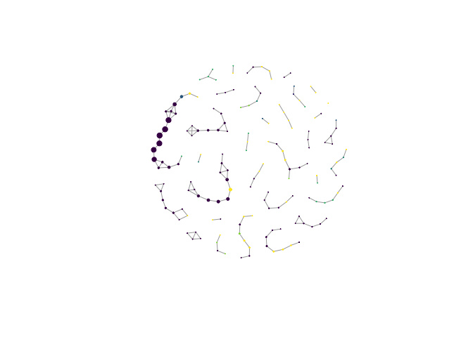<!-- -->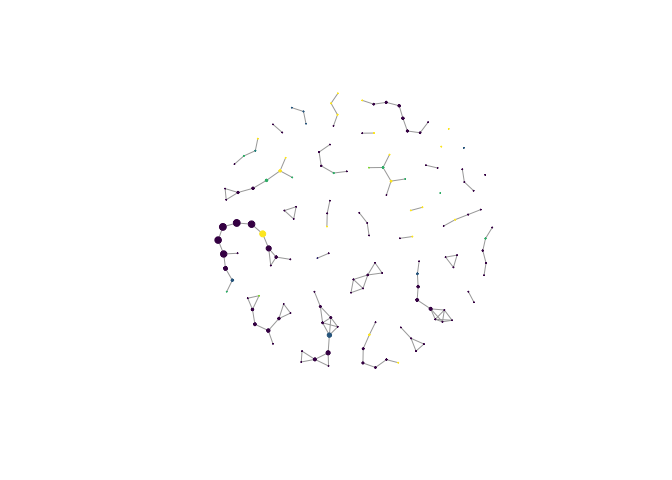<!-- -->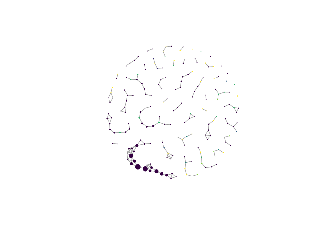<!-- -->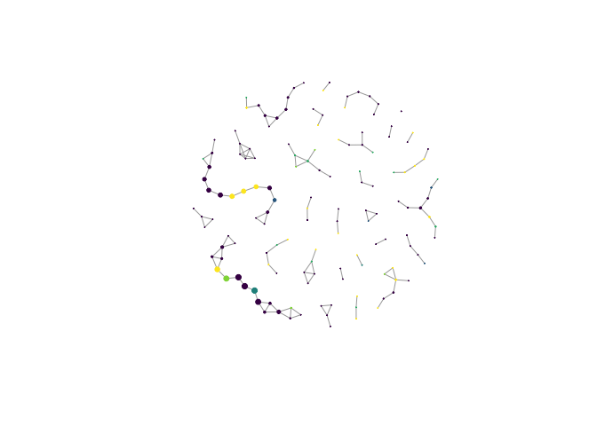<!-- -->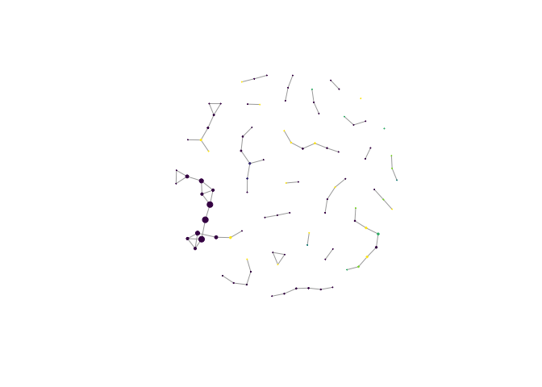<!-- -->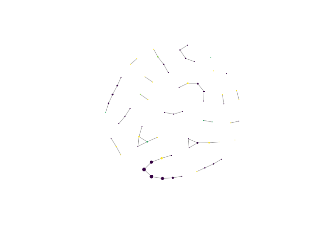<!-- -->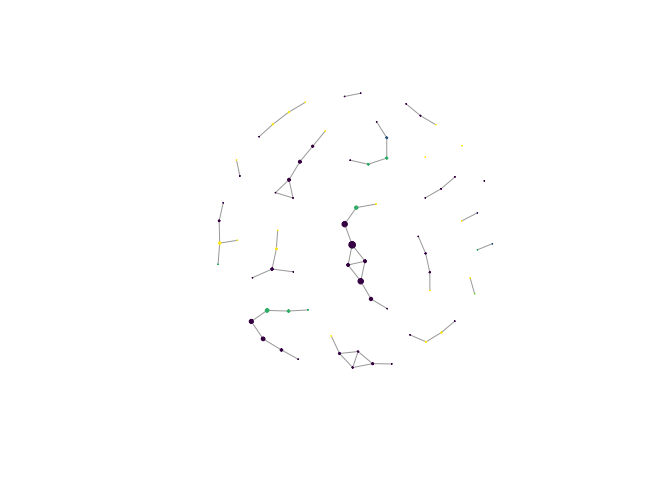<!-- -->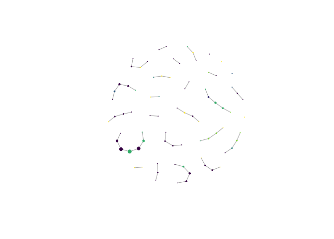<!-- -->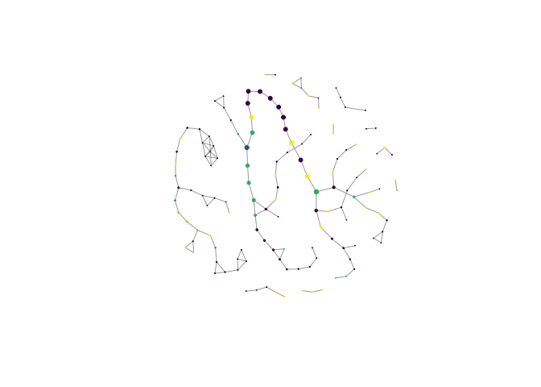<!-- -->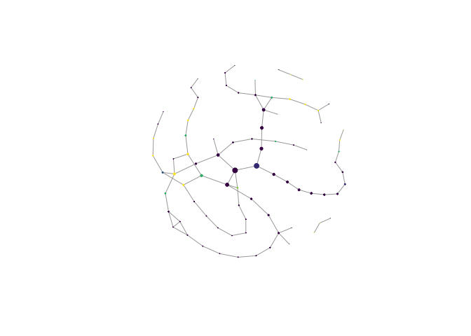<!-- -->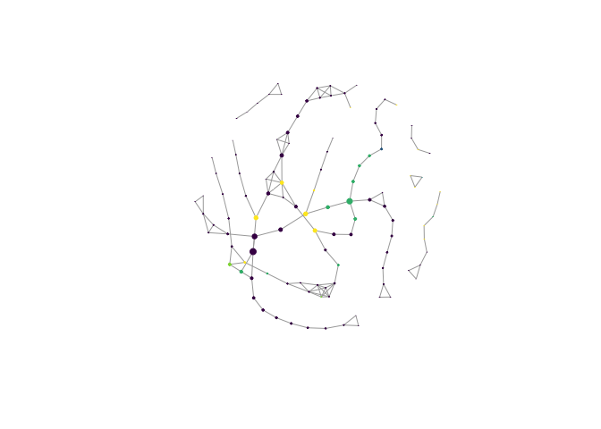<!-- -->

##Network Estimation for Species-Specific Networks

First, we need to make within-species networks, 2 per species: 1 within
REGUA and 1 outside REGUA. Start by making phyloseq objects. Below is a
plot illustrating sample size by species. We select only those species
with greater than 5 samples in each habitat type.

``` r
#vizualize which species have the highest sample sizes. Need at least 5 individuals in each 
#the protected and fragmented habitats
metadata_REGArea<-metadata_complete[metadata_complete$Region!="LIMI",]
ggplot(data=metadata_REGArea, aes(x=HabitatType)) + geom_bar(stat="count") + facet_wrap(~ParasiteSpecies)
```

<!-- -->

Below we make the phyloseq objects

``` r
#Subsample the BM.REGArea object for specific species
ParaLong <- subset_samples(BM.REGArea, ParasiteSpecies=="Paratrichobius longicrus")
```

    ## Found more than one class "phylo" in cache; using the first, from namespace 'phyloseq'

    ## Also defined by 'tidytree'

    ## Found more than one class "phylo" in cache; using the first, from namespace 'phyloseq'

    ## Also defined by 'tidytree'

    ## Found more than one class "phylo" in cache; using the first, from namespace 'phyloseq'

    ## Also defined by 'tidytree'

    ## Found more than one class "phylo" in cache; using the first, from namespace 'phyloseq'

    ## Also defined by 'tidytree'

``` r
AspiFalc <- subset_samples(BM.REGArea, ParasiteSpecies=="Aspidoptera falcata")
```

    ## Found more than one class "phylo" in cache; using the first, from namespace 'phyloseq'
    ## Also defined by 'tidytree'

    ## Found more than one class "phylo" in cache; using the first, from namespace 'phyloseq'

    ## Also defined by 'tidytree'

    ## Found more than one class "phylo" in cache; using the first, from namespace 'phyloseq'

    ## Also defined by 'tidytree'

    ## Found more than one class "phylo" in cache; using the first, from namespace 'phyloseq'

    ## Also defined by 'tidytree'

``` r
BasiJuqu <- subset_samples(BM.REGArea, ParasiteSpecies=="Basilia juquiensis")
```

    ## Found more than one class "phylo" in cache; using the first, from namespace 'phyloseq'
    ## Also defined by 'tidytree'

    ## Found more than one class "phylo" in cache; using the first, from namespace 'phyloseq'

    ## Also defined by 'tidytree'

    ## Found more than one class "phylo" in cache; using the first, from namespace 'phyloseq'

    ## Also defined by 'tidytree'

    ## Found more than one class "phylo" in cache; using the first, from namespace 'phyloseq'

    ## Also defined by 'tidytree'

``` r
StreWied <- subset_samples(BM.REGArea, ParasiteSpecies=="Strebla wiedemanni")
```

    ## Found more than one class "phylo" in cache; using the first, from namespace 'phyloseq'
    ## Also defined by 'tidytree'

    ## Found more than one class "phylo" in cache; using the first, from namespace 'phyloseq'

    ## Also defined by 'tidytree'

    ## Found more than one class "phylo" in cache; using the first, from namespace 'phyloseq'

    ## Also defined by 'tidytree'

    ## Found more than one class "phylo" in cache; using the first, from namespace 'phyloseq'

    ## Also defined by 'tidytree'

``` r
#Separate each species' phyloseq object into samples from protected and fragmented habitat
#then remove the ASVs that don't occur in any sample within each new phyloseq object
ParaLong.Protected<- subset_samples(ParaLong, HabitatType=="Protected")
```

    ## Found more than one class "phylo" in cache; using the first, from namespace 'phyloseq'
    ## Also defined by 'tidytree'

    ## Found more than one class "phylo" in cache; using the first, from namespace 'phyloseq'

    ## Also defined by 'tidytree'

    ## Found more than one class "phylo" in cache; using the first, from namespace 'phyloseq'

    ## Also defined by 'tidytree'

    ## Found more than one class "phylo" in cache; using the first, from namespace 'phyloseq'

    ## Also defined by 'tidytree'

``` r
ParaLong.Protected<- prune_taxa(taxa_sums(ParaLong.Protected)>0, ParaLong.Protected)
```

    ## Found more than one class "phylo" in cache; using the first, from namespace 'phyloseq'
    ## Also defined by 'tidytree'

``` r
ParaLong.Protected
```

    ## phyloseq-class experiment-level object
    ## otu_table()   OTU Table:         [ 78 taxa and 16 samples ]
    ## sample_data() Sample Data:       [ 16 samples by 28 sample variables ]
    ## tax_table()   Taxonomy Table:    [ 78 taxa by 7 taxonomic ranks ]
    ## phy_tree()    Phylogenetic Tree: [ 78 tips and 77 internal nodes ]

``` r
ParaLong.Fragmented<- subset_samples(ParaLong, HabitatType=="Fragmented")
```

    ## Found more than one class "phylo" in cache; using the first, from namespace 'phyloseq'
    ## Also defined by 'tidytree'

    ## Found more than one class "phylo" in cache; using the first, from namespace 'phyloseq'

    ## Also defined by 'tidytree'

    ## Found more than one class "phylo" in cache; using the first, from namespace 'phyloseq'

    ## Also defined by 'tidytree'

    ## Found more than one class "phylo" in cache; using the first, from namespace 'phyloseq'

    ## Also defined by 'tidytree'

``` r
ParaLong.Fragmented<- prune_taxa(taxa_sums(ParaLong.Fragmented)>0, ParaLong.Fragmented)
```

    ## Found more than one class "phylo" in cache; using the first, from namespace 'phyloseq'
    ## Also defined by 'tidytree'

``` r
ParaLong.Fragmented
```

    ## phyloseq-class experiment-level object
    ## otu_table()   OTU Table:         [ 143 taxa and 21 samples ]
    ## sample_data() Sample Data:       [ 21 samples by 28 sample variables ]
    ## tax_table()   Taxonomy Table:    [ 143 taxa by 7 taxonomic ranks ]
    ## phy_tree()    Phylogenetic Tree: [ 143 tips and 142 internal nodes ]

``` r
AspiFalc.Protected<- subset_samples(AspiFalc, HabitatType=="Protected")
```

    ## Found more than one class "phylo" in cache; using the first, from namespace 'phyloseq'
    ## Also defined by 'tidytree'

    ## Found more than one class "phylo" in cache; using the first, from namespace 'phyloseq'

    ## Also defined by 'tidytree'

    ## Found more than one class "phylo" in cache; using the first, from namespace 'phyloseq'

    ## Also defined by 'tidytree'

    ## Found more than one class "phylo" in cache; using the first, from namespace 'phyloseq'

    ## Also defined by 'tidytree'

``` r
AspiFalc.Protected<- prune_taxa(taxa_sums(AspiFalc.Protected)>0, AspiFalc.Protected)
```

    ## Found more than one class "phylo" in cache; using the first, from namespace 'phyloseq'
    ## Also defined by 'tidytree'

``` r
AspiFalc.Protected
```

    ## phyloseq-class experiment-level object
    ## otu_table()   OTU Table:         [ 51 taxa and 8 samples ]
    ## sample_data() Sample Data:       [ 8 samples by 28 sample variables ]
    ## tax_table()   Taxonomy Table:    [ 51 taxa by 7 taxonomic ranks ]
    ## phy_tree()    Phylogenetic Tree: [ 51 tips and 50 internal nodes ]

``` r
AspiFalc.Fragmented<- subset_samples(AspiFalc, HabitatType=="Fragmented")
```

    ## Found more than one class "phylo" in cache; using the first, from namespace 'phyloseq'
    ## Also defined by 'tidytree'

    ## Found more than one class "phylo" in cache; using the first, from namespace 'phyloseq'

    ## Also defined by 'tidytree'

    ## Found more than one class "phylo" in cache; using the first, from namespace 'phyloseq'

    ## Also defined by 'tidytree'

    ## Found more than one class "phylo" in cache; using the first, from namespace 'phyloseq'

    ## Also defined by 'tidytree'

``` r
AspiFalc.Fragmented<- prune_taxa(taxa_sums(AspiFalc.Fragmented)>0, AspiFalc.Fragmented)
```

    ## Found more than one class "phylo" in cache; using the first, from namespace 'phyloseq'
    ## Also defined by 'tidytree'

``` r
AspiFalc.Fragmented
```

    ## phyloseq-class experiment-level object
    ## otu_table()   OTU Table:         [ 75 taxa and 13 samples ]
    ## sample_data() Sample Data:       [ 13 samples by 28 sample variables ]
    ## tax_table()   Taxonomy Table:    [ 75 taxa by 7 taxonomic ranks ]
    ## phy_tree()    Phylogenetic Tree: [ 75 tips and 74 internal nodes ]

``` r
BasiJuqu.Protected<- subset_samples(BasiJuqu, HabitatType=="Protected")
```

    ## Found more than one class "phylo" in cache; using the first, from namespace 'phyloseq'
    ## Also defined by 'tidytree'

    ## Found more than one class "phylo" in cache; using the first, from namespace 'phyloseq'

    ## Also defined by 'tidytree'

    ## Found more than one class "phylo" in cache; using the first, from namespace 'phyloseq'

    ## Also defined by 'tidytree'

    ## Found more than one class "phylo" in cache; using the first, from namespace 'phyloseq'

    ## Also defined by 'tidytree'

``` r
BasiJuqu.Protected<- prune_taxa(taxa_sums(BasiJuqu.Protected)>0, BasiJuqu.Protected)
```

    ## Found more than one class "phylo" in cache; using the first, from namespace 'phyloseq'
    ## Also defined by 'tidytree'

``` r
BasiJuqu.Protected
```

    ## phyloseq-class experiment-level object
    ## otu_table()   OTU Table:         [ 107 taxa and 9 samples ]
    ## sample_data() Sample Data:       [ 9 samples by 28 sample variables ]
    ## tax_table()   Taxonomy Table:    [ 107 taxa by 7 taxonomic ranks ]
    ## phy_tree()    Phylogenetic Tree: [ 107 tips and 106 internal nodes ]

``` r
BasiJuqu.Fragmented<- subset_samples(BasiJuqu, HabitatType=="Fragmented")
```

    ## Found more than one class "phylo" in cache; using the first, from namespace 'phyloseq'
    ## Also defined by 'tidytree'

    ## Found more than one class "phylo" in cache; using the first, from namespace 'phyloseq'

    ## Also defined by 'tidytree'

    ## Found more than one class "phylo" in cache; using the first, from namespace 'phyloseq'

    ## Also defined by 'tidytree'

    ## Found more than one class "phylo" in cache; using the first, from namespace 'phyloseq'

    ## Also defined by 'tidytree'

``` r
BasiJuqu.Fragmented<- prune_taxa(taxa_sums(BasiJuqu.Fragmented)>0, BasiJuqu.Fragmented)
```

    ## Found more than one class "phylo" in cache; using the first, from namespace 'phyloseq'
    ## Also defined by 'tidytree'

``` r
BasiJuqu.Fragmented
```

    ## phyloseq-class experiment-level object
    ## otu_table()   OTU Table:         [ 111 taxa and 11 samples ]
    ## sample_data() Sample Data:       [ 11 samples by 28 sample variables ]
    ## tax_table()   Taxonomy Table:    [ 111 taxa by 7 taxonomic ranks ]
    ## phy_tree()    Phylogenetic Tree: [ 111 tips and 110 internal nodes ]

``` r
StreWied.Protected<- subset_samples(StreWied, HabitatType=="Protected")
```

    ## Found more than one class "phylo" in cache; using the first, from namespace 'phyloseq'
    ## Also defined by 'tidytree'

    ## Found more than one class "phylo" in cache; using the first, from namespace 'phyloseq'

    ## Also defined by 'tidytree'

    ## Found more than one class "phylo" in cache; using the first, from namespace 'phyloseq'

    ## Also defined by 'tidytree'

    ## Found more than one class "phylo" in cache; using the first, from namespace 'phyloseq'

    ## Also defined by 'tidytree'

``` r
StreWied.Protected<- prune_taxa(taxa_sums(StreWied.Protected)>10, StreWied.Protected)
```

    ## Found more than one class "phylo" in cache; using the first, from namespace 'phyloseq'
    ## Also defined by 'tidytree'

``` r
StreWied.Protected
```

    ## phyloseq-class experiment-level object
    ## otu_table()   OTU Table:         [ 57 taxa and 8 samples ]
    ## sample_data() Sample Data:       [ 8 samples by 28 sample variables ]
    ## tax_table()   Taxonomy Table:    [ 57 taxa by 7 taxonomic ranks ]
    ## phy_tree()    Phylogenetic Tree: [ 57 tips and 55 internal nodes ]

``` r
StreWied.Fragmented<- subset_samples(StreWied, HabitatType=="Fragmented")
```

    ## Found more than one class "phylo" in cache; using the first, from namespace 'phyloseq'
    ## Also defined by 'tidytree'

    ## Found more than one class "phylo" in cache; using the first, from namespace 'phyloseq'

    ## Also defined by 'tidytree'

    ## Found more than one class "phylo" in cache; using the first, from namespace 'phyloseq'

    ## Also defined by 'tidytree'

    ## Found more than one class "phylo" in cache; using the first, from namespace 'phyloseq'

    ## Also defined by 'tidytree'

``` r
StreWied.Fragmented<- prune_taxa(taxa_sums(StreWied.Fragmented)>0, StreWied.Fragmented)
```

    ## Found more than one class "phylo" in cache; using the first, from namespace 'phyloseq'
    ## Also defined by 'tidytree'

``` r
StreWied.Fragmented
```

    ## phyloseq-class experiment-level object
    ## otu_table()   OTU Table:         [ 79 taxa and 13 samples ]
    ## sample_data() Sample Data:       [ 13 samples by 28 sample variables ]
    ## tax_table()   Taxonomy Table:    [ 79 taxa by 7 taxonomic ranks ]
    ## phy_tree()    Phylogenetic Tree: [ 79 tips and 78 internal nodes ]

``` r
#Make a list of phyloseq objects
Species_Phyloseq_List<-list(ParaLong.Protected,AspiFalc.Protected,BasiJuqu.Protected,StreWied.Protected,ParaLong.Fragmented,AspiFalc.Fragmented,BasiJuqu.Fragmented,StreWied.Fragmented)

names(Species_Phyloseq_List)<-list("ParaLong.Protected","AspiFalc.Protected","BasiJuqu.Protected","StreWied.Protected","ParaLong.Fragmented","AspiFalc.Fragmented","BasiJuqu.Fragmented","StreWied.Fragmented")
```

Now, estimate networks for each of these phyloseq objects

``` r
pargs<-list(rep.num=50, seed=10010, ncores=2)

# se.ParaLong.Protected<- spiec.easi(ParaLong.Protected, method='mb', lambda.min.ratio=5e-3, nlambda=30, pulsar.params=pargs)
# getStability(se.ParaLong.Protected) #0.04794139
# sum(getRefit(se.ParaLong.Protected))/2 #59
se.ParaLong.Protected<-readRDS(gzcon(url("https://github.com/kspeeriful/Microbiomes_and_Habitat_Loss_Brazil/raw/main/SpiecEasi/Species_Specific_Networks/ParaLong_Protected.RData")))

#Paratrichobius longicrus
# se.ParaLong.Fragmented<- spiec.easi(ParaLong.Fragmented, method='mb', lambda.min.ratio=5e-2, nlambda=50, pulsar.params=pargs)
# getStability(se.ParaLong.Fragmented) #0.0488628
# sum(getRefit(se.ParaLong.Fragmented))/2 #121
se.ParaLong.Fragmented<-readRDS(gzcon(url("https://github.com/kspeeriful/Microbiomes_and_Habitat_Loss_Brazil/raw/main/SpiecEasi/Species_Specific_Networks/ParaLong_Fragmented.RData")))

#Aspidoptera falcata
# se.AspiFalc.Protected<- spiec.easi(AspiFalc.Protected, method='mb', lambda.min.ratio=5e-1, nlambda=20, pulsar.params=pargs)
# getStability(se.AspiFalc.Protected) #0.04969663
# sum(getRefit(se.AspiFalc.Protected))/2 #33
se.AspiFalc.Protected<- readRDS(gzcon(url("https://github.com/kspeeriful/Microbiomes_and_Habitat_Loss_Brazil/raw/main/SpiecEasi/Species_Specific_Networks/AspiFalc.Protected.RData")))

# se.AspiFalc.Fragmented<- spiec.easi(AspiFalc.Fragmented, method='mb', lambda.min.ratio=1e-2, nlambda=30, pulsar.params=pargs)
# getStability(se.AspiFalc.Fragmented) #0.04752144
# sum(getRefit(se.AspiFalc.Fragmented))/2 #54
se.AspiFalc.Fragmented<- readRDS(gzcon(url("https://github.com/kspeeriful/Microbiomes_and_Habitat_Loss_Brazil/raw/main/SpiecEasi/Species_Specific_Networks/AspiFalc.Fragmented.RData")))

#Basilia juquiensis
# se.BasiJuqu.Protected<- spiec.easi(BasiJuqu.Protected, method='mb', lambda.min.ratio=1e-1, nlambda=20, pulsar.params=pargs)
# getStability(se.BasiJuqu.Protected) #0.04799605
# sum(getRefit(se.BasiJuqu.Protected))/2 #91
se.BasiJuqu.Protected<- readRDS(gzcon(url("https://github.com/kspeeriful/Microbiomes_and_Habitat_Loss_Brazil/raw/main/SpiecEasi/Species_Specific_Networks/BasiJuqu.Protected.RData")))

# se.BasiJuqu.Fragmented<- spiec.easi(BasiJuqu.Fragmented, method='mb', lambda.min.ratio=1e-2, nlambda=20, pulsar.params=pargs)
# getStability(se.BasiJuqu.Fragmented) #0.04670821
# sum(getRefit(se.BasiJuqu.Fragmented))/2 #108
se.BasiJuqu.Fragmented <- readRDS(gzcon(url("https://github.com/kspeeriful/Microbiomes_and_Habitat_Loss_Brazil/raw/main/SpiecEasi/Species_Specific_Networks/BasiJuqu.Fragmented.RData")))

#Strebla wiedemanni
# se.StreWied.Protected<- spiec.easi(StreWied.Protected, method='mb', lambda.min.ratio=5e-3, nlambda=20, pulsar.params=pargs)
# getStability(se.StreWied.Protected) #0.04790777
# sum(getRefit(se.StreWied.Protected))/2 #46
se.StreWied.Protected<- readRDS(gzcon(url("https://github.com/kspeeriful/Microbiomes_and_Habitat_Loss_Brazil/raw/main/SpiecEasi/Species_Specific_Networks/StreWied.Protected.RData")))

# se.StreWied.Fragmented<- spiec.easi(StreWied.Fragmented, method='mb', lambda.min.ratio=1e-1, nlambda=30, pulsar.params=pargs)
# getStability(se.StreWied.Fragmented) #0.04978955
# sum(getRefit(se.StreWied.Fragmented))/2 #55
se.StreWied.Fragmented<- readRDS(gzcon(url("https://github.com/kspeeriful/Microbiomes_and_Habitat_Loss_Brazil/raw/main/SpiecEasi/Species_Specific_Networks/StreWied.Fragmented.RData")))

#create a list of species-specific SpiecEasi networks
Species_SE<-list(se.ParaLong.Protected,se.AspiFalc.Protected,se.BasiJuqu.Protected,se.StreWied.Protected, se.ParaLong.Fragmented,se.AspiFalc.Fragmented,se.BasiJuqu.Fragmented,se.StreWied.Fragmented)

names(Species_SE)<-c("se.ParaLong.Protected","se.AspiFalc.Protected","se.BasiJuqu.Protected","se.StreWied.Protected","se.ParaLong.Fragmented","se.AspiFalc.Fragmented","se.BasiJuqu.Fragmented","se.StreWied.Fragmented")

#Also create a list of only streblid species
Streblid_SE<-list(se.ParaLong.Protected,se.AspiFalc.Protected,se.StreWied.Protected, se.ParaLong.Fragmented,se.AspiFalc.Fragmented,se.StreWied.Fragmented)

names(Streblid_SE)<-c("se.ParaLong.Protected","se.AspiFalc.Protected","se.StreWied.Protected","se.ParaLong.Fragmented","se.AspiFalc.Fragmented","se.StreWied.Fragmented")

#Convert graph objects to adjacency matrices
Species_SE_graph <- Map(function(x,y) adj2igraph(getRefit(x), vertex.attr=list(name=taxa_names(y))), Species_SE, Species_Phyloseq_List)
```

##Network Decomposition using Orbits Network decomposition using orbits
allows a comparison between networks that have different sample sizes,
so is a size-independent network comparison.

Here, we use network decomposition to examine if there are conserved
changes in network structure within Species between REGUA and
outside-REGUA fragments.

Decompose the species-specific networks into orbits and use PCoA to
visualize the differences. We also decompose the habitat patch networks
and visualize the orbit distributions using PCoA.

``` r
library("orca")

#Below code is from Zachary Kurtz, developer of SpiecEasi
#get refits from each network
refits<-lapply(Species_SE, function(x) x$refit$stars)
refits_streblid<-lapply(Streblid_SE, function(x) x$refit$stars)
refits_fragment<-lapply(seBM.combo, function(x) x$refit$stars)

#Compute graphlet correlation vectors
gcmat <- t(sapply(refits, pulsar::gcvec))
gcmat_streblid <- t(sapply(refits_streblid, pulsar::gcvec))
gcmat_fragment<- t(sapply(refits_fragment, pulsar::gcvec))

#embedding and plot
mds <- cmdscale(dist(gcmat))
mds_streblid <- cmdscale(dist(gcmat_streblid))
mds_fragment <- cmdscale(dist(gcmat_fragment))

plot(mds)
text(mds, labels=row.names(mds))
```

<!-- -->

``` r
#Figure S8
plot(mds_streblid)
text(mds_streblid, labels=row.names(mds_streblid))
```

<!-- -->

``` r
#Figure 5d
plot(mds_fragment)
text(mds_fragment, labels=row.names(mds_fragment))
```

<!-- -->

``` r
#examine clusters in the data using kmeans
#Aspidopetera falcata networks are outliers, so use 3 clusters
clust <- kmeans(mds, 3)$cluster
clust
```

    ##  se.ParaLong.Protected  se.AspiFalc.Protected  se.BasiJuqu.Protected 
    ##                      2                      3                      2 
    ##  se.StreWied.Protected se.ParaLong.Fragmented se.AspiFalc.Fragmented 
    ##                      2                      1                      2 
    ## se.BasiJuqu.Fragmented se.StreWied.Fragmented 
    ##                      2                      1

``` r
clust_streblid <-kmeans(mds_streblid, 3)$cluster
clust_streblid
```

    ##  se.ParaLong.Protected  se.AspiFalc.Protected  se.StreWied.Protected 
    ##                      2                      3                      2 
    ## se.ParaLong.Fragmented se.AspiFalc.Fragmented se.StreWied.Fragmented 
    ##                      1                      2                      1

``` r
#fragments F8 and F5 group together apart from all other fragments when using 2 clusters, when we use 3 clusters the impact of area is more aparent.
clust_fragment <-kmeans(mds_fragment, 3)$cluster
clust_fragment
```

    ##  seBM.REGUA seBM.REGUA2 seBM.REGUA3    seBM.F10     seBM.F9     seBM.F8 
    ##           1           1           1           1           1           3 
    ##     seBM.F7     seBM.F5     seBM.F4     seBM.F2     seBM.F1 
    ##           1           3           2           2           2
